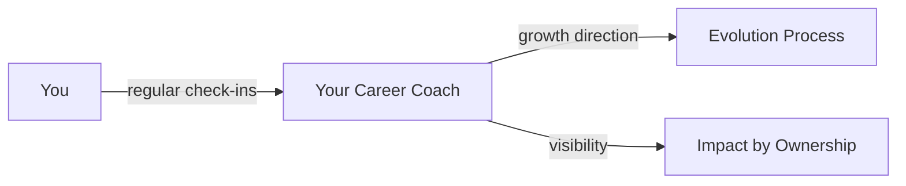

> [!tip] TL;DR
> No hierarchy. No ivory towers. A team of experts, each with a different role, all playing for the same goal.

---

## The Plainsight Flywheel

Think of Plainsight as a **football team**, not a corporate ladder. Every player has a different role: goalkeeper, midfielder, striker. But no role is more important than another. The team wins or loses *together*. That's exactly how we operate.

We don't have "managers" in the traditional sense. We have people who take ownership of what needs to happen, and everyone's contribution carries equal weight.

Our organisation is built around two sides of the same machine, linked together like cogs in a wheel:

![[Organisation structure.png]]

On the **right** sit our three offerings. This is where our experts do what they do best:

| Offering | What we do |
|---|---|
| **Data/AI Strategy & Governance** | Helping organisations define their data and AI roadmap and set up the right governance to make it stick. |
| **AI & GenAI Implementation** | Building and deploying AI and generative AI solutions that deliver real business value. |
| **Data & Analytics** | Engineering data platforms, analytics solutions, and everything in between. |

On the **left** sit the supporting services that keep the machine running: backoffice, marketing, sales, and recruitment. Without them, the offerings don't reach the people who need them.

Both sides are equally important. The cogs only turn when they work together. An expert building a customer's data platform is just as vital as the person making sure the right people find their way to Plainsight.

---

## How We Grow: Career Coaches

Every person at Plainsight has a **career coach**: someone dedicated to their personal and professional growth.

Career coaches aren't managers. They don't assign work or approve timesheets. They exist for one reason: to make sure you're evolving in the direction *you* want to go.

> Read more about how growth works in [[🎯 Evolution Process]].

---

## How We Learn: Knowledge Hubs

Knowledge doesn't live in silos. It circulates.

**Knowledge Hubs** are informal, topic-driven groups that form around subjects our experts want to go deeper on. They're not permanent departments. They come and go based on what's relevant.

| Aspect | How it works |
|---|---|
| **Who starts one?** | Anyone who sees the need to deepen expertise in a topic |
| **Who leads?** | The person who initiated it. Not appointed, self-selected |
| **Who joins?** | Anyone interested. No approval needed |
| **How long do they last?** | As long as the topic is relevant: weeks, months, or longer |
| **What do they produce?** | Shared knowledge: playbook pages, internal sessions, reusable assets |

%% Examples might include: dbt best practices, LLM/RAG patterns, Fabric adoption, streaming architectures %%

This model keeps us sharp without bureaucracy. If something matters, someone will pick it up. That's how a team of experts operates.

---

## Short Lines, Big Impact

We keep communication lines **short on purpose**.

No layers of approvals. No "let me check with my manager's manager." If you need something, you talk to the person who can help. Directly. This isn't an accident; it's a deliberate choice we protect as we grow.

> [!warning] Scaling without layers
> Growing the team doesn't mean adding hierarchy. It means building stronger habits: better async communication, clearer ownership, and a culture where anyone can raise their hand.

---

## Culture Is the Strategy

Our culture isn't a poster on the wall. It's **how we actually work**.

Everyone is free to give and receive feedback, at any time, in any direction. Not because a process tells us to, but because it makes us grow faster as people and as a company. We're all learning every minute of the day, and we actively support that in each other.

Want to know what drives that culture? Read [[🥇 The Foundation of Plainsight]].

---

## Where to Go Next

| Topic | Page |
|---|---|
| Our purpose and values | [[🥇 The Foundation of Plainsight]] |
| How you grow here | [[🎯 Evolution Process]] |
| The employee journey | [[🚀 Onboarding]] |
| Our technical guidelines | [[Why 'Technical Guideline Ops']] |
