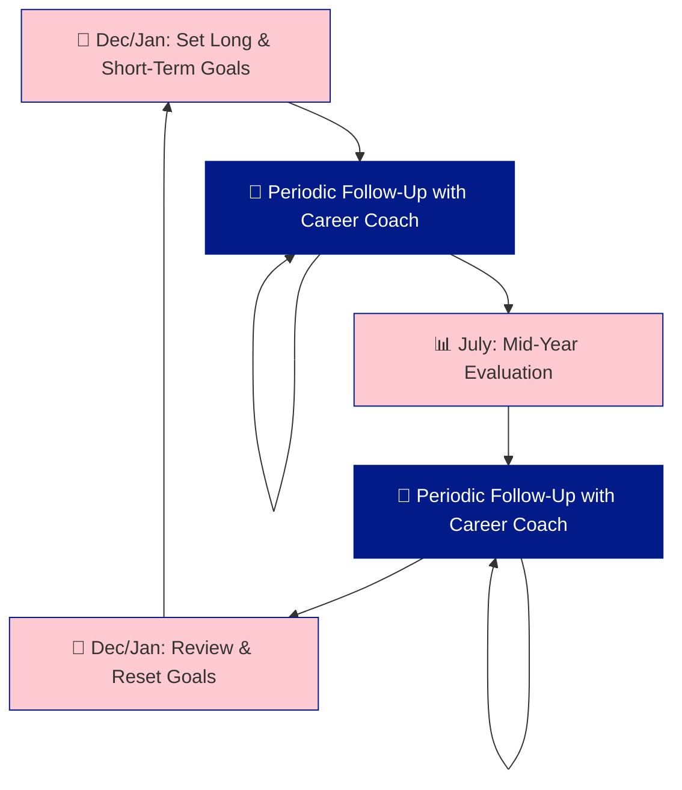

# Plainsight Evaluation Process 🔍

At Plainsight, our evaluation process is designed to align your personal career aspirations with the company’s goals. This is how we structure it:

## December: Setting the Stage for Success 🎯

In December, we initiate the process by asking you to reflect on your career direction:

### Long-Term Vision 🌅
We want to know how you see your career evolving. Do you aspire to be more technical, focus on functional aspects, or develop into a people leader? This is your opportunity to give an indication of your long-term career goals.

### Short-Term Focus (1-Year Scope) 🗓️
To support your long-term goals, we ask you to set specific objectives for the coming year. What do you want to achieve? Where do you need support? We encourage you to create SMART goals—Specific, Measurable, Achievable, Relevant, and Time-bound—to guide your progress.

## Role of the Career Coach 🧭

Your career coach plays a crucial role in helping you reach your short-term goals. They will guide you, offer support, and ensure that you’re on the right track both in terms of your knowledge development and your well-being on current projects.

### Ongoing Follow-Up 📈
The career coach will check in with you periodically to make sure everything is on track. These follow-ups are designed to address any challenges you might be facing and to ensure that you’re making progress toward your goals.

## July: Mid-Year Evaluation 🗒️

In July, we conduct a mid-year evaluation. This is a well-structured conversation where we:

- **Review Progress**: We assess how well you’re tracking toward your SMART goals.
- **Customer Feedback**: We share and discuss feedback from clients to ensure alignment.
- **Support Needs**: If there are areas where your career coach can assist, this is the time to ask.

The mid-year evaluation is an essential checkpoint to ensure that you’re on course to achieve your objectives and to adjust any plans if needed.

---

This process ensures that your career development is both proactive and aligned with the needs of Plainsight, fostering growth for both you and the company.
