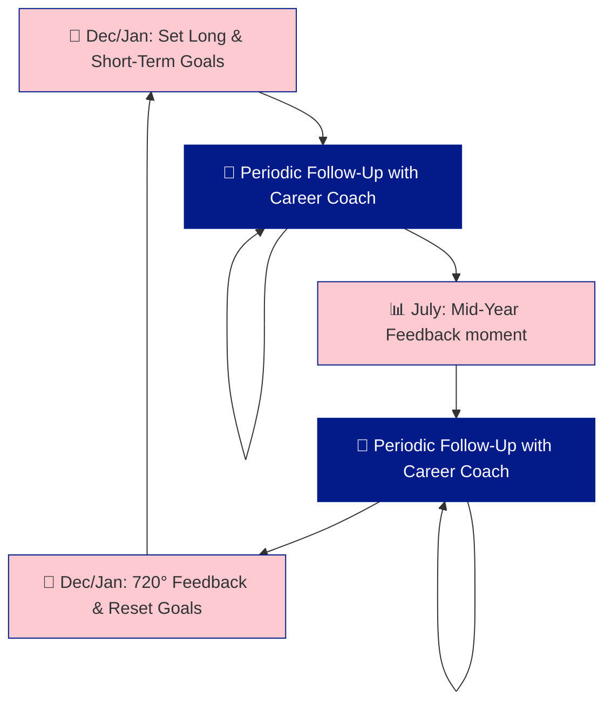

# Plainsight Evolution Process 🔍

At Plainsight, we believe that growth is a continuous journey fueled by honest, open feedback. We don’t adhere to the traditional concept of "evaluations" but instead embrace what we call 720° feedback. This approach ensures that every voice is heard, whether it's within our team or from our customers, fostering a culture where improvement is constant and multidimensional.

Besides the continuous open candor and feedback culture, we have two fixed 720° feedback moments each year. These sessions allow us to set both short- and long-term goals, follow up on progress, and ensure that feedback from all relevant perspectives—coach to consultant, consultant to coach, peer consultants, customer to consultant, and customer to Plainsight as a company—is taken into account. This structured process ensures that personal and team growth remain aligned with our values. ♾️

This is how we structure it:

## December: Setting the Stage for Success 🎯

In December, we initiate the process by asking you to reflect on your career direction:

### Long-Term Vision 🌅
We want to know how you see your career evolving. Do you aspire to be more technical, focus on functional aspects, or develop into a people leader? This is your opportunity to give an indication of your long-term career goals.

### Short-Term Focus (1-Year Scope) 🗓️
To support your long-term goals, we ask you to set specific objectives for the coming year. What do you want to achieve? Where do you need support? We encourage you to create SMART goals—Specific, Measurable, Achievable, Relevant, and Time-bound—to guide your progress.

## Role of the Career Coach 🧭

Your career coach plays a crucial role in helping you reach your short-term goals. They will guide you, offer support, and ensure that you’re on the right track both in terms of your knowledge development and your well-being on current projects.

### Ongoing Follow-Up 📈
The career coach will check in with you periodically to make sure everything is on track. These follow-ups are designed to address any challenges you might be facing and to ensure that you’re making progress toward your goals.

## July: Mid-Year Feedback moment 🗒️

In July, we conduct a mid-year feedback moment. This is a well-structured conversation where we:

- **Review Progress**: We assess how well you’re tracking toward your SMART goals.
- **720° Feedback**: We gather feedback from all relevant perspectives: coach to consultant, consultant to coach, peer consultants, customer to consultant, and customer to Plainsight 
- **Support Needs**: If there are areas where your career coach can assist, this is the time to ask.

This mid-year feedback moment is an essential checkpoint to ensure that you’re on course to achieve your objectives and to adjust any plans if needed.

---

This process ensures that your career development is both proactive and aligned with the needs of Plainsight, fostering growth for both you and the company.♾️🚀
