# Pre-Boarding at Plainsight 🛹

Welcome to the start of your journey with Plainsight! Our recruitment process is designed to be as seamless, transparent, and engaging as possible. Here’s what you can expect as you embark on this exciting path with us.

```mermaid

graph LR;
    subgraph A[Phase 1: 🎉 Initial Engagement]
        A1[👋 Interview 1: Get to Know Us]
    end
    
    subgraph B[Phase 2: 🤓 In-Depth Meeting]
        direction LR
        B1[💬 Interview 2: Questions & Deep-Dive] 
        B2[🛠️ Technical Challenge]
    end
        
    subgraph C[Phase 4: 📝 Decision Making]
        direction LR
        C1[📄 Offer Proposal] --> C2[🤔 What's it gonna be? Yes or No?!]
    end
    
    subgraph D[Phase 5: 🌟 Onboarding]
        direction LR
        D1[📋 Pre-boarding] --> FD2[🚀 First Day at Plainsight]
    end
    
    A --> B --> C --> D

    
```

  

## The Hiring Journey 🚀

### 1. Initial Contact: Making the Connection 🤝
Our journey together begins the moment you express interest in joining Plainsight. Whether you applied directly or were scouted by our talent team, we’ll reach out to set up an initial conversation. This is our chance to get to know you, understand your career goals, and see how they align with our vision.

### 2. The Screening Process: Let’s Dive Deeper 🔍
In this stage, we’ll review your experience, skills, and potential fit with our team. This might include a phone or video interview where we discuss your past projects, your approach to problem-solving, and how you could contribute to Plainsight’s mission. We’ll also answer any questions you have about the role, our culture, or our expectations.

### 3. The Assessment: Showcasing Your Skills 🛠️
Depending on the role, you might be asked to complete an assessment or case study that simulates the kind of work you’d be doing at Plainsight. This is a chance for you to demonstrate your expertise and for us to see how you approach challenges in a practical context.

### 4. The Interview Rounds: Meeting the Team 💼
Next, you’ll have the opportunity to meet with various members of our team, including potential colleagues and leaders. These interviews are as much about us getting to know you as they are about you learning more about us. We value open, two-way conversations where both sides can explore if there’s a mutual fit.

### 5. The Offer: Welcome to the Plainsight Team 🎉
If everything aligns, we’ll extend a formal offer for you to join the team. This offer will include details on your role, compensation, benefits, and any other relevant information. We believe in being transparent and fair, so we’ll take the time to go over the offer with you and answer any questions.

## Preparing for Your First Day 🌱

Once you’ve accepted the offer, the pre-boarding process officially begins. We’ll provide you with all the information you need to hit the ground running on your first day. This includes access to our onboarding portal, where you can complete necessary paperwork, learn more about our culture, and start getting acquainted with your team.

We’ll also pair you with a buddy who will be your go-to person for any questions or support you need as you settle in. Our goal is to make you feel welcomed and prepared from day one.

## Your First Steps with Plainsight 🛤️

Your journey with us is just beginning, and we’re thrilled to have you on board. At Plainsight, we’re committed to your growth and success, and we can’t wait to see the amazing things we’ll accomplish together.

Welcome to Plainsight—where innovation meets passion, and your potential is limitless.
