# Plainsight Support 🛠️

At Plainsight, we're dedicated to ensuring that you have the support you need to thrive. Whether you're facing an issue, need assistance, or have a question, our support team is here to help you every step of the way.

## How to Get Support

### Logging an Issue 📝

If you encounter any issues or need to request a change, here's how you can get in touch with us:

- **Email**: Send a detailed email to [support@plainsight.pro](mailto:support@plainsight.pro). You'll receive an automatic confirmation that your ticket has been received.
- **Website**: Visit our support portal at [support.plainsight.pro](https://support.plainsight.pro) to log a ticket, check the status of your requests, and see who is handling them.

### Ticket Process 🚦

Our ticket process ensures that your issues are tracked and resolved efficiently:

1. **📥 Open**: Your ticket is logged and acknowledged.
2. **⚙️ In Progress**: Our team is working on resolving your issue.
3. **⏳ Pending**: Your ticket is waiting for additional information or resolution of a related issue.
4. **✅ Solved**: The issue has been resolved and the ticket is closed.

```mermaid
---
config:
  layout: elk
  theme: forest
  look: neo
---
graph TD;
    A[📧 Log Issue via Email or Portal] --> B[📥 Open Ticket]
    B --> C[⚙️ In Progress]
    C --> D[⏳ Pending: Awaiting Feedback or Resolution]
    D --> E[✅ Solved: Issue Resolved]
    B -.-> F[🔴 High Priority? Call Account Manager]
    F --> C
    
    classDef blueBox fill:#031B89,stroke:#031B89,stroke-width:1px,color:#FFFFFF;
    class A,B,C,D,E,F blueBox;

``` 

### High-Priority Issues (P1) 🔴

For high-priority issues where email isn't enough:

1. **Send an email**: Log your issue as usual by emailing [support@plainsight.pro](mailto:support@plainsight.pro).
2. **Call Account Manager**: After logging the ticket, call your account manager with the ticket number to confirm receipt and ensure immediate attention.

### Consulting Your Tickets 📄

To view and manage your tickets:

1. **Create an Account**: Visit [support.plainsight.pro](https://support.plainsight.pro) and create an account.
2. **Sign In**: Log in to view your open requests, their status, and who is working on them.

