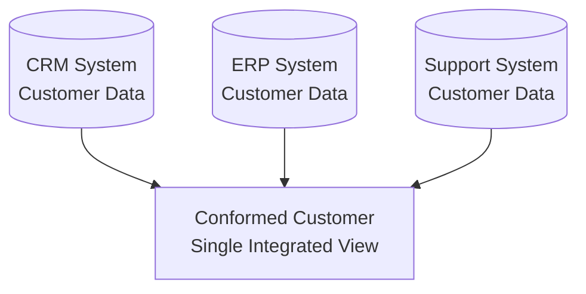

# Conformed Layer

> [!info] Core Concept
> The **Conformed Layer** bridges raw source data and business-ready dimensional models. Think of it as the "data refinement zone" where messy operational data becomes clean, integrated, and analysis-ready.

## Purpose

The Conformed layer serves as a critical transformation point in the data architecture:

**Core Transformations:**
- **Data Quality Validation**: Enforce data quality rules and error handling. 
- **Denormalization**: Flatten normalized structures for query performance. This layer provides a less 'strict' modelling technique. 
- **Multi-Source Integration**: Merge overlapping entities from different systems
- **History Tracking** : Establishing change tracking on attributes ( e.g. `snapshotting` and change tracking). These tables are later used for SCD2 creation in [[Dimension Tables]]. 

## Key Transformations

### Data Quality Validation
==Rules are applied and enforced== before data enters this layer. Invalid records are flagged, corrected, or routed to error handling.

**Examples:**
- Email format validation
- Required field checks
- Referential integrity verification
- Business rule enforcement (e.g., OrderDate ≤ ShipDate)

### Denormalization

Raw operational systems store data normalized (for transaction efficiency). The Conformed layer begins flattening these structures.

| Before (Normalized) | After (Denormalized) |
|---------------------|----------------------|
| Customer → Address (separate tables) | Customer with embedded address columns |
| Product → Category → Subcategory (3 tables) | Product with Category and Subcategory columns |
| Monthly columns (Jan, Feb, Mar...) | Month + Value rows (unpivoted) |

**Why?** Denormalized data is ==faster to query and easier to understand== for analysts and downstream dimensional modeling.

### Source System Integration

Multiple source systems often contain overlapping entities. The Conformed layer is where these merge.

**Integration challenges solved:**
- Deduplication across sources
- Standardized naming (e.g., "USA" vs "United States" vs "US")
- Conflict resolution (which source is authoritative?)
- Surrogate key assignment

### History Tracking

The Conformed layer establishes change tracking infrastructure used by downstream [[Dimension Tables]].

**Example: Customer region change**

| CustomerID | Name      | Region | ValidFrom  | ValidTo    | IsCurrent |
| ---------- | --------- | ------ | ---------- | ---------- | --------- |
| 1          | Acme Corp | East   | 2024-01-01 | 2025-03-15 | FALSE     |
| 1          | Acme Corp | West   | 2025-03-15 | 9999-12-31 | TRUE      |

> [!tip] Why Track Here?
> Implementing snapshotting/history tracking logic in the Conformed layer means dimensional models inherit accurate historical context automatically.

## Common Use Cases

### Multi-Source Customer Integration
Combine customer records from CRM (sales perspective), ERP (billing perspective), and support systems (service history) into a single, authoritative customer entity.

### Master Data Management
The Conformed layer feeds [[Master Data]] with clean entities ready for business user classification, categorization, and enrichment.

### Historical Trend Analysis
Data scientists and analysts leverage SCD2-tracked entities to understand how attributes changed over time (e.g., customer segments, product categories, organizational structures).

### Audit & Compliance
Traceable data lineage with validation flags ensures regulatory compliance and supports forensic analysis.

## Best Practices

| Practice                            | Rationale                                                               |
| ----------------------------------- | ----------------------------------------------------------------------- |
| **Document transformation rules**   | Future maintainers need to understand conformance logic                 |
| **Consistent naming conventions**   | Simplifies cross-source integration and debugging                       |
| **Quality checks before entry**     | Don't propagate bad data downstream                                     |
| **Balance denormalization**         | Flatten enough for usability, not so much you lose modeling flexibility |
| **Version control transformations** | Treat ETL code as critical infrastructure                               |

> [!warning] Common Pitfall
> Don't over denormalize in the Conformed layer. If you flatten everything into massive wide tables, you'll lose the flexibility needed for efficient dimensional modeling downstream.

---

## Related Topics

- [[Data Layers and Modeling]] - Overall architecture context
- [[Dimension Tables]] - Downstream consumer of conformed data for dimensional modeling
- [[Fact Tables]] - Downstream consumer of conformed data for dimensional modeling
- [[Master Data]] - Parallel consumer for reference data management
