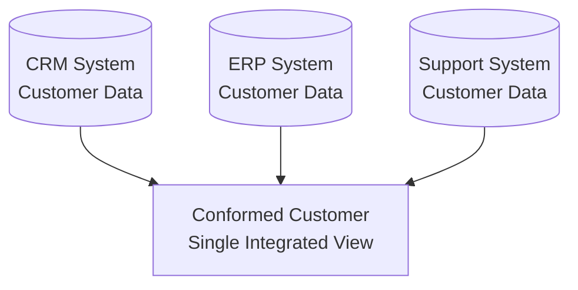

# Conformed Layer

> [!info] Core Concept
> The **Conformed Layer** bridges raw source data and business-ready dimensional models. Think of it as the "data refinement zone" where messy operational data becomes clean, integrated, and analysis-ready.

## Purpose

The Conformed layer serves as a critical transformation point in the data architecture, sitting between the Staging/Intermediate layers and the Dimensional Model (see [[Data Layers and Modeling]]). It provides cleaned, denormalized data that feeds both the Front Room (dimensional modeling) and [[Master Data]] systems.

**Core Transformations:**
- **Data Quality Validation**: Enforce data quality rules and error handling
- **Denormalization**: Flatten normalized structures for query performance
- **Multi-Source Integration**: Merge overlapping entities from different systems
- **History Tracking**: Establish change tracking infrastructure for downstream SCD2 implementation in [[Dimension Tables]]

## Two Table Types: Base vs. Snapshot

The Conformed layer contains two distinct types of tables working in tandem:

| Table Type | Purpose | Rows per Entity | Historical Tracking | Naming Convention | SCD Strategy |
|------------|---------|-----------------|---------------------|-------------------|--------------|
| **Base Tables** | Current state | 1 row (latest version) | ❌ No history | `C_EntityName`<br/>(e.g., `C_Customer`, `C_Product`) | SCD Type 1<br/>(overwrite) |
| **Snapshot Tables** | Historical versions | Multiple rows (all versions) | ✅ ==All columns tracked with SCD Type 2== | `C_EntityName_Snapshot`<br/>(e.g., `C_Customer_Snapshot`, `C_Product_Snapshot`) | ==SCD Type 2 on ALL attributes== |

> [!warning] Key Distinction: Snapshot Tables vs. Dimension Tables
> **Snapshot tables** in the Conformed layer apply SCD Type 2 tracking to ALL columns, every attribute change creates a new version. This differs from [[Dimension Tables]] in the Dimensional Model, which selectively apply SCD strategies:
> - **Snapshot tables**: Pure SCD Type 2 on all attributes—complete historical lineage for downstream flexibility. This type of table is only used in the Conformed layer. 
> - **Dimension tables**: Mix of SCD Type 0 (never changes), SCD Type 1 (overwrite some attributes), and SCD Type 2 (track specific attributes). This type of table is only used in the Dimension/Fact Layer.
> 
> This distinction allows dimensional modelers to choose which attributes require history tracking when building dimensions from snapshot sources.

## Table Types in the Conformed Layer

### Base Tables (Current State)

**Base tables** store the current, cleaned state of entities with denormalization applied. These represent the "as-is now" view of your data.

**Characteristics:**
- One row per entity (current state only)
- Denormalized structure (flattened from source normalized tables)
- Data quality rules enforced
- Multi-source integration applied

**Naming convention:** `C_` prefix + entity name (e.g., `C_Customer`, `C_Product`, `C_Invoice`)

**Example structure:**
```sql
CREATE TABLE C_Customer
(
    CustomerID INT NOT NULL PRIMARY KEY,
    CustomerNumber VARCHAR(20) NOT NULL,
    CustomerName VARCHAR(100) NOT NULL,
    
    -- Embedded address (denormalized)
    AddressLine1 VARCHAR(100),
    City VARCHAR(50),
    StateProvince VARCHAR(50),
    Country VARCHAR(50),
    
    -- Business attributes
    CustomerSegment VARCHAR(20),
    CreditRating VARCHAR(10),
    
    -- Technical columns
    T_CreatedRunId UNIQUEIDENTIFIER NOT NULL,
    T_ModifiedRunId UNIQUEIDENTIFIER NOT NULL,
    T_CreatedDateTime DATETIME NOT NULL,
    T_ModifiedDateTime DATETIME NOT NULL
);
```

**Use cases:**
- Direct querying for current-state analytics
- Feeding [[Master Data]] with latest entity information
- Source for transaction fact tables where historical context isn't critical

### Snapshot Tables (Historical Tracking)

**Snapshot tables** track every version of entity changes over time with SCD Type 2 patterns applied. These capture the "as-was-then" history for accurate temporal analysis.

**Characteristics:**
- Multiple rows per entity (one per version)
- Includes `T_ValidFromDateTime`, `T_ValidToDateTime`, `T_IsCurrent` columns
- All attributes tracked with SCD Type 2: every column change creates a new version==
- Complete historical lineage preserved for downstream dimensional modeling flexibility

**Naming convention:** `C_` prefix + entity name + `_Snapshot` suffix (e.g., `C_Customer_Snapshot`, `C_Product_Snapshot`)

**Example structure:**
```sql
CREATE TABLE C_Customer_Snapshot
(
    CustomerSnapshotID INT NOT NULL PRIMARY KEY,
    CustomerID INT NOT NULL,
    CustomerNumber VARCHAR(20) NOT NULL,
    CustomerName VARCHAR(100) NOT NULL,
    
    -- Embedded address (denormalized)
    AddressLine1 VARCHAR(100),
    City VARCHAR(50),
    StateProvince VARCHAR(50),
    Country VARCHAR(50),
    
    -- Business attributes (tracked over time)
    CustomerSegment VARCHAR(20),
    CreditRating VARCHAR(10),
    
    -- Historical tracking (SCD Type 2)
    T_ValidFromDateTime DATETIME NOT NULL,
    T_ValidToDateTime DATETIME NULL,
    T_IsCurrent BIT NOT NULL,
    
    -- Technical columns
    T_CreatedRunId UNIQUEIDENTIFIER NOT NULL,
    T_ModifiedRunId UNIQUEIDENTIFIER NOT NULL,
    T_CreatedDateTime DATETIME NOT NULL,
    T_ModifiedDateTime DATETIME NOT NULL
);
```

**Use cases:**
- Source for SCD Type 2 dimension tables in the [[Dimension Tables|Dimensional Model]]
- Historical trend analysis and "point-in-time" queries
- Audit trails and compliance reporting
- Understanding how entities evolved over time

> [!tip] When to Create Snapshot Tables
> Not every base table needs a snapshot companion. Create snapshot tables only for entities where:
> - Historical attribute changes matter for analysis (e.g., customer segments, product categories, organizational hierarchies)
> - Downstream dimensions require SCD Type 2 tracking
> - Compliance or audit requirements mandate historical tracking
> 
> Transaction-oriented tables (like `Invoice`, `SalesBudget`) typically don't need snapshots—they're already point-in-time records.

## Key Transformations
### Data Quality Validation
Rules are applied and enforced before data enters this layer. Invalid records are flagged, corrected, or routed to error handling.

**Examples:**
- Email format validation
- Required field checks
- Referential integrity verification
- Business rule enforcement (e.g., OrderDate ≤ ShipDate)
### Denormalization

Raw operational systems store data normalized (for transaction efficiency). The Conformed layer begins flattening these structures.

| Before (Normalized)                         | After (Denormalized)                          |
| ------------------------------------------- | --------------------------------------------- |
| Customer → Address (separate tables)        | Customer with embedded address columns        |
| Product → Category → Subcategory (3 tables) | Product with Category and Subcategory columns |
| Monthly columns (Jan, Feb, Mar...)          | Month + Value rows (unpivoted)                |

**Why?** Denormalized data is faster to query and easier to understand for analysts and downstream dimensional modeling.

### Source System Integration

Multiple source systems often contain overlapping entities. The Conformed layer is where these merge.



**Integration challenges solved:**
- Deduplication across sources
- Standardized naming (e.g., "USA" vs "United States" vs "US")
- Conflict resolution (which source is authoritative?)
- Surrogate key assignment

### History Tracking with Snapshot Tables

The Conformed layer establishes change tracking infrastructure through snapshot tables, which downstream [[Dimension Tables]] consume for SCD Type 2 implementation.

**Example: C_Customer_Snapshot tracking region changes (SCD Type 2 on ALL attributes)**

| CustomerSnapshotID | CustomerID | Name      | Region | T_ValidFromDateTime | T_ValidToDateTime   | T_IsCurrent |
| ------------------ | ---------- | --------- | ------ | ------------------- | ------------------- | ----------- |
| 1001               | 1          | Acme Corp | East   | 2024-01-01 00:00:00 | 2025-03-15 00:00:00 | 0           |
| 1002               | 1          | Acme Corp | West   | 2025-03-15 00:00:00 | NULL                | 1           |

Meanwhile, the base `C_Customer` table would only contain the current record:

| CustomerID | Name      | Region | T_ModifiedDateTime  |
| ---------- | --------- | ------ | ------------------- |
| 1          | Acme Corp | West   | 2025-03-15 00:00:00 |

> [!tip] Why Track Here?
> Implementing snapshotting logic in the Conformed layer (rather than directly in dimensions) provides:
> - **Reusability**: Multiple downstream processes can consume the same historical data without rebuilding tracking logic
> - **Separation of concerns**: History tracking logic separated from dimensional modeling logic
> - **Flexibility**: Base tables for current-state queries, snapshot tables for historical analysis
> - **Performance**: Dimensional models can be rebuilt from snapshots without reprocessing source systems

## Common Use Cases

### Multi-Source Customer Integration
Combine customer records from CRM (sales perspective), ERP (billing perspective), and support systems (service history) into a single, authoritative customer entity.

### Master Data Management
The Conformed layer feeds [[Master Data]] with clean entities ready for business user classification, categorization, and enrichment.

### Historical Trend Analysis
Data scientists and analysts leverage SCD2-tracked entities to understand how attributes changed over time (e.g., customer segments, product categories, organizational structures).

### Audit & Compliance
Traceable data lineage with validation flags ensures regulatory compliance and supports forensic analysis.

## Best Practices

| Practice                                 | Rationale                                                                                         |
| ---------------------------------------- | ------------------------------------------------------------------------------------------------- |
| **Document transformation rules**        | Future maintainers need to understand conformance logic                                           |
| **Consistent naming conventions**        | Use `C_EntityName` for base tables, `C_EntityName_Snapshot` for snapshot tables                   |
| **Quality checks before entry**          | Don't propagate bad data downstream                                                               |
| **Balance denormalization**              | Flatten enough for usability, not so much you lose modeling flexibility                           |
| **Selective snapshotting**               | Only create snapshot tables for entities requiring historical tracking—avoid unnecessary overhead |
| **Synchronize base and snapshot tables** | Ensure base table updates trigger corresponding snapshot inserts when attributes change           |
| **Version control transformations**      | Treat ETL code as critical infrastructure                                                         |
| **Apply DRY principles**                 | Extract reusable transformations into functions/macros—see [[DRY  - Don't Repeat Yourself]] for patterns                   |


> [!warning] Common Pitfalls
> **Over-denormalization**: Don't flatten everything into massive wide tables. You'll lose the modeling flexibility needed for efficient front room design downstream.
> 
> **Over-snapshotting**: Don't create snapshot tables for every entity. Transaction tables, budget tables, and other point-in-time records typically don't need snapshots; they're already historical by nature.

---

## Related Topics

- [[Data Layers and Modeling]] - Overall architecture context
- [[Dimension Tables]] - Downstream consumer of conformed data for dimensional modeling
- [[Fact Tables]] - Downstream consumer of conformed data for dimensional modeling
- [[Master Data]] - Parallel consumer for reference data management
