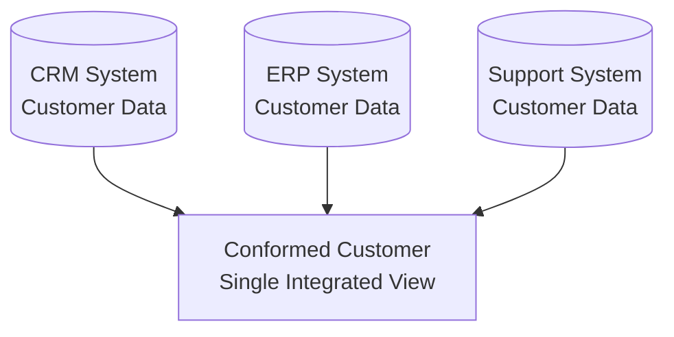

# Conformed Layer

> [!info] Core Concept
> The **Conformed Layer** bridges raw source data and business-ready dimensional models. Think of it as the "data refinement zone" where messy operational data becomes clean, integrated, and analysis-ready.

## Purpose

The Conformed layer serves as a critical transformation point in the data architecture:

**Core Transformations:**
- **Data Quality Validation**: Enforce data quality rules and error handling. 
- **Denormalization**: Flatten normalized structures for query performance. This layer provides a less 'strict' modelling technique. 
- **Multi-Source Integration**: Merge overlapping entities from different systems
- **History Tracking** : Establishing change tracking on attributes ( e.g. `snapshotting` and change tracking). These tables are later used for SCD2 creation in [[Dimension Tables]].

## Table Structure

Conformed layer tables follow consistent patterns for integration and history tracking. ==All conformed tables use integer surrogate keys== as their primary key for consistency with downstream dimensional models.

### Normal Conformed Table

A standard conformed table that overwrites or updates data, maintaining only the current state:

```sql
CREATE TABLE C_Customer
(
    --Primary key (surrogate)
    Customer_SK INT NOT NULL PRIMARY KEY,
    
    --Natural key(s) from source system(s)
    CustomerNumber VARCHAR(20) NOT NULL,
    SourceSystemID INT NOT NULL,
    
    --Integrated attributes from multiple sources
    CustomerName VARCHAR(100) NOT NULL,
    Email VARCHAR(100) NULL,
    PhoneNumber VARCHAR(20) NULL,
    AddressLine1 VARCHAR(100) NULL,
    City VARCHAR(50) NULL,
    StateProvince VARCHAR(50) NULL,
    PostalCode VARCHAR(20) NULL,
    Country VARCHAR(50) NULL,
    
    --Data quality flags
    IsValidated BIT NOT NULL,
    ValidationStatus VARCHAR(50) NULL,
    
    --Audit attributes
    T_CreatedRunId UNIQUEIDENTIFIER NOT NULL,
    T_ModifiedRunId UNIQUEIDENTIFIER NOT NULL,
    T_CreatedDateTime DATETIME NOT NULL,
    T_ModifiedDateTime DATETIME NOT NULL
);
```

**Key characteristics:**
- ==Integer surrogate key (`Customer_SK`)== provides consistent identifier across sources
- Natural keys track source system identifiers for traceability
- Single current version per entity (no historical tracking)
- Updates overwrite existing records (SCD Type 1 pattern)

### Snapshot Conformed Table

A snapshot table captures the full state of an entity at regular intervals, preserving complete history:

```sql
CREATE TABLE C_Customer_Snapshot
(
    --Primary key (surrogate + snapshot date)
    Customer_SK INT NOT NULL,
    SnapshotDate DATE NOT NULL,
    
    --Natural key(s) from source system(s)
    CustomerNumber VARCHAR(20) NOT NULL,
    SourceSystemID INT NOT NULL,
    
    --Integrated attributes (same as normal table)
    CustomerName VARCHAR(100) NOT NULL,
    Email VARCHAR(100) NULL,
    PhoneNumber VARCHAR(20) NULL,
    AddressLine1 VARCHAR(100) NULL,
    City VARCHAR(50) NULL,
    StateProvince VARCHAR(50) NULL,
    PostalCode VARCHAR(20) NULL,
    Country VARCHAR(50) NULL,
    
    --Historical tracking attributes
    T_ValidFromDate DATE NOT NULL,
    T_ValidToDate DATE NULL,  -- NULL for current record
    T_IsCurrent BIT NOT NULL,
    
    --Data quality flags
    IsValidated BIT NOT NULL,
    ValidationStatus VARCHAR(50) NULL,
    
    --Audit attributes
    T_CreatedRunId UNIQUEIDENTIFIER NOT NULL,
    T_ModifiedRunId UNIQUEIDENTIFIER NOT NULL,
    T_CreatedDateTime DATETIME NOT NULL,
    T_ModifiedDateTime DATETIME NOT NULL,
    
    --Composite primary key
    PRIMARY KEY (Customer_SK, SnapshotDate)
);
```

**Key characteristics:**
- ==Integer surrogate key (`Customer_SK`)== combined with `SnapshotDate` forms composite primary key
- Full record inserted for each snapshot period (daily, weekly, monthly)
- Enables point-in-time analysis and trend tracking
- Supports SCD Type 2 creation in downstream [[Dimension Tables]]

### Normal vs. Snapshot Tables

| Aspect | Normal Conformed Table | Snapshot Conformed Table |
|--------|------------------------|--------------------------|
| **Primary Key** | Single integer surrogate key | Composite: Surrogate key + SnapshotDate |
| **History** | Current state only | Full history preserved |
| **Updates** | Overwrites existing records | Inserts new records per snapshot |
| **Storage** | Minimal (one row per entity) | Growing (row per entity per snapshot) |
| **Use Case** | Current integrated view | Historical trend analysis, SCD2 preparation |
| **Change Detection** | Not preserved | All changes visible across snapshots |
| **Query Pattern** | Simple lookups | Time-based filtering required |

> [!tip] Choosing Between Normal and Snapshot
> Use **normal tables** when you only need current state and storage efficiency matters. Use **snapshot tables** when historical trends, point-in-time analysis, or SCD Type 2 downstream dimensions are required. 

## Key Transformations

### Data Quality Validation
==Rules are applied and enforced== before data enters this layer. Invalid records are flagged, corrected, or routed to error handling.

**Examples:**
- Email format validation
- Required field checks
- Referential integrity verification
- Business rule enforcement (e.g., OrderDate ≤ ShipDate)

### Denormalization

Raw operational systems store data normalized (for transaction efficiency). The Conformed layer begins flattening these structures.

| Before (Normalized) | After (Denormalized) |
|---------------------|----------------------|
| Customer → Address (separate tables) | Customer with embedded address columns |
| Product → Category → Subcategory (3 tables) | Product with Category and Subcategory columns |
| Monthly columns (Jan, Feb, Mar...) | Month + Value rows (unpivoted) |

**Why?** Denormalized data is ==faster to query and easier to understand== for analysts and downstream dimensional modeling.

### Source System Integration

Multiple source systems often contain overlapping entities. The Conformed layer is where these merge.



**Integration challenges solved:**
- Deduplication across sources
- Standardized naming (e.g., "USA" vs "United States" vs "US")
- Conflict resolution (which source is authoritative?)
- Surrogate key assignment

### History Tracking

The Conformed layer establishes change tracking infrastructure used by downstream [[Dimension Tables]]. This is implemented through [[#Snapshot Conformed Table|snapshot tables]].

**Example: Customer region change captured in snapshot**

| Customer_SK | SnapshotDate | Name      | Region | T_ValidFromDate | T_ValidToDate | T_IsCurrent |
| ----------- | ------------ | --------- | ------ | --------------- | ------------- | ----------- |
| 1           | 2024-01-01   | Acme Corp | East   | 2024-01-01      | 2025-03-15    | FALSE       |
| 1           | 2025-03-15   | Acme Corp | West   | 2025-03-15      | NULL          | TRUE        |

> [!info] Snapshot Timing
> In practice, snapshots are taken at regular intervals (daily, weekly, or monthly). The `SnapshotDate` represents when the snapshot was captured, while `T_ValidFromDate` tracks when the actual change occurred in the source system. These dates may not align—a change occurring mid-day might be captured in the next scheduled snapshot.

> [!tip] Why Track Here?
> Implementing snapshotting/history tracking logic in the Conformed layer means dimensional models inherit accurate historical context automatically. See [[#Table Structure|Table Structure]] for detailed implementation patterns.

## Common Use Cases

### Multi-Source Customer Integration
Combine customer records from CRM (sales perspective), ERP (billing perspective), and support systems (service history) into a single, authoritative customer entity.

### Master Data Management
The Conformed layer feeds [[Master Data]] with clean entities ready for business user classification, categorization, and enrichment.

### Historical Trend Analysis
Data scientists and analysts leverage SCD2-tracked entities to understand how attributes changed over time (e.g., customer segments, product categories, organizational structures).

### Audit & Compliance
Traceable data lineage with validation flags ensures regulatory compliance and supports forensic analysis.

## Best Practices

| Practice                            | Rationale                                                               |
| ----------------------------------- | ----------------------------------------------------------------------- |
| **Document transformation rules**   | Future maintainers need to understand conformance logic                 |
| **Consistent naming conventions**   | Simplifies cross-source integration and debugging                       |
| **Quality checks before entry**     | Don't propagate bad data downstream                                     |
| **Balance denormalization**         | Flatten enough for usability, not so much you lose modeling flexibility |
| **Version control transformations** | Treat ETL code as critical infrastructure                               |


> [!warning] Common Pitfall
> Don't over denormalize in the Conformed layer. If you flatten everything into massive wide tables, you'll lose the flexibility needed for efficient dimensional modeling downstream.

---

## Related Topics

- [[Data Layers and Modeling]] - Overall architecture context
- [[Dimension Tables]] - Downstream consumer of conformed data for dimensional modeling
- [[Fact Tables]] - Downstream consumer of conformed data for dimensional modeling
- [[Master Data]] - Parallel consumer for reference data management
