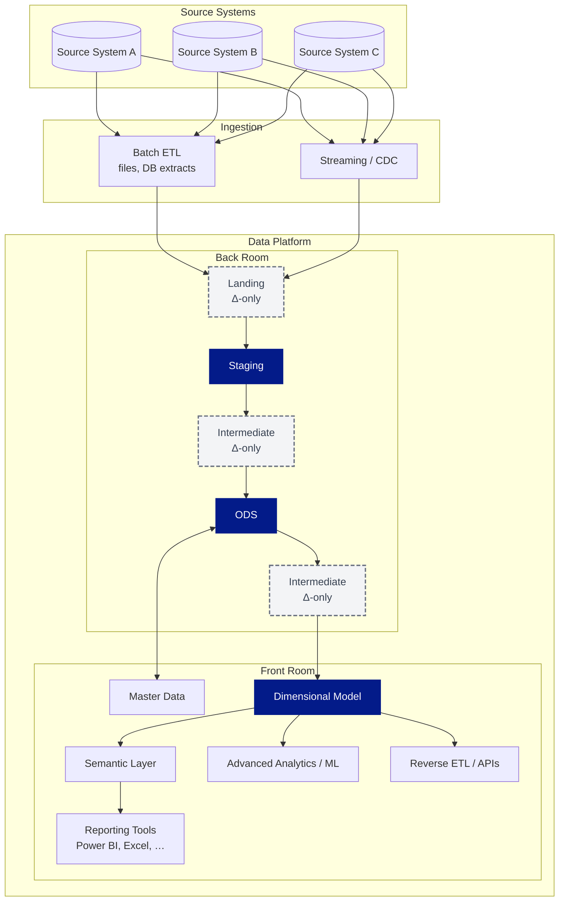
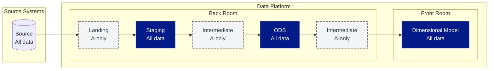

# Data Layers and Modeling - Overview

The graph underneath, shows the normal flow of a best-practice implementation of a Data Platform at projects of Plainsight. 

The flow of data is hence as follows: 

Here we see all data that the information is flowing through. 
1. The **Source** contains all information but is not part of our Data Platform. Read more about sources in [[Data Sources & Data Loading]]
2. **Landing** contains the increments extracted from the source. This includes the newly inserted, modified or deleted records compared to previous ETL run. The data going through landing is then merged into the Staging Layer. 
3. The **Staging** layer contains a replica of the source information. This layer contains a replica of the source after an ETL load. The data in this layer is as close to the source as possible (similar column names, similar table names) and nearly no data corrections are applied here. This layer is used for reloads of data to subsequent layers.
4. The **Intermediate Layers** provide helpful steps to apply changes to the staging and ODS layers such as flattening, filtering, grouping, denormalizing/flattening and more. The intermediary layers can consist of volatile views, of small increments, persisted tables and more. These layer helps split-up the ETL for more modularity, re-use of logic and more. 
5. The **Operational Data Store (ODS)** provides cleaned data with data quality rules applied. This layer is used to more easily integrate different sources, for historical build-up (supporting SCD2 logic in later-on streams) and for increased querying capacity to address difficult business questions. This layer is not meant for querying by the business as data is organised in a somewhat normalized manner. This layer can be used by more experienced data engineers and data analysts. Read more about this layer in [[Operational Data Store]]. 
6. The **Dimensional Model** provides data in facts and dimensions. This layer is optimized for fast querying, easy to explore by business users and ideal for use in reporting tools. Read more about this layer in [[Dimensional Modeling]]. 

# Hybrid Hub-and-Spoke and Kimball Architecture

Our preferred approach is referenced in Ralph Kimball's 'The Data Warehouse Toolkit' as a **Hybrid Hub-and-Spoke and Kimball Architecture**.

![[Hybrid Hub-and-Spoke and Kimball Architecture.png]]

Following is mentioned in the book in Chapter 1: 
> Some proponents of this blended approach claim it’s the best of both worlds. Yes, it
blends the two enterprise-oriented approaches. It may leverage a preexisting investment
in an integrated repository, while addressing the performance and usability
issues associated with the 3NF EDW by offloading queries to the dimensional presentation
area. And because the end deliverable to the business users and BI applications
is constructed based on Kimball tenets, who can argue with the approach?

This hybrid approach is preferred above a 'Dimensional Model Only' architecture due to following reasons: 
* The Back Room tables provide more flexibility for integration to other sources, history build-up and more. 
* The Back Room tables provides an easier way to fill the dimensional model. 
* As data platforms now separate storage and compute, an additional copy of the data has a low impact on the infrastructure cost. 
* For more advanced AI and Data Science use cases, this Back Room is preferred over the Front Room. 
* Levering AI-supported ETL development easily aids in the delivery of both the Front- and Back Room. 

