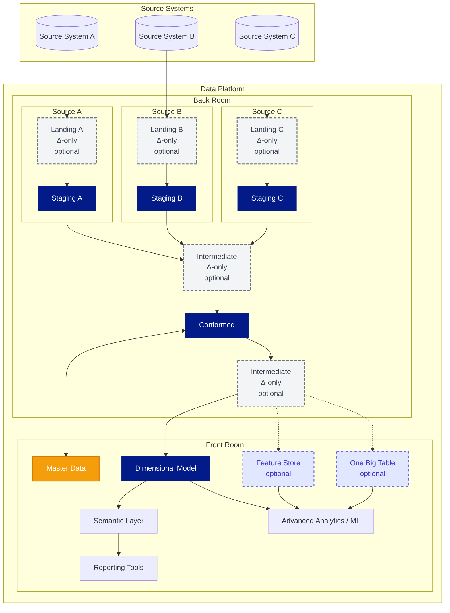
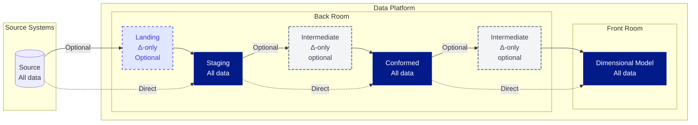
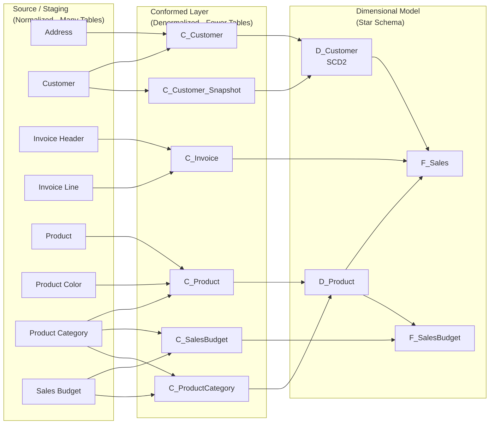

	
# Data Layers and Modeling - Overview

The graph underneath, shows the normal flow of a best-practice implementation of a Data Platform at projects of Plainsight. 

The typical flow of data is hence as follows: 

Here we see all data that the information is flowing through. 
1. The **Source** contains all information but is not part of our Data Platform. Read more about sources in [[Data Sources & Data Loading]]

2. **Landing (Optional)** contains the increments extracted from the source or external tables populated by ingestion tools. This layer is useful when:
   - External tools (Fabric Pipelines, Databricks Lakeflow Connect, replication, ...) populate external tables
   - Incremental-only data needs preprocessing before merging into staging
   - Raw files (JSON, Parquet) require parsing before staging
   - Change data capture (CDC) streams need transformation
   
> [!tip] The 'Landing' layer can be skipped when no intermediary steps are required to fill 'Staging'
   
4. The **Staging** layer contains a replica of the source information. This layer contains a replica of the source after an ETL load. The data in this layer is as close to the source as possible (similar column names, similar table names) and nearly no data corrections are applied here. This layer is used for reloads of data to subsequent layers. Read more in [[Landing and Staging]].

5. The **Intermediate Layers** provide helpful steps to apply changes to the staging and Conformed layers such as flattening, filtering, grouping, denormalizing/flattening and more. The intermediary layers can consist of volatile views, of small increments, persisted tables and more. These layer helps split-up the ETL for more modularity, re-use of logic and more. 
   
> [!tip] The 'Intermediate' layer can be skipped when no intermediary steps are required to fill 'Conformed' or 'Front Room' layers
   
5. The **Conformed** layer provides cleaned data with data quality rules applied and initial denormalization. Tables are unpivoted, making the data more accessible while still allowing for further business-friendly modeling. This layer is used to integrate different sources, for historical build-up (supporting SCD2 logic in later-on streams), and for increased querying capacity to address business questions. This is the ideal phase to feed Master Data Services (MDS). This layer can be used by experienced data engineers and data analysts. Read more about this layer in [[Conformed Layer]]. 

6. The **Front Room** provides business-optimized data structures for reporting, analytics, and machine learning:
   - **Star - Dimensional Model** (Facts & Dimensions): Star schema optimized for fast querying and business user exploration. Read more in [[Dimension Tables]] and [[Fact Tables]].
   - **Master Data**: Operational database for business-maintained reference data, budgets, and classifications that enriches the data platform. Read more in [[Master Data]].
   - **One Big Table (OBT)**: Fully denormalized wide table for simplified access and specific analytical use cases.
   - **Feature Store**: Curated features for machine learning model training and inference. 

# Architecture Philosophy

Our layered architecture approach balances flexibility with performance, inspired by industry best practices while adapted to modern cloud data platforms.

## Why Multiple Layers?

This multi-layered approach is preferred over a 'Dimensional Model Only' architecture for several key reasons:

* **Flexibility for integration**: The Back Room layers (Staging, Conformed) provide multiple integration points for diverse source systems and historical data build-up.
* **Easier dimensional modeling**: Having clean, conformed data makes it significantly easier to build and maintain dimensional models.
* **Cost efficiency**: Modern data platforms separate storage and compute, making additional data layers low-cost while providing significant value.
* **Advanced analytics support**: For AI, Data Science, and ML use cases, the Back Room's more granular and flexible structure is often preferred over the Front Room's optimized dimensional model.
* **AI-assisted development**: Leveraging AI-supported ETL development tools works efficiently with both Back Room and Front Room layers, accelerating delivery.
* **Source system isolation**: Keeping Landing and Staging per source system maintains clear data lineage and simplifies troubleshooting.
* **Progressive transformation**: The Intermediate layers enable modular, reusable transformations that can be tested and maintained independently.

## Layer-by-Layer Transformation Example

To illustrate how data transforms across layers, let's follow a typical e-commerce scenario from Source/Staging through Conformed to Dimensional Model.

**Transformation flow:**
- **Source/Staging (8 tables)**: Normalized structure with `Customer`, `Address`, `Invoice Header`, `Invoice Line`, `Product`, `Product Color`, `Product Category`, `Sales Budget`
- **Conformed Layer (6 tables)**: Denormalized into `C_Customer` (Customer + Address), `C_Customer_Snapshot` (history tracking from Customer), `C_Product` (Product + Color + Category), `C_ProductCategory` (aggregated product categories from Sales Budget), `C_Invoice` (Invoice Header + Lines), `C_SalesBudget` (budget targets from Sales Budget and Product Category)
- **Dimensional Model (4 tables)**: Star schema with 2 facts (`F_Sales`, `F_SalesBudget`) and 2 dimensions (`D_Customer`, `D_Product` merging both detail and category levels)

> [!tip] Progressive Denormalization
> Notice the progressive reduction in table count as data moves through layers:
> - **Staging**: 8 tables with complex relationships
> - **Conformed**: 6 tables with denormalization, history tracking (`C_Customer_Snapshot`), business categorization (`C_ProductCategory`), and budgets (`C_SalesBudget`)
> - **Dimensional**: 2 fact tables + 2 dimension tables in star schema
> 
> Key insight: `D_Product` merges both `C_Product` (detail level with individual products) and `C_ProductCategory` (aggregate category level) into a single dimensional hierarchy. This allows both `F_Sales` (detailed transactions at product level) and `F_SalesBudget` (aggregated budgets at category level) to share the same dimension, enabling actual vs. budget comparisons across the product hierarchy.
---

## Related Topics

- [[Data Sources & Data Loading]] - How data enters the platform
- [[Conformed Layer]] - Critical transformation layer between Back Room and Front Room
- [[Dimension Tables]] - Star schema dimension design patterns
- [[Fact Tables]] - Star schema fact table design patterns  
- [[Master Data]] - Operational database for business-maintained reference data
