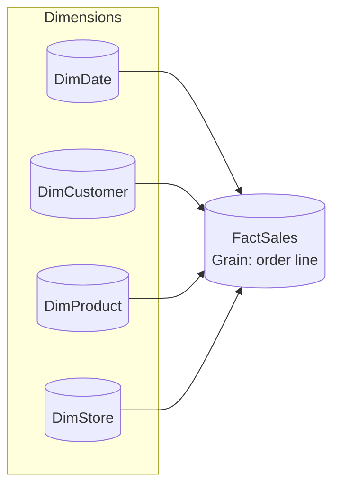
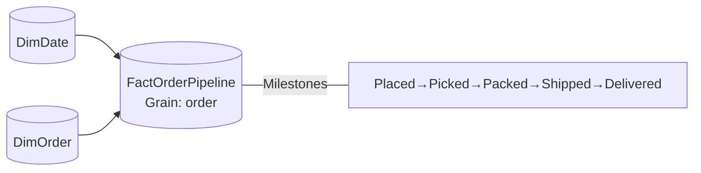

# Data Modeling (Kimball‑first)

**Overview**  
Model for analytics using **dimensional modeling** by default. Favor **star schemas**, conformed dimensions, and clear grain. Use conceptual → logical → physical as needed, but keep the deliverable simple, fast, and explainable.

## Core principles

- **Business-first**: start from the questions/metrics and define fact grain up front.
- **Kimball preference**: star schemas by default; snowflake only with a concrete, measured need.
- **Simplicity over cleverness**: fewer tables, clearer names, single-direction filters.
- **Surrogate keys**: integer SKs for dimensions; natural keys stored as attributes.
- **Time intelligence ready**: dedicated Date/Time dimensions; mark and relate properly.
- **Type changes**: SCD1 for corrections, SCD2 for history that users analyze.
- **Separation of concerns**: ingestion brings data in; modeling shapes it for use.
    
## Do
- Define **fact types** explicitly: Transaction, Periodic Snapshot, Accumulating Snapshot.
- Pick **one grain** per fact and stick to it (e.g., order line, daily inventory).
- Use **conformed dimensions** across facts (Customer, Product, Date, Store...).
- Keep relationships **single-direction**; avoid many‑to‑many unless bridged.
- Keep **business logic** in measures/views, not in ingestion jobs.
- Document **assumptions, grain, SCD strategy, and data contracts** per model.
    

## Don’t
- Don’t build an **OBT (One Big Table)** for convenience; it blocks reuse and worsens performance.
- Don’t snowflake **by default**; normalize only when it materially cuts duplication and cost.
- Don’t mix **operational** OLTP patterns into the analytics layer.
- Don’t change dimension keys when attributes change; use **SCD** instead.
- Don’t rely on **bi‑directional** relationships unless a reviewed exception.

## Model layers (when helpful)
- **Conceptual**: business entities and relationships; no tech constraints.
- **Logical**: attributes, keys, and relationships; still tech‑agnostic.
- **Physical**: actual tables/columns/keys/partitions in the platform.
    

## Dimensional patterns (preferred)
- **Star Schema** (default): one fact at a clear grain with surrounding dimensions. Best for most analytics.
- **Snowflake Schema** (rare): normalize a large, sparse dimension to reduce duplication.
- **Galaxy/Constellation**: multiple facts sharing conformed dimensions.
    

## SCD guidance
- **SCD1** (overwrite): fixes errors or non‑analytical changes.
- **SCD2** (row‑version): add `ValidFrom/ValidTo/IsCurrent`; use for attributes users analyze over time.
- Use **degenerate dimensions** for order numbers, invoice IDs, etc.
    

## Many‑to‑many & hierarchies
- Use **bridge tables** or **factless facts** for coverage (e.g., students ↔ classes, promos ↔ products).
- Model **parent‑child** or ragged hierarchies in a separate helper (path or bridge) if needed.

## Practical examples

### Star schema with conformed dimensions



### Accumulating snapshot (example)



### Bridge for many‑to‑many

```mermaid
flowchart LR
  P[(DimProduct)] --*|ProductPromoBridge| B((Bridge))
  R[(DimPromotion)] --* B
  F[(FactSales)] --- B
```

## Naming & keys

- Tables: **singular** nouns (`DimProduct`, `FactSales`).
- Surrogate keys: `ProductKey` (int); natural keys as attributes (`ProductCode`).
- Date keys: `DateKey` as integer `YYYYMMDD`.
- Measures live with their subject area; avoid calculated columns for aggregations.

## When Kimball isn’t enough

- **Data Vault** for volatile sources and audit‑heavy integration (in a separate layer). Expose **Kimball stars** to users.
- **Relational/3NF** remains for OLTP, not for analytics consumption.

## Modeling tools (optional)

Use any diagramming tool that supports ER and star schema notation. Consistency > brand.

## Notes & exceptions
- Snowflake dimensions need a clear size/maintenance benefit; otherwise **flatten**.
- Many facts at different grains? Consider separate stars and a **conformed Date** (and other shared dims).
- If a shared dimension explodes in size or sparsity, split it by context (e.g., Customer vs. Account) with clear conformance rules.