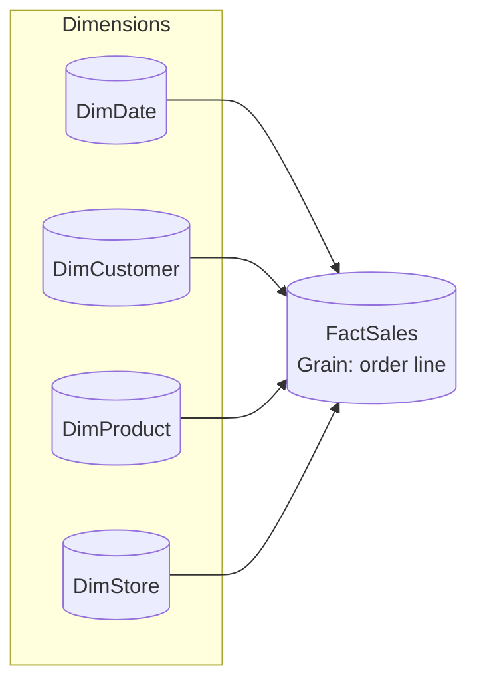
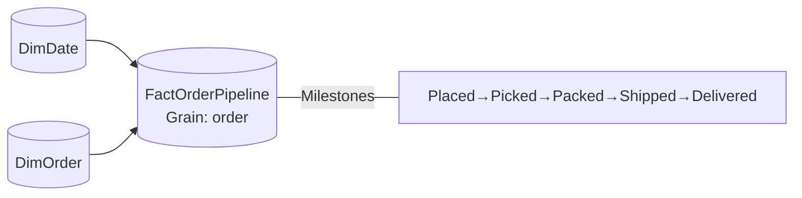

# Dimensional Modeling

You're early! We're still working on this chapter. Come back in a few weeks. :-)

This is a placeholder. 

%%
## Core principles
  
- **Business-first**: start from the questions/metrics and define fact grain up front.
- **Simplicity over cleverness**: fewer tables, clearer names, one-to-many relationships. 
- **Surrogate keys**: integer SKs for dimensions; natural keys stored as attributes.
- **Type changes**: SCD1 for corrections, SCD2 for history that users analyze.
## Do
- Pick **one grain** per fact and stick to it (e.g., order line, daily inventory).
- Use **conformed dimensions** across facts (Customer, Product, Date, Store...).
- Document **assumptions, grain, SCD strategy, and data contracts** per model.
## Don’t
- Don’t mix **operational** OLTP patterns into the analytics layer.
- Don’t change dimension keys when attributes change; use **SCD** instead.

## Dimensional patterns (preferred)
- **Star Schema** (default): one fact at a clear grain with surrounding dimensions. Best for most analytics.
  
## SCD guidance
- **SCD1** (overwrite): fixes errors or non‑analytical changes.
- **SCD2** (row‑version): add `ValidFrom/ValidTo/IsCurrent`; use for attributes users analyze over time.
- Use **degenerate dimensions** for order numbers, invoice IDs, etc.

 ## Practical examples
## Star schema with conformed dimensions

  

## Accumulating snapshot (example)

  

 
## Naming & keys
- Tables: **singular** nouns (`DimProduct`, `FactSales`).
- Surrogate keys: `ProductKey` (int); natural keys as attributes (`ProductCode`).
- Date keys: `DateKey` as integer `YYYYMMDD`.
- Measures live with their subject area; avoid calculated columns for aggregations.
