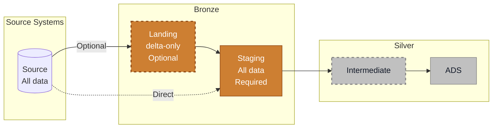

# Landing and Staging Layers

> [!info] Purpose
> Landing and Staging form the Bronze entry point of your data platform. **Landing** is optional (delta-only preprocessing), while **Staging** is required (full replica of source data).

## Overview

These layers bring source data into your platform with minimal transformation, preserving source fidelity while preparing for downstream integration.

## Landing Layer (Optional)

**Purpose:** Preprocess incremental data before merging into staging.

**Data pattern:** Delta-only (increments, changes, new records)

**When to use:**
- External ingestion tools populate external tables (e.g., replication tools, data connectors)
- Incremental CDC streams need preprocessing before full history build
- Raw files require parsing (JSON, Parquet, XML)
- Source data needs filtering or light transformation before staging

**When to skip:**
- Source is directly queryable without preprocessing
- No external tools; direct database connections work
- Simple incremental patterns can be handled in staging

### Landing Characteristics

| Aspect              | Details                              |
| ------------------- | ------------------------------------ |
| **Data Volume**     | Incremental only                     |
| **Transformation**  | Minimal: parse, flatten, filter      |
| **Materialization** | External tables, views, or ephemeral |
| **Naming**          | `lnd_<source>_<entity>`              |
| **Retention**       | Short-term or transient              |

### Common Landing Patterns

**1. External tables from ingestion tools**
- Replication tools land data as external tables
- Landing layer filters deleted records, adds metadata
- Staging merges increments into full history

**2. Raw file parsing**
- Object storage contains JSON/Parquet/CSV files
- Landing parses and flattens nested structures
- Staging consolidates parsed data

**3. CDC stream preprocessing**
- Change streams capture INSERT/UPDATE/DELETE operations
- Landing captures operations with sequence tracking
- Staging applies CDC logic to build full state

> [!tip] Start Without Landing
> Most projects don't need landing initially. Add it only when preprocessing complexity (external tools, file parsing, CDC) justifies the extra layer.

## Staging Layer (Required)

**Purpose:** Stable, source-aligned replica with full history.

**Data pattern:** All data (complete history after ETL load)

**Key principle:** Staging contains a replica of source data after ETL processing. Data is as close to the source as possible - similar column names, similar table names, minimal corrections. This layer enables reloads to subsequent layers without hitting source systems again.

### Staging Characteristics

| Aspect | Details |
|--------|---------|
| **Data Volume** | All data (full history) |
| **Transformation** | Minimal - rename, cast, light cleaning |
| **Materialization** | Views or tables |
| **Naming** | `stg_<source>_<entity>` |
| **Retention** | Long-term (foundation for downstream) |

### Why Staging Matters

**Single source of truth:** Downstream layers reference staging, not raw sources; consistent data access across the platform.  
**Reprocessing capability:** Rebuild ADS/dimensional layers from staging without impacting source systems.  
**Testing entry point:** Data quality checks start here: catch bad data before propagation.  
**Source isolation:** Each source system gets its own staging area - clear lineage and simplified troubleshooting.  

---
## Related Pages

- [[Data Layers and Modeling]]: Full data platform architecture overview
- [[Data Sources & Data Loading]]: Source system integration patterns
- [[Analytical Data Store (ADS)]]: Next transformation step after staging
---
