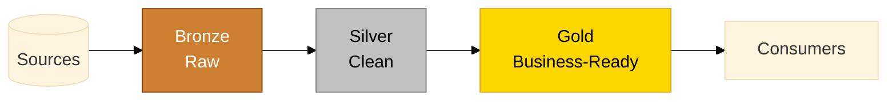
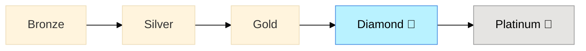
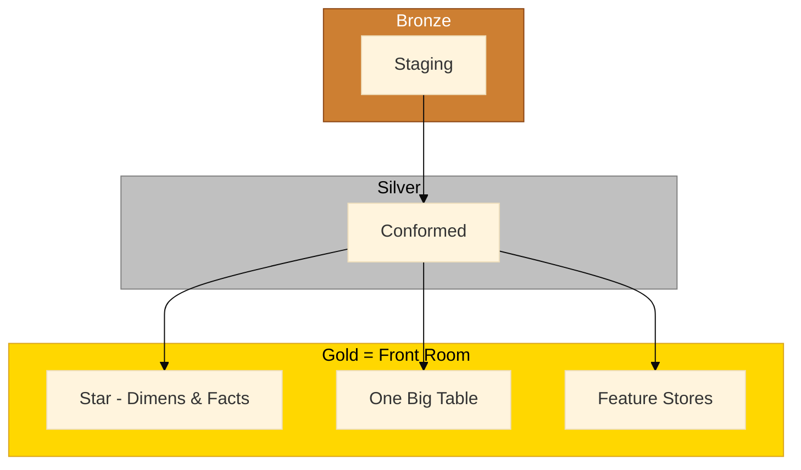

# Medallion Architecture - Bronze, Silver, Gold

> [!info] Overview
> Medallion architecture (Bronze → Silver → Gold) is a popular pattern for organizing data by quality tier. At Plainsight, we prefer the more explicit layering approach described in [[Data Layers and Modeling]] because Medallion's boundaries are often ambiguous and lead to layer proliferation (Diamond, Platinum, etc.).

## Why We Prefer Explicit Layering

**Problems with Medallion:**

1. **Ambiguous boundaries**: Where does deduplication belong; Bronze or Silver? What about type conversions?
2. **Layer proliferation**: Teams add Diamond, Platinum, Titanium layers when three tiers don't fit. 
3. **Endless debates**: "Is this Silver or Gold work?" wastes time. 
4. **Metaphorical names**: Bronze/Silver/Gold lack semantic meaning.

**Our approach uses semantic names** (Landing, Staging, Conformed, Front Room) with clear responsibilities per layer.  

## Detailed Mapping

Following maps our [[Data Layers and Modeling]] to the different layers. Stick to 'Bronze, Silver, Gold' and map the 'Gold' to the `Front Room` layers

---
## Related Pages

- [[Data Layers and Modeling]]: Our preferred approach
- [[Landing and Staging]]: Bronze equivalent
- [[Conformed Layer]]: Silver equivalent
- [[Star - Dimension Tables]] & [[Star - Fact Tables]]: Gold equivalent

> [!tip] Bottom Line
> Medallion works for simple cases, but semantic layer names (Landing/Staging/Conformed/Front Room) prevent ambiguity and layer proliferation in complex implementations.
