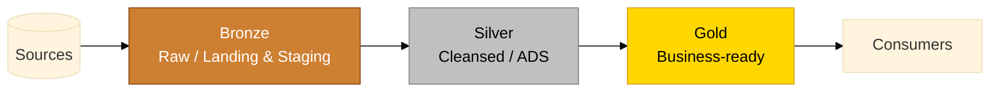
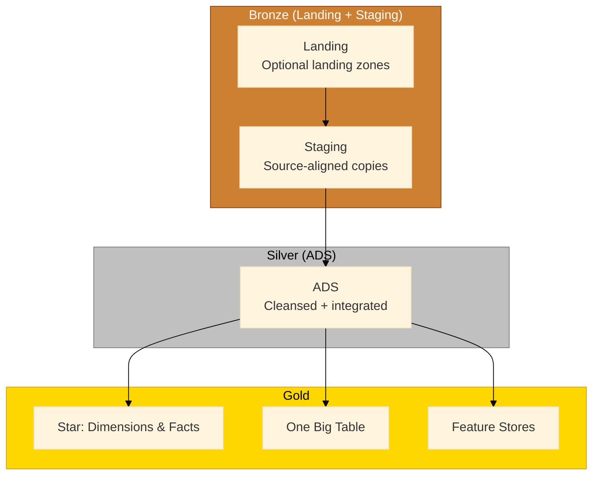

# Medallion Architecture - Bronze, Silver, Gold

> [!info] Overview
> Plainsight uses the Medallion pattern as a shared language (Bronze -> Silver -> Gold) while keeping our semantic layer names for clarity (Landing/Staging -> ADS -> Gold business products). Medallion names keep us aligned with platform defaults; semantic names keep responsibilities explicit.

## How We Use Medallion at Plainsight

- **Bronze = Landing + Staging (raw, auditable)**  
  Land data as-is, keep history, and isolate by source. Light parsing only when required for ingestion.
- **Silver = ADS (cleansed, conformed, historical)**  
  Apply quality rules, integrate sources, denormalize for usability, and create SCD-ready snapshots.
- **Gold (Dims/Facts, OBT, Feature Store)**  
  Publish business-ready products: dimensional stars (facts + dimensions), one-big-tables, semantic views, and curated features.

The Dim/Fact, ADS, Staging, and Landing layers remain the canonical implementation. Use Medallion terms as friendly aliases so teams can align quickly with tooling and vendor language without losing precision.

## Responsibilities by Layer

| Medallion | Plainsight layer(s) | What happens here | Typical outputs |
|-----------|---------------------|-------------------|-----------------|
| Bronze | Landing + Staging | Preserve raw data with auditability; minimal transformation; per-source isolation | Raw Delta/Parquet tables with audit columns |
| Silver | ADS | Data quality checks, conformance, source integration, progressive denormalization, optional SCD snapshots | `ADS_*` base tables, `ADS_*_Snapshot` history tables |
| Gold | Gold business products | Business modeling and products | Star schemas (Dims/Facts), OBTs, feature sets, semantic views |

## Working With Both Naming Sets

- Use **Bronze/Silver/Gold** when coordinating with platforms, partners, or UI defaults.
- Use **Landing/Staging, ADS, Gold business products** when documenting responsibilities or writing code.
- Tag schemas, jobs, and storage paths with both when it helps discoverability (`layer=ads`, `medallion=silver`).

> [!tip] Avoid layer sprawl
> Stick to Bronze, Silver, and Gold. If you need intermediate logic, model it as views or transient steps inside the nearest layer instead of inventing new metals.

## Recommended Flow

## Practices That Keep Medallion + Semantic Layers in Sync

- Keep quality gates explicit at each transition (Bronze -> Silver, Silver -> Gold).
- Preserve reloadability: Landing/Staging is the recovery point for rebuilding Silver/Gold.
- Centralize SCD2 tracking in ADS snapshots; keep Gold focused on business modeling.
- Publish Gold products that hide upstream complexity from consumers.
- Document both the Medallion alias and the semantic layer name for every dataset.

---
## Related Pages

- [[Data Layers and Modeling]]: End-to-end architecture
- [[Landing and Staging]]: Bronze equivalent
- [[Analytical Data Store (ADS)]]: Silver equivalent
- [[Star - Dimension Tables]] and [[Star - Fact Tables]]: Gold equivalents
