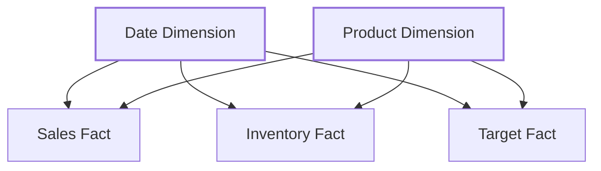
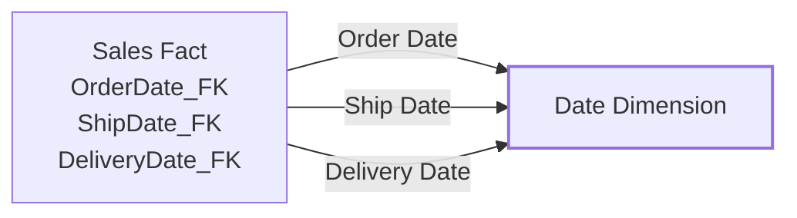

# Dimension Tables

> [!info] Core Concept
> Dimension tables describe the **who, what, where, when, and why** of your business. They provide context for the numeric measures stored in [[Fact Tables]], enabling analysts to filter, group, and slice data meaningfully.

## Structure Overview

A well-designed dimension table follows industry best practices:

```sql
CREATE TABLE D_Salesperson
(
    --Surrogate key
    Salesperson_SK INT NOT NULL,
    
    --Natural key(s) / Business key(s)
    EmployeeID VARCHAR(20) NOT NULL,
    
    --Dimension attributes
    FirstName VARCHAR(20) NOT NULL,
    LastName VARCHAR(50) NOT NULL,
    Email VARCHAR(100) NOT NULL,
    PhoneNumber VARCHAR(20) NULL,
    
    --Foreign key(s) to other dimensions
    SalesRegion_FK INT NOT NULL,
    DataSource_FK INT NOT NULL, 
    
    --Historical tracking attributes (SCD type 2)
    T_ValidFromDateTime DATETIME NOT NULL,
    T_ValidToDateTime DATETIME NULL, -- Defaults to NULL when T_IsCurrent = 1
    T_IsCurrent BIT NOT NULL,
    
    --Audit attributes
    T_CreatedRunId UNIQUEIDENTIFIER NOT NULL,
    T_ModifiedRunId UNIQUEIDENTIFIER NOT NULL,
    T_CreatedDateTime DATETIME NOT NULL,
    T_ModifiedDateTime DATETIME NOT NULL
);
```

## Key Components

### Surrogate Keys

==Always use surrogate keys== as the primary key for dimension tables. A surrogate key is a system-generated, single-column **integer** unique identifier.

For complete details on key design principles, see [[Surrogate, Primary & Foreign Keys]].

**Why surrogate keys for dimensions:**
- Enables [[Slowly Changing Dimensions]] (SCD Type 2) for historical tracking
- Consolidates multiple data sources without identifier conflicts
- Simplifies multi-column natural keys into efficient single-column keys
- Insulates the data warehouse from source system changes

> [!warning] Exception: Date & Time Dimensions
> Date dimensions should use `YYYYMMDD` format (e.g., `20251028`) as the surrogate key. This is human-readable, sortable, and conforms to ISO 8601 standards.

### Natural Keys (Business Keys)
The **natural key** (or business key) is the identifier from the source system. Store this to maintain traceability and enable ETL lookups.

**Example:** `EmployeeID`, `ProductCode`, `CustomerNumber`

Don't use natural keys as primary keys → They can change, clash across sources, or be multi-column.

### Dimension Attributes
Dimension attributes provide the descriptive context used for filtering and grouping in analytical queries.

**Common attributes:**
- Text columns: `FirstName`, `CategoryName`, `Region`
- Numeric codes: `ProductSize`, `Priority`
- Flags: `IsActive`, `IsPreferred`

> [!tip] Discovering Attributes
> Listen for the word **"by"** in conversations: "analyze sales **by** salesperson, **by** month, **by** product category" → These are your dimension attributes!

### Technical Columns (Historical Tracking & Audit)

Dimension tables include technical columns for version tracking (SCD Type 2) and data lineage:

| Attribute             | Purpose                                                                 | Example                                                                            |
| --------------------- | ----------------------------------------------------------------------- | ---------------------------------------------------------------------------------- |
|                       | ==**SCD Type 2 **==                                                     |                                                                                    |
| `T_ValidFromDateTime` | Start datetime of version validity                                      | `1900-01-01 00:00:00` (initial load)<br>`2025-03-15 14:30:00` (subsequent version) |
| `T_ValidToDateTime`   | End datetime of version validity. This is 'excluding' this millisecond. | `NULL` (current record)<br>`2025-03-15 14:30:00` (expired record)                  |
| `T_IsCurrent`         | Flag indicating current version                                         | `1` (TRUE - current)<br>`0` (FALSE - historical)                                   |
|                       | ==**Audit & Lineage **==                                                |                                                                                    |
| `T_CreatedRunId`      | GUID identifying the ETL run that created the record                    | `A7B3C5D8-1234-5678-90AB-CDEF12345678`                                             |
| `T_ModifiedRunId`     | GUID identifying the ETL run that last modified the record              | `A7B3C5D8-1234-5678-90AB-CDEF12345678`                                             |
| `T_CreatedDateTime`   | Timestamp when the record was created                                   | `2025-01-15 08:30:00`                                                              |
| `T_ModifiedDateTime`  | Timestamp when the record was last modified                             | `2025-03-15 14:30:00`                                                              |

**SCD Type 2 patterns:**
- **Initial load**: Set `T_ValidFromDateTime = '1900-01-01 00:00:00'` to ensure all historical fact records can join to the dimension, regardless of transaction date
- **New versions**: When creating a new version, set `T_ValidFromDateTime` to the exact datetime when the change occurred
- **Current records**: Set `T_ValidToDateTime = NULL` and `T_IsCurrent = 1` (never use far-future dates like `9999-12-31`)
- **Expired records**: When closing a version, set `T_ValidToDateTime` to the exact datetime when the change occurred and `T_IsCurrent = 0`

**Audit & lineage patterns:**
- Use `UNIQUEIDENTIFIER` (GUID) run IDs to trace records back to specific ETL execution logs for debugging and lineage tracking
- The datetime columns provide human-readable timestamps for audit trails and troubleshooting
- On initial creation: `T_CreatedRunId = T_ModifiedRunId` and `T_CreatedDateTime = T_ModifiedDateTime`
- On updates (SCD Type 1): Update `T_ModifiedRunId` and `T_ModifiedDateTime` only
- On new versions (SCD Type 2): New record gets new `T_CreatedRunId` and `T_CreatedDateTime`; old record gets updated `T_ModifiedRunId` and `T_ModifiedDateTime`

## Slowly Changing Dimensions (SCD)

Manage historical changes with three primary strategies:

### SCD Type 1: Overwrite

**Update existing row—no history preserved.**

**Before Update:**

| Salesperson_SK | Name       | Phone    |
| -------------- | ---------- | -------- |
| 101            | John Smith | 555-1234 |

**After Update:**

| Salesperson_SK | Name       | Phone        |
| -------------- | ---------- | ------------ |
| 101            | John Smith | ==555-9999== |

**Use for:**
- Attributes that don't require historical tracking (phone number, email)
- Error corrections
- Most changing attributes

⚠️ **Impact:** Historical aggregations change retroactively; as if the new value was always true.

### SCD Type 2: Track History

**Insert new version row with validity dates.**

**Before Change:**

| Salesperson_SK | Name          | Region    | T_ValidFromDateTime | T_ValidToDateTime | T_IsCurrent |
| -------------- | ------------- | --------- | ------------------- | ----------------- | ----------- |
| 101            | Lynn Tsoflias | Australia | 2023-01-01 00:00:00 | NULL              | 1           |

**After Change (Region Transfer to United Kingdom):**

| Salesperson_SK | Name           | Region            | T_ValidFromDateTime | T_ValidToDateTime   | T_IsCurrent |
| -------------- | -------------- | ----------------- | ------------------- | ------------------- | ----------- |
| 101            | Lynn Tsoflias  | Australia         | 2023-01-01 00:00:00 | 2025-03-15 14:30:00 | ==0==       |
| ==102==        | Lynn Tsoflias  | ==United Kingdom== | ==2025-03-15 14:30:00== | NULL                | ==1==       |

**Operations:**
1. **UPDATE** existing record (SK 101): Set `T_ValidToDateTime = '2025-03-15 14:30:00'` and `T_IsCurrent = 0`
2. **INSERT** new record (SK 102): New surrogate key with updated region, `T_ValidFromDateTime = '2025-03-15 14:30:00'`, `T_ValidToDateTime = NULL`, `T_IsCurrent = 1`

**Use for:**
- Attributes requiring accurate historical context (region, manager, status)
- Audit and compliance requirements

✅ **Benefit:** Historical aggregations remain accurate—sales attributed to the region where the salesperson worked at that time.

> [!tip] Label Attribute for SCD Type 2
> Include a human-readable label combining key attributes and version context:
> - `"Lynn Tsoflias (Australia)"` (old version)
> - `"Lynn Tsoflias (United Kingdom)"` (current version)

> [!warning] Balance Usability vs. Accuracy
> Too many SCD Type 2 changes create overwhelming version counts. If an attribute changes frequently, consider storing it in the [[Fact Tables]] instead.

### ADS Dimensions

**ADS dimensions** are shared across multiple fact tables, ensuring consistency and reducing redundancy.



**Examples:** Date, Product, Customer, Geography

Design ADS dimensions with attributes relevant to ALL related fact tables.

### Role-Playing Dimensions

**One physical dimension referenced multiple times** in a fact table with different meanings.



**Other examples:** Airport (Departure/Arrival), Geography (Billing/Shipping Address)

### Degenerate Dimensions

**Dimension attribute stored directly in fact table** (no separate dimension table).

**Example:** `OrderNumber`, `InvoiceNumber`, `TransactionID`

**Why?** When the dimension is at the same grain as the fact and has no additional attributes or hierarchy.

## Special Dimension Members

Include rows representing data quality states:

| Surrogate Key | Meaning  | Use Case                        |
| ------------- | -------- | ------------------------------- |
| `-1`          | _Unknown | Lookup failure during fact load |
| `-2`          | _N/A     | Not applicable                  |


## Related Topics

- [[Fact Tables]] - Numeric measures that dimensions provide context for
- [[Surrogate, Primary & Foreign Keys]] - Key design principles and best practices
- [[Data Layers and Modeling]] - Where dimensions fit in the architecture
- [[Analytical Data Store (ADS)]] - Source of cleaned, denormalized data for dimension loading
- [[Master Data]] - Operational database for user-maintained reference data

---

## Sources

This guide is based on dimensional modeling principles from:

**Ralph Kimball & Margy Ross, [*The Data Warehouse Toolkit: The Definitive Guide to Dimensional Modeling*](https://www.kimballgroup.com/data-warehouse-business-intelligence-resources/books/data-warehouse-dw-toolkit/) (3rd Edition, Wiley, 2013)**

Kimball's dimensional modeling methodology remains the industry standard for designing data warehouses optimized for business intelligence and analytics. This book provides comprehensive coverage of dimension table design patterns, slowly changing dimensions, and star schema architecture.

Additional practices adapted from Plainsight's real-world implementation experience with modern cloud data platforms.
