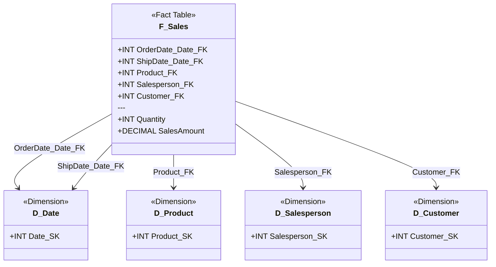

# Fact Tables

> [!info] Core Concept
> Fact tables store **numeric measurements** (the "facts") of business events and processes. They contain the quantitative data you analyze—sales amounts, quantities, balances, temperatures—within the context provided by [[Dimension Tables]].

## Structure Overview

A well-designed fact table follows industry best practices:

```sql
CREATE TABLE F_Sales
(
    --Dimension keys (surrogate)
    OrderDate_Date_FK INT NOT NULL,
    ShipDate_Date_FK INT NOT NULL,
    Product_FK INT NOT NULL,
    Salesperson_FK INT NOT NULL,
    Customer_FK INT NOT NULL,
    
    --Business keys (natural keys from source systems)
    OrderDate_BK DATE NOT NULL,
    ShipDate_BK DATE NULL,
    ProductCode_BK VARCHAR(50) NOT NULL,
    EmployeeID_BK VARCHAR(20) NOT NULL,
    CustomerNumber_BK VARCHAR(20) NOT NULL,
    
    --Attributes (degenerate dimensions)
    SalesOrderNo INT NOT NULL,
    SalesOrderLineNo SMALLINT NOT NULL,
    
    --Measures
    Quantity INT NOT NULL,
    UnitPrice DECIMAL(10,2) NOT NULL,
    DiscountAmount DECIMAL(10,2) NOT NULL,
    SalesAmount DECIMAL(10,2) NOT NULL,
    
    -- Technical columns
    T_CreatedRunId UNIQUEIDENTIFIER NOT NULL,
    T_ModifiedRunId UNIQUEIDENTIFIER NOT NULL,
    T_CreatedDateTime DATETIME NOT NULL,
    T_ModifiedDateTime DATETIME NOT NULL
);
```

## Key Components

### Primary Key
Don't create a primary key on fact tables → They rarely serve a useful purpose and unnecessarily increase storage size.

The **grain of the fact table** (combination of dimension keys) provides an implied primary key. For example, in a sales fact table at order line level, the combination of `SalesOrderNo + SalesOrderLineNo` uniquely identifies each row.

### Dimension Keys

**Dimension keys determine the dimensionality and grain** of the fact table. These are foreign keys referencing surrogate keys in [[Dimension Tables]].



**Best practices:**
- Set all dimension keys as `NOT NULL`
- Use [[Dimension Tables#Special Dimension Members|special dimension members]] (-1, -2) for `_UNK` and `_N/A`
- Support [[Dimension Tables#Role-Playing Dimensions|role-playing dimensions]] with multiple keys to the same dimension (e.g., `OrderDate_FK`, `ShipDate_FK`, `DeliveryDate_FK`)

### Business Keys (Natural Keys)

**Store business keys from source systems alongside surrogate keys** to simplify querying and handle late-arriving facts.

**Why include business keys in fact tables:**
- **Simplified queries**: Analysts can filter/join using recognizable identifiers (product codes, dates) without joining to dimension tables
- **Late-arriving facts**: When a fact arrives before its dimension is loaded, store the business key and use dimension special members (e.g., `-1` for _Unknown) as a placeholder
- **ETL debugging**: Trace back to source system records using natural identifiers
- **Reprocessing**: Re-lookup surrogate keys if dimension records are reprocessed or corrected

**Naming convention:** Suffix business keys with `BK` to distinguish from surrogate foreign keys:
- `ProductCode_BK` (business key) vs. `Product_FK` (surrogate key)
- `OrderDate_BK` (business key) vs. `OrderDate_FK` (surrogate key)
- `CustomerNumber_BK` (business key) vs. `Customer_FK` (surrogate key)

**Example pattern:**
```sql
-- Fact table with both surrogate and business keys
Product_FK INT NOT NULL,           -- Surrogate key (foreign key to D_Product)
ProductCode_BK VARCHAR(50) NOT NULL, -- Business key (natural identifier from source)
```

> [!tip] Late-Arriving Fact Handling
> When a fact arrives but the dimension record doesn't exist yet:
> 1. Store the business key in the fact table (`ProductCode_BK = 'ABC-123'`)
> 2. Set the surrogate key to special member `-1` (`Product_FK = -1`)
> 3. Later, when the dimension loads, reprocess the fact to update `Product_FK` with the correct surrogate key
> 4. The business key ensures you can always trace back to the source and correctly match facts to dimensions

**Storage trade-off:** Business keys increase fact table width, but the benefits for query simplicity, troubleshooting, and late-arriving fact handling typically outweigh the storage cost. 

### Grain Definition

The grain is the most critical design decision for a fact table. It defines the level of detail stored.

**Questions to determine grain:**
- What exactly does one row represent?
- At what level of detail do we capture this measurement?
- Can we aggregate from this grain to answer all required questions?

**Example grains:**

| Fact Table | Grain |
|------------|-------|
| Sales | One row per order line item |
| Inventory Snapshot | One row per product per day |
| Web Clickstream | One row per page view event |
| Sales Target | One row per salesperson per quarter |
| Customer Account Balance | One row per account per month-end |

> [!tip] Grain Rule
> **Store facts at the lowest atomic level possible** unless data volumes or query requirements justify a higher grain. It's easy to aggregate up but impossible to disaggregate down.

### Attributes (Degenerate Dimensions)

Attributes in fact tables provide additional context but are neither measures nor dimension keys.

**Common examples:**
- Order numbers: `SalesOrderNo`, `InvoiceNo`
- Transaction IDs: `TransactionID`, `TicketNumber`
- Tracking numbers: `ShipmentTrackingNo`

These form [[Dimension Tables#Degenerate Dimensions|degenerate dimensions]];dimensional data stored directly in the fact table without a separate dimension table.

### Measures

**Measures are the numeric values you analyze**; the core business metrics stored in fact tables.

**Characteristics:**
- Typically numeric data types: `INT`, `DECIMAL`, `FLOAT`
- Aggregated in queries: SUM, AVG, COUNT, MIN, MAX
- Represent quantities, amounts, balances, rates, or other quantifiable observations

**Examples:** `Quantity`, `SalesAmount`, `CostAmount`, `DiscountAmount`, `ProfitAmount`, `StockBalance`, `Temperature`

### Technical Columns

Fact tables include technical columns for data lineage, audit trails, and data quality tracking:

| Attribute            | Purpose                                                    | Example                                                 |
| -------------------- | ---------------------------------------------------------- | ------------------------------------------------------- |
| `T_CreatedRunId`     | GUID identifying the ETL run that created the record       | `A7B3C5D8-1234-5678-90AB-CDEF12345678`                  |
| `T_ModifiedRunId`    | GUID identifying the ETL run that last modified the record | `A7B3C5D8-1234-5678-90AB-CDEF12345678`                  |
| `T_CreatedDateTime`  | Timestamp when the record was created                      | `2025-01-15 08:30:00`                                   |
| `T_ModifiedDateTime` | Timestamp when the record was last modified                | `2025-03-15 14:30:00`                                   |


**Lineage & audit patterns:**
- Use `UNIQUEIDENTIFIER` (GUID) run IDs to trace records back to specific ETL execution logs for debugging and lineage tracking
- The datetime columns provide human-readable timestamps for audit trails and troubleshooting
- On initial creation: `T_CreatedRunId = T_ModifiedRunId` and `T_CreatedDateTime = T_ModifiedDateTime`
- On updates (rare, mainly for accumulating snapshots): Update `T_ModifiedRunId` and `T_ModifiedDateTime` only
- Most fact tables are insert-only: `T_ModifiedRunId` and `T_ModifiedDateTime` remain unchanged after initial insert


## Fact Table Size

Fact tables are typically:
- **Narrow**: Fewer columns than dimension tables (just keys + measures + attributes)
- **Deep**: Massive row counts—millions, billions, or more

**Size drivers:**
- **Dimensionality**: More dimension keys = more possible combinations
- **Granularity**: Lower grain (more detailed) = more rows
- **Measure count**: Number of numeric metrics captured
- **History**: Years of data retained

## Related Topics

- [[Dimension Tables]] - Provide context for fact measures through filtering and grouping
- [[Data Layers and Modeling]] - Where fact tables fit in the architecture
- [[Analytical Data Store (ADS)]] - Source layer for cleaned data feeding into dimensional model

---

## Sources

This guide is based on dimensional modeling principles from:

**Ralph Kimball & Margy Ross, [*The Data Warehouse Toolkit: The Definitive Guide to Dimensional Modeling*](https://www.kimballgroup.com/data-warehouse-business-intelligence-resources/books/data-warehouse-dw-toolkit/) (3rd Edition, Wiley, 2013)**

Kimball's dimensional modeling methodology defines the industry-standard approach to fact table design, including transaction facts, periodic snapshots, accumulating snapshots, and measure additivity patterns. This book provides the foundational concepts for star schema architecture.

Additional practices adapted from Plainsight's real-world implementation experience with modern cloud data platforms.
