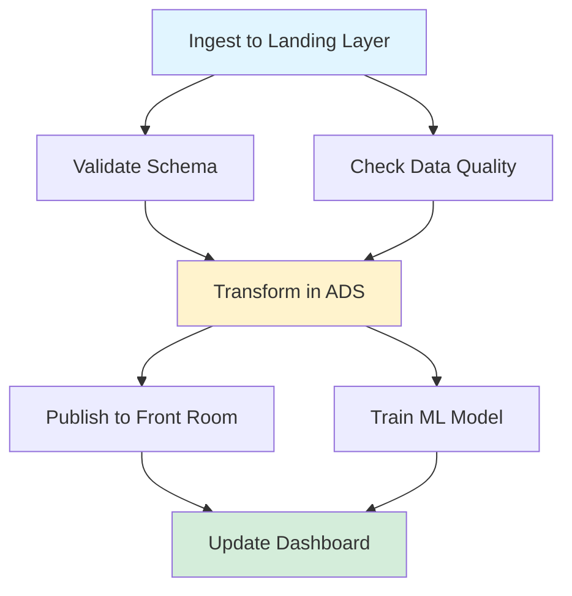
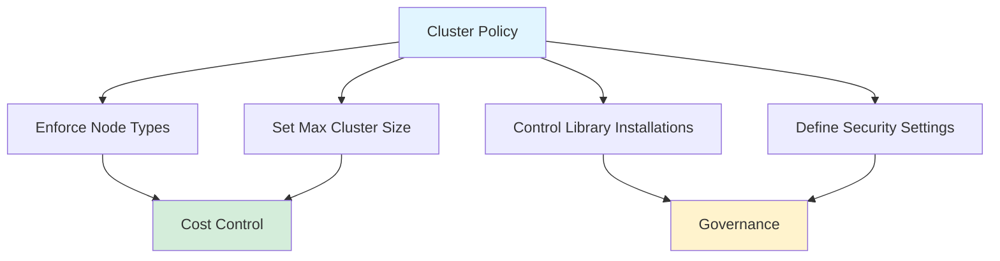
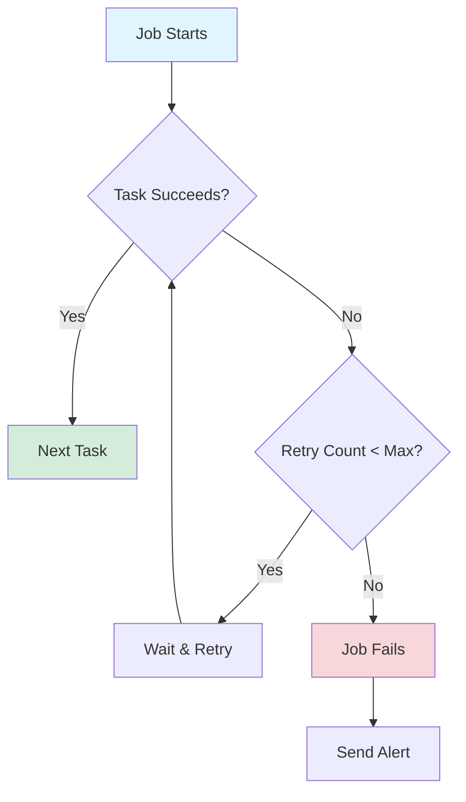
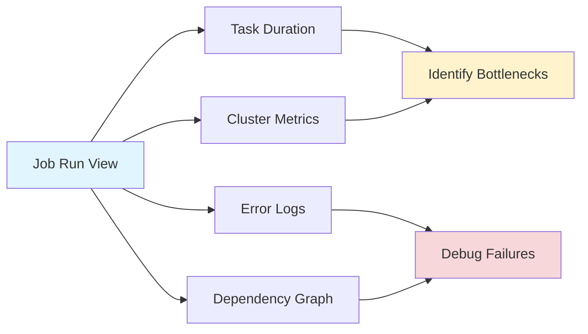
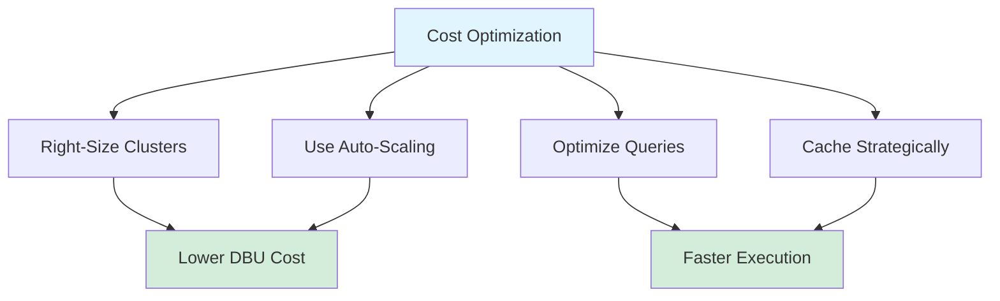

# Databricks Jobs Best Practices

> [!info] Purpose
> Databricks Jobs provide a reliable way to orchestrate data pipelines, machine learning workflows, and scheduled tasks at scale. This guide outlines best practices to ensure your jobs are efficient, maintainable, and cost-effective.

## Overview

Whether you're orchestrating notebooks, SQL queries, Delta Live Tables, or custom applications, following these best practices helps you build production-grade data workflows that scale.


## 1. Design Jobs with Clear, Modular Responsibilities

> [!warning] Avoid Monolithic Jobs
> Don't create a single job that does "everything." Break complex workflows into smaller, focused tasks.

### Break Complex Workflows into Smaller Tasks

Each task should perform **one logical function**:
- Data ingestion
- Validation
- Transformation
- Model training
- Reporting

**Benefits:**
- ✅ Easier troubleshooting (failures are isolated)
- ✅ Improved reusability across pipelines
- ✅ Better parallel execution
- ✅ Clearer ownership and maintenance

### Use Job Task Dependencies



- Define execution order using `depends_on` relationships
- Keep dependency graphs **shallow and clear** to reduce cognitive load
- Avoid deeply nested dependencies that are hard to visualize

## 2. Parameterize Your Jobs for Flexibility

==Hard-coding parameters in notebooks or scripts makes jobs brittle and difficult to reuse.==

### Best Practices

**Use multiple parameterization methods:**

| Method | Use Case | Example |
|--------|----------|---------|
| Databricks job parameters | Job-level configuration | Environment name, data paths |
| Notebook widgets (`dbutils.widgets`) | Notebook inputs | Table names, date ranges |
| Databricks Secrets | Sensitive data | API keys, passwords |
| Configuration files in Git | Complex configs | Schema definitions, business rules |
| Environment variables | Cluster-level settings | Log levels, feature flags |

### Example: Parameterized Notebook

```python
# Define widgets for parameters
dbutils.widgets.text("environment", "dev", "Environment")
dbutils.widgets.text("table_name", "sales_data", "Target Table")
dbutils.widgets.text("date", "2024-01-01", "Processing Date")

# Retrieve parameters
env = dbutils.widgets.get("environment")
table_name = dbutils.widgets.get("table_name")
processing_date = dbutils.widgets.get("date")

# Use parameters
target_table = f"{env}.landing.{table_name}"  # Landing/Bronze-equivalent
print(f"Processing {target_table} for date {processing_date}")
```

> [!tip] Environment Flexibility
> Parameterization helps you run the same code across dev, staging, and prod environments without manual edits.

## 3. Use Cluster Policies and Job Clusters

### Prefer Job Clusters over All-Purpose Clusters

**Job clusters:**
- ✅ Spin up only when needed
- ✅ Shut down automatically after job completion
- ✅ Ensure clean environment for dependency management
- ✅ Reduce cost by preventing idle cluster time

**All-purpose clusters:**
- ❌ Remain running even when idle
- ❌ May have conflicting dependencies from multiple users
- ❌ Higher cost for scheduled workloads

### Implement Cluster Policies



**Benefits:**
- Enforce best practices (approved node types, max sizes, allowed libraries)
- Improve security and governance
- Prevent accidental use of very large or expensive instances

## 4. Manage Dependencies Properly

> [!warning] Dependency Conflicts
> Dependency conflicts can break pipelines. Proper management is critical for reliability.

### Dependency Management Strategies

**Use init scripts or environment files:**
```bash
# requirements.txt
pandas==2.0.3
numpy==1.24.3
scikit-learn==1.3.0
mlflow==2.8.1
```

**Pin versions of critical libraries:**
- ✅ Ensures reproducibility
- ✅ Prevents breaking changes from auto-updates
- ✅ Simplifies troubleshooting

**Prefer workspace or repo-based notebooks:**
- Keeps code organized and version-controlled
- Enables code review and collaboration
- Supports CI/CD workflows

### Install Libraries at Job Level

```yaml
# Job configuration example
libraries:
  - pypi:
      package: pandas==2.0.3
  - pypi:
      package: scikit-learn==1.3.0
  - maven:
      coordinates: com.databricks:spark-xml_2.12:0.16.0
```

This ensures **isolation and reproducibility** across job runs.

## 5. Implement Robust Error Handling and Retry Logic

### Configure Built-in Retry Settings



**Retry configuration best practices:**
- Configure retries for **transient failures** (network issues, throttling, cluster startup)
- Avoid infinite retries - **3 attempts is a common safe default**
- Use exponential backoff for retries
- Set appropriate timeout values

### Add Custom Error Handling in Code

```python
import logging
from datetime import datetime

logger = logging.getLogger(__name__)

def process_data(df, table_name):
    """Process data with comprehensive error handling."""
    try:
        # Validate inputs early to fail fast
        if df is None or df.count() == 0:
            raise ValueError(f"Empty dataframe for table {table_name}")
        
        # Validate schema
        expected_columns = ["id", "timestamp", "value"]
        missing_cols = set(expected_columns) - set(df.columns)
        if missing_cols:
            raise ValueError(f"Missing required columns: {missing_cols}")
        
        # Process data
        result = df.transform_logic()
        
        # Validate output
        if result.count() == 0:
            logger.warning(f"No records produced for {table_name}")
        
        logger.info(f"Successfully processed {result.count()} records")
        return result
        
    except Exception as e:
        logger.error(f"Failed to process {table_name}: {str(e)}")
        # Log additional context for debugging
        logger.error(f"Timestamp: {datetime.now()}")
        logger.error(f"Input record count: {df.count() if df else 0}")
        raise
```

### Configure Alerts

Set up notifications for critical events:

- **Job failures** - Notify when any task fails after exhausting retry attempts
- **Skipped tasks** - Alert when tasks are skipped due to dependency failures
- **Long runtimes** - Trigger when execution time exceeds defined thresholds
- **Data quality issues** - Notify on validation failures or anomalies

## 6. Enable Logging, Monitoring, and Observability

==Visibility is essential for maintenance and debugging.==

### Implement Comprehensive Logging

```python
import logging
from datetime import datetime

# Configure structured logging
logging.basicConfig(
    level=logging.INFO,
    format='%(asctime)s - %(name)s - %(levelname)s - %(message)s'
)

logger = logging.getLogger(__name__)

# Log key events
logger.info(f"Job started at {datetime.now()}")
logger.info(f"Processing table: {table_name}")
logger.info(f"Records processed: {record_count}")
logger.warning(f"Data quality check failed for column: {column_name}")
logger.error(f"Failed to load data: {error_message}")
```


### Leverage Job Run View



**Monitor:**
- Task runtimes and failure patterns
- Cluster size, auto-scaling behavior
- Execution time trends over time
- Resource utilization (CPU, memory, disk)

## 7. Integrate Jobs with CI/CD Pipelines

> [!tip] Production-Grade Pipelines
> Production-grade pipelines rely on automation. Manual deployments don't scale.

Use Databricks asset bundles to store jobs and deploy in different environments.

This ensures **consistent deployment between environments**.

> [!info] Related Resources
> See [[Databricks CI-CD]] for detailed CI/CD guidance.

## 8. Secure Your Jobs Properly

> [!warning] Security First
> Security should never be an afterthought. Build it in from the start.

### Key Security Practices

| Practice               | Implementation                         | Benefit                          |
| ---------------------- | -------------------------------------- | -------------------------------- |
| **Secret management**  | Use Databricks Secrets, never hardcode | Prevents credential exposure     |
| **Least privilege**    | Assign minimal required permissions    | Limits blast radius of breaches  |
| **Service principals** | Use instead of personal tokens         | Better auditability and rotation |
| **Network isolation**  | Use private endpoints where possible   | Reduces attack surface           |

### Never Store Credentials in Notebooks

❌ **Don't do this:**
```python
api_key = "sk-1234567890abcdef"  # NEVER DO THIS
```

✅ **Do this instead:**
```python
api_key = dbutils.secrets.get(scope="api-keys", key="external-service")
```

### Assign Least-Privilege Permissions

Configure access controls for:
- **Jobs**: Who can view, edit, run
- **Clusters**: Who can attach, restart, terminate
- **Service principals**: Minimal required permissions

**Example permission model:**

| Role | Jobs | Clusters | Secrets |
|------|------|----------|---------|
| Developer | View, Run | Use existing | Read dev scope |
| Data Engineer | View, Edit, Run | Create, Modify | Read prod scope |
| Admin | All permissions | All permissions | Manage all |

## 9. Optimize Job Performance and Cost

==Even small inefficiencies can become expensive at scale.==

### Cost-Saving Strategies



**Recommended optimizations:**

1. **Use auto-scaling job clusters** with appropriate min/max sizes
   - Start small, scale up as needed
   - Set realistic maximums based on workload patterns

2. **Cache intermediate results only when beneficial**
   - Cache DataFrames that are reused multiple times
   - Unpersist cached data when no longer needed

3. **Use Photon runtime** for SQL/ETL workloads
   - 2-3x faster query execution
   - Lower overall cost despite higher DBU rate

4. **Apply Delta optimizations:**
   - `OPTIMIZE` for file compaction
   - `Z-ORDER BY` for query performance
   - `VACUUM` to remove old files

5. **Avoid unnecessary shuffles and wide transformations**
   - Use narrow transformations when possible
   - Partition data appropriately
   - Filter early to reduce data volume

### Performance Tuning Table

| Technique | When to Use | Expected Impact |
|-----------|------------|-----------------|
| Auto-scaling | Variable workloads | 20-40% cost reduction |
| Photon | SQL/ETL heavy | 2-3x faster, lower cost |
| OPTIMIZE | Frequent small writes | 30-50% query speedup |
| Z-ORDER | Specific filter patterns | 50-80% query speedup |
| Partitioning | Time-series or categorical filters | 60-90% data skipping |

### Measure and Tune

**Track performance with:**
- Cluster metrics in the Databricks UI
- Spark UI for query plans and stage details
- Job run history for trends

**Profile slow jobs:**
```python
# Add timing instrumentation
import time

start_time = time.time()
result = expensive_operation()
elapsed = time.time() - start_time

logger.info(f"Operation took {elapsed:.2f} seconds")
```

## 10. Test Thoroughly Before Production

> [!warning] Testing is Non-Negotiable
> Do not deploy untested workflows to production systems.

Always test jobs in development and acceptation before deploying to production.


## Summary: Job Design Checklist

When creating or reviewing a Databricks Job, ensure you've addressed:

- [ ] **Modularity**: Tasks are small, focused, and reusable
- [ ] **Parameterization**: No hardcoded values; uses widgets, secrets, configs
- [ ] **Cluster strategy**: Using job clusters with appropriate policies
- [ ] **Dependencies**: Libraries pinned and managed at job level
- [ ] **Error handling**: Retries configured, custom error logic implemented
- [ ] **Logging**: Comprehensive logging with structured output
- [ ] **Monitoring**: Alerts configured for failures and anomalies
- [ ] **CI/CD**: Jobs managed in Git with automated deployment
- [ ] **Security**: Secrets managed properly, least privilege enforced
- [ ] **Performance**: Optimized for cost and speed
- [ ] **Testing**: Thoroughly tested in staging before production

---

## Related Pages

- [[Databricks CI-CD]]
- [[Data Pipeline Patterns]]
- [[Lakehouse Architecture]]
- [[Workspace Organization]]

---

*Following these best practices ensures your Databricks Jobs are production-ready, cost-effective, and maintainable at scale.*