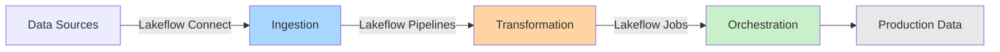
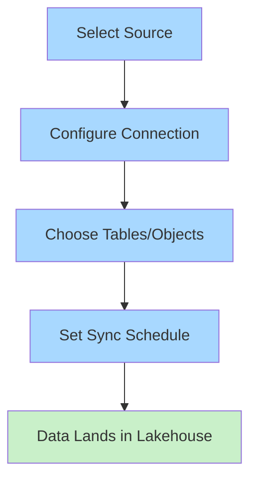
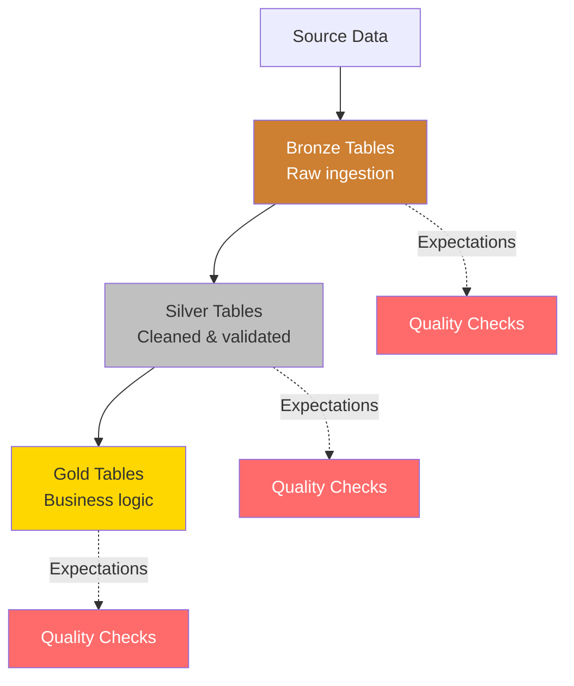
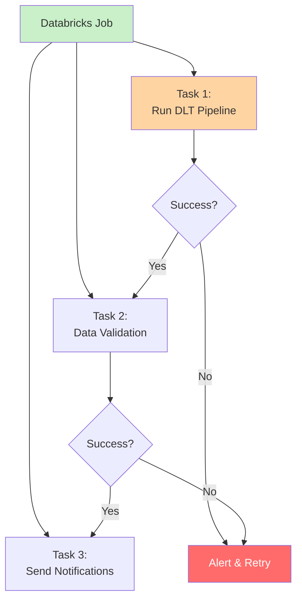
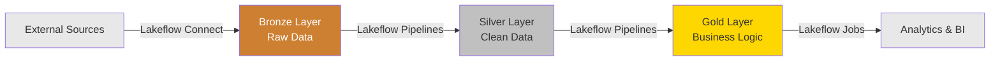
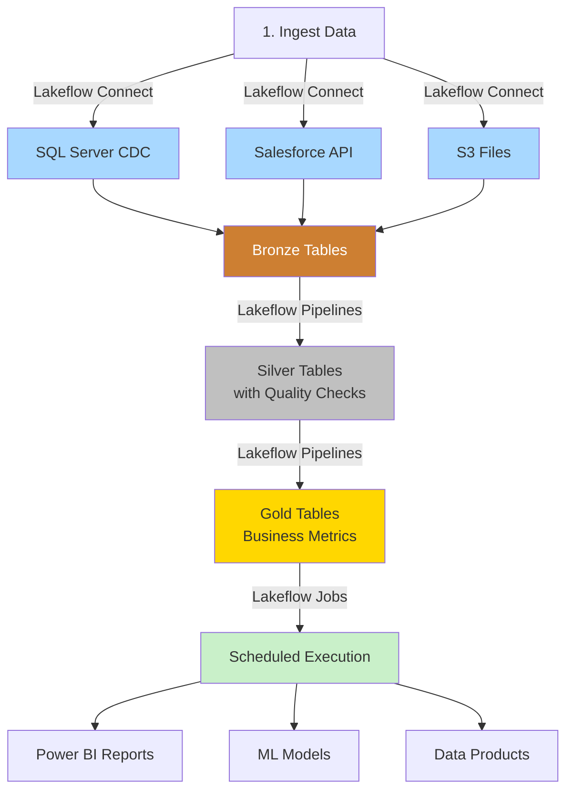
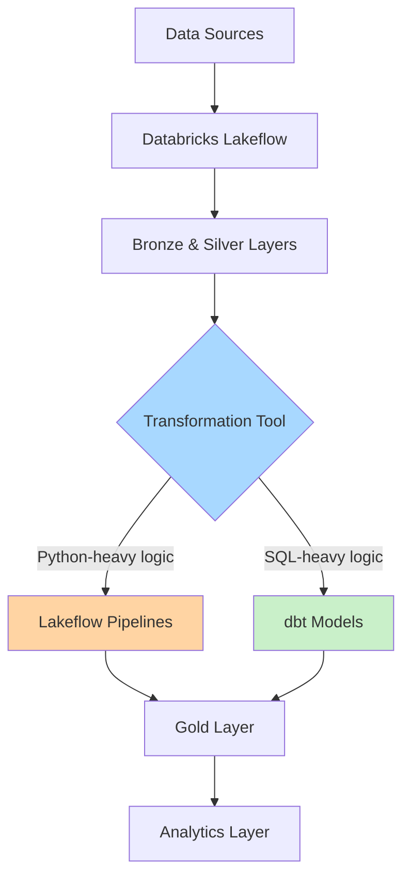
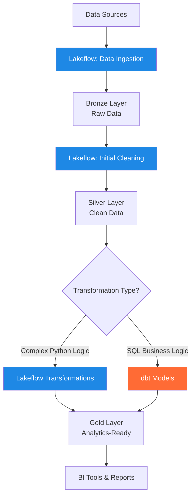
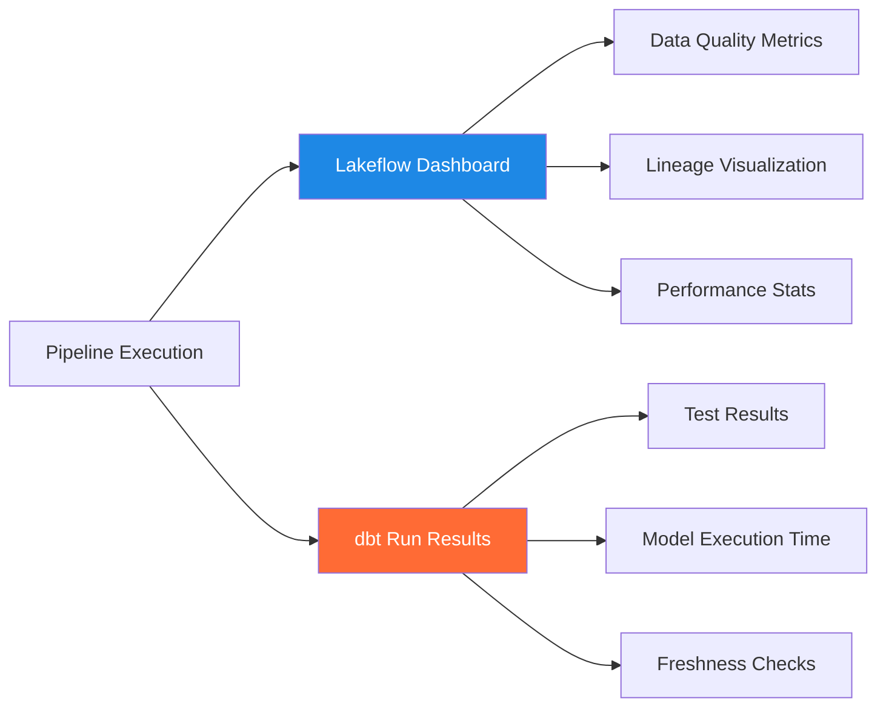

# ETL Framework

> [!info] Who to contact?
> This guide explains how to build ETL pipelines in Databricks using **Lakeflow** — a unified solution with three core components: Lakeflow Connect, Lakeflow Pipelines, and Lakeflow Jobs. For detailed information about Plainsight's specific ETL framework implementation, reach out to **Benoit**.

## Overview: Databricks Lakeflow

**Databricks Lakeflow** is a unified data engineering solution that simplifies building production data pipelines. It combines data ingestion, transformation, and orchestration into a single integrated platform.



### The Three Components

| Component | Purpose | What It Does |
|-----------|---------|--------------|
| **Lakeflow Connect** | Data ingestion | Point-and-click ingestion from databases and enterprise apps |
| **Lakeflow Pipelines** | Data transformation | Declarative pipelines with built-in quality checks (Delta Live Tables) |
| **Lakeflow Jobs** | Orchestration | Reliable scheduling, monitoring, and production deployment |

[!info] 
Declarative pipelines is renamed to Spark Declarative pipelines because it is now fully integrated within Spark. This also means that some DLT related commands will change in naming. 

---

## Lakeflow Connect: Data Ingestion

**Lakeflow Connect** provides scalable, point-and-click data ingestion from various sources without writing complex connector code.

### What Can You Ingest?

| Source Type | Examples | Technology |
|-------------|----------|------------|
| **Databases** | SQL Server, MySQL, PostgreSQL, Oracle | Change Data Capture (CDC) |
| **Enterprise Apps** | Salesforce, Workday, ServiceNow, Google Analytics | Native connectors |
| **Cloud Storage** | S3, ADLS Gen2, GCS | Auto Loader |
| **Streaming** | Kafka, Kinesis, Event Hub, Pub/Sub | Real-time ingestion |
| **Unstructured Data** | PDFs, Excel from SharePoint | Document processing |

### How It Works



### Key Features

**Change Data Capture (CDC)** for databases:
- Efficiently captures only changed data
- Minimal impact on source systems
- Real-time or scheduled sync options
- Handles schema changes automatically

**Point-and-click setup:**
- No code required for standard sources
- Visual configuration interface
- Automatic schema detection
- Built-in error handling

### Example: Ingesting from SQL Server

```python
# Lakeflow Connect handles this automatically via UI
# But if you need programmatic access:

from databricks.lakeflow import connect

# Configure SQL Server connection
connection = connect.create_connection(
    name="sql_server_prod",
    connection_type="sqlserver",
    host="prod-sql.company.com",
    port=1433,
    database="sales_db",
    username="reader_user",
    password=dbutils.secrets.get("db", "sql_password")
)

# Select tables to ingest
tables = ["orders", "customers", "products"]

# Start CDC ingestion
connect.ingest_tables(
    connection=connection,
    tables=tables,
    target_catalog="raw",
    target_schema="sales",
    mode="cdc"  # Change Data Capture
)
```

> [!tip] When to Use Lakeflow Connect
> Use Lakeflow Connect for any external data source. It handles the complexity of connections, schemas, and incremental loading so you can focus on data transformations.

---

## Lakeflow Pipelines: Data Transformation

**Lakeflow Pipelines** (built on Delta Live Tables) provides a declarative framework for transforming data. You define *what* you want, and Databricks handles *how* to execute it efficiently.

### Core Concepts

| Concept | Description | Use Case |
|---------|-------------|----------|
| **Tables** | Materialized datasets | Final outputs you want to query |
| **Views** | Intermediate transformations | Reusable logic without storage |
| **Streaming Tables** | Real-time processing | Continuous data ingestion |
| **Expectations** | Data quality rules | Validation and enforcement |

### Medal Architecture with DLT



### DLT Pipeline Example

```python
import dlt
from pyspark.sql.functions import col, current_timestamp

# Bronze: Raw data ingestion
@dlt.table(
    comment="Raw sales data from source system",
    table_properties={"quality": "bronze"}
)
def bronze_sales():
    return (
        spark.readStream
            .format("cloudFiles")
            .option("cloudFiles.format", "json")
            .load("/mnt/raw/sales/")
    )

# Silver: Cleaned and validated
@dlt.table(
    comment="Cleaned sales data with quality checks",
    table_properties={"quality": "silver"}
)
@dlt.expect_or_drop("valid_sale_id", "sale_id IS NOT NULL")
@dlt.expect_or_drop("positive_amount", "amount > 0")
@dlt.expect("recent_data", "sale_date >= current_date() - 365")
def silver_sales():
    return (
        dlt.read_stream("bronze_sales")
            .withColumn("processed_at", current_timestamp())
            .dropDuplicates(["sale_id"])
    )

# Gold: Business aggregations
@dlt.table(
    comment="Daily revenue by product category",
    table_properties={"quality": "gold"}
)
def gold_daily_revenue():
    return (
        dlt.read("silver_sales")
            .groupBy("sale_date", "product_category")
            .agg(
                sum("amount").alias("total_revenue"),
                count("sale_id").alias("transaction_count")
            )
    )
```

### Data Quality Expectations

DLT provides three levels of quality enforcement:

| Expectation Type | Behavior | When to Use |
|-----------------|----------|-------------|
| `@dlt.expect()` | Track violations, keep records | Monitor data quality trends |
| `@dlt.expect_or_drop()` | Drop invalid records | Handle bad data gracefully |
| `@dlt.expect_or_fail()` | Stop pipeline on violation | Critical business rules |

> [!warning] Production Consideration
> Use `expect_or_fail()` sparingly—it will stop your entire pipeline. Reserve it for truly critical validations.

### Key Features of Lakeflow Pipelines

**Automatic orchestration:**
- Dependency management between tables
- Incremental processing
- Automatic retries on failure

**Built-in monitoring:**
- Data lineage visualization
- Quality metrics tracking
- Performance optimization

**Real-time mode:**
- Low-latency streaming
- Consistently fast delivery
- No code changes needed

> [!tip] When to Use Lakeflow Pipelines
> Use Lakeflow Pipelines for all data transformations. The declarative approach makes code maintainable, and built-in quality checks ensure reliable data.

---

## Lakeflow Jobs: Orchestration

**Lakeflow Jobs** orchestrates your entire data workflow, from ingestion through transformation to final delivery. It provides reliable scheduling, monitoring, and production deployment.

### Job Components



### Job Configuration

| Configuration | Purpose | Recommendation |
|---------------|---------|----------------|
| **Trigger** | When to run | Cron schedule for batch, continuous for streaming |
| **Cluster** | Compute resources | Use Job Clusters for cost efficiency |
| **Retries** | Error handling | Set 2-3 retries with backoff |
| **Alerts** | Notifications | Email on failure, dashboard for monitoring |
| **Dependencies** | Task ordering | Chain tasks with clear dependencies |

### Example Job Setup

```json
{
  "name": "Daily Sales ETL",
  "tasks": [
    {
      "task_key": "run_dlt_pipeline",
      "pipeline_task": {
        "pipeline_id": "abc123-pipeline-id"
      }
    },
    {
      "task_key": "data_quality_check",
      "depends_on": [{"task_key": "run_dlt_pipeline"}],
      "notebook_task": {
        "notebook_path": "/Validation/check_data_quality"
      }
    },
    {
      "task_key": "send_report",
      "depends_on": [{"task_key": "data_quality_check"}],
      "notebook_task": {
        "notebook_path": "/Reports/email_summary"
      }
    }
  ],
  "schedule": {
    "quartz_cron_expression": "0 0 2 * * ?",
    "timezone_id": "Europe/Brussels"
  },
  "email_notifications": {
    "on_failure": ["data-team@plainsight.com"]
  }
}
```

> [!tip] Cost Optimization
> Always use **Job Clusters** instead of All-Purpose clusters for scheduled jobs. They automatically terminate after completion. See [[How to choose your Compute?]] for details.

### Monitoring and Lineage

Lakeflow Jobs provides data-first observability:

**Full lineage tracking:**
- Source to table relationships
- Transformation dependencies
- Dashboard connections

**Health monitoring:**
- Data freshness metrics
- Quality check results
- Pipeline execution status

**Automated alerts:**
- Failure notifications
- SLA breach warnings
- Quality degradation alerts

> [!tip] When to Use Lakeflow Jobs
> Use Lakeflow Jobs to orchestrate any workload: ingestion pipelines, DLT transformations, notebooks, SQL queries, ML training, and more. It provides a single pane of glass for monitoring your entire data platform.

---

## How Lakeflow Components Work Together

The three Lakeflow components create an end-to-end data engineering workflow:



### Complete Pipeline Flow



### Real-World Example

**Scenario:** Real-time sales analytics from multiple sources

| Step | Component | Action |
|------|-----------|--------|
| 1 | **Lakeflow Connect** | Ingest sales data from SQL Server (CDC), Salesforce orders, and S3 clickstream logs |
| 2 | **Lakeflow Pipelines** | Transform bronze → silver with quality checks (no nulls, positive amounts) |
| 3 | **Lakeflow Pipelines** | Create gold layer with daily/hourly revenue aggregations |
| 4 | **Lakeflow Jobs** | Schedule pipeline to run every 15 minutes with alerts on failure |
| 5 | **Result** | Fresh data in Power BI dashboards with <20 minute latency |

---

## Best Practices

### Ingestion (Lakeflow Connect)

| Practice | Rationale |
|----------|-----------|
| ✅ Use CDC for databases | Captures only changes, minimizes source system impact |
| ✅ Schedule ingestion during off-peak hours | Reduces load on operational systems |
| ✅ Monitor ingestion metrics | Catch schema changes and failures early |
| ❌ Don't skip bronze layer | Always preserve raw data for reprocessing |

### Transformation (Lakeflow Pipelines)

| Practice | Rationale |
|----------|-----------|
| ✅ Follow medal architecture | Clear separation of data quality levels |
| ✅ Add expectations at each layer | Catch quality issues early in the pipeline |
| ✅ Use streaming for real-time needs | Enables low-latency data delivery |
| ✅ Document table purposes | Makes pipelines maintainable by team |
| ❌ Don't mix quality levels in one table | Maintain clear bronze/silver/gold boundaries |
| ❌ Don't use expect_or_fail() liberally | Reserve for truly critical business rules |

### Orchestration (Lakeflow Jobs)

| Practice | Rationale |
|----------|-----------|
| ✅ Use Job Clusters for scheduled runs | Automatically terminates, saves costs |
| ✅ Set up failure alerts | Enables quick response to issues |
| ✅ Enable 2-3 retries with backoff | Handles transient failures gracefully |
| ✅ Run Production mode for incremental | Efficient processing of only new data |
| ❌ Don't use All-Purpose clusters for jobs | Wastes money on idle compute |
| ❌ Don't run full refresh in production | Unnecessary reprocessing increases costs |

---

## Related Documentation

### Within Databricks Best-Practices
- [[How to choose your Compute?]] - Selecting the right compute resources for your pipelines

### Fabric Architecture (Similar Concepts)
- [[Data Layers and Modeling]] - Medal architecture principles (applies to Lakeflow)
- [[Landing and Staging]] - Bronze layer patterns
- [[Data Pipeline Patterns]] - Common pipeline architectures
- [[Lakehouse Architecture]] - Overall data platform design

### dbt Integration
- [[Project Structure]] - Organizing transformation code
- [[Operations & Testing]] - Testing strategies applicable to DLT expectations

---

*For Plainsight-specific Lakeflow framework guidance, contact Benoit | Last updated: November 2025*

```python
import dlt
from pyspark.sql.functions import col, current_timestamp

# Bronze Layer: Raw data ingestion
@dlt.table(
    name="raw_orders",
    comment="Raw orders data from source system",
    table_properties={"quality": "bronze"}
)
def bronze_orders():
    return (
        spark.readStream
            .format("cloudFiles")
            .option("cloudFiles.format", "json")
            .load("/mnt/landing/orders/")
    )

# Silver Layer: Cleaned and validated
@dlt.table(
    name="clean_orders",
    comment="Cleaned orders with quality checks",
    table_properties={"quality": "silver"}
)
@dlt.expect_or_drop("valid_order_id", "order_id IS NOT NULL")
@dlt.expect_or_drop("valid_amount", "order_amount > 0")
def silver_orders():
    return (
        dlt.read_stream("raw_orders")
            .withColumn("processed_at", current_timestamp())
            .dropDuplicates(["order_id"])
    )

# Gold Layer: Business logic
@dlt.table(
    name="daily_revenue",
    comment="Daily aggregated revenue by product",
    table_properties={"quality": "gold"}
)
def gold_daily_revenue():
    return (
        dlt.read("clean_orders")
            .groupBy("order_date", "product_id")
            .agg(
                sum("order_amount").alias("total_revenue"),
                count("order_id").alias("order_count")
            )
    )
```

## dbt Integration with Databricks

**dbt (data build tool)** complements Databricks by providing:
- SQL-first transformation layer
- Version control for data models
- Documentation and testing framework
- Modular and reusable code structure

### How dbt Fits in the Ecosystem



### dbt Project Structure

```
dbt_project/
├── models/
│   ├── staging/          # Silver layer transformations
│   │   ├── stg_orders.sql
│   │   └── stg_customers.sql
│   ├── intermediate/     # Reusable business logic
│   │   └── int_customer_orders.sql
│   └── marts/            # Gold layer analytics
│       ├── fct_orders.sql
│       └── dim_customers.sql
├── tests/                # Data quality tests
├── macros/               # Reusable SQL functions
└── dbt_project.yml       # Project configuration
```

### Example dbt Model

```sql
-- models/staging/stg_orders.sql
{{
    config(
        materialized='incremental',
        unique_key='order_id',
        on_schema_change='sync_all_columns'
    )
}}

WITH source AS (
    SELECT * FROM {{ source('bronze', 'raw_orders') }}
    
    WHERE processed_at > (SELECT MAX(processed_at) FROM {{ this }})
    
),

cleaned AS (
    SELECT
        order_id,
        customer_id,
        order_date,
        order_amount,
        status,
        created_at,
        updated_at
    FROM source
    WHERE order_id IS NOT NULL
        AND order_amount > 0
)

SELECT * FROM cleaned
```

## Lakeflow vs dbt: When to Use What

| Aspect | Databricks Lakeflow | dbt | Best Practice |
|--------|-------------------|-----|---------------|
| **Language** | Python (PySpark) | SQL | Use dbt for SQL transformations, Lakeflow for complex Python logic |
| **Real-time** | Native streaming support | Batch-oriented | Use Lakeflow for streaming, dbt for batch |
| **Data Quality** | Built-in expectations | Custom tests | Combine both for comprehensive quality checks |
| **Orchestration** | Fully managed | External orchestrator needed | Lakeflow handles its own scheduling |
| **Bronze/Silver** | Excellent for ingestion | Better for transformation | Lakeflow for raw → clean, dbt for clean → business logic |
| **Version Control** | Notebook-based | Git-native | dbt provides better version control |

## Combined Architecture Pattern

At Plainsight, we leverage both tools for their strengths:



**Legend:** 🔵 Databricks Lakeflow | 🟠 dbt

### Workflow Example

**Step 1: Lakeflow ingests and cleans raw data**
```python
# Lakeflow pipeline: Bronze to Silver
@dlt.table(name="silver_orders")
@dlt.expect_or_drop("valid_data", "order_id IS NOT NULL")
def clean_orders():
    return spark.read.table("bronze.raw_orders").dropDuplicates()
```

**Step 2: dbt builds business logic on clean data**
```sql
-- dbt model: Silver to Gold
{{ config(materialized='table') }}

SELECT
    o.order_id,
    c.customer_name,
    o.order_date,
    o.order_amount,
    c.customer_segment
FROM {{ ref('silver_orders') }} o
LEFT JOIN {{ ref('silver_customers') }} c
    ON o.customer_id = c.customer_id
```

**Step 3: Both outputs land in Gold layer**
- Lakeflow tables: `gold.realtime_metrics`
- dbt tables: `gold.daily_revenue`, `gold.customer_segments`

## Running dbt with Databricks

### Configuration Setup

```yaml
# profiles.yml
databricks:
  target: prod
  outputs:
    prod:
      type: databricks
      host: "{{ env_var('DBT_DATABRICKS_HOST') }}"
      http_path: "{{ env_var('DBT_DATABRICKS_HTTP_PATH') }}"
      token: "{{ env_var('DBT_DATABRICKS_TOKEN') }}"
      schema: gold
      threads: 4
```

### Execution Methods

| Method | Use Case | Command Example |
|--------|----------|-----------------|
| **Local Development** | Testing on laptop | `dbt run --select stg_orders` |
| **Databricks Job** | Production runs | Schedule notebook with `!dbt run` |
| **GitHub Actions** | CI/CD pipeline | Automated on PR merge |
| **dbt Cloud** | Managed service | Schedule via UI |

### Example Databricks Job for dbt

```python
# Databricks notebook: Run dbt pipeline
%pip install dbt-databricks

# Set environment variables
import os
os.environ['DBT_DATABRICKS_HOST'] = dbutils.secrets.get("dbt", "host")
os.environ['DBT_DATABRICKS_TOKEN'] = dbutils.secrets.get("dbt", "token")

# Run dbt commands
!dbt deps
!dbt run --select tag:daily
!dbt test
```

## Data Quality Strategy

Combine quality checks from both frameworks:

### Lakeflow Expectations

```python
@dlt.table(name="validated_orders")
@dlt.expect("valid_amount", "order_amount > 0")
@dlt.expect_or_drop("required_fields", "order_id IS NOT NULL AND customer_id IS NOT NULL")
@dlt.expect_or_fail("critical_check", "order_date <= current_date()")
def quality_checked_data():
    return spark.table("raw_orders")
```

### dbt Tests

```yaml
# models/schema.yml
version: 2

models:
  - name: fct_orders
    columns:
      - name: order_id
        tests:
          - unique
          - not_null
      - name: order_amount
        tests:
          - dbt_utils.accepted_range:
              min_value: 0
              max_value: 1000000
      - name: customer_id
        tests:
          - relationships:
              to: ref('dim_customers')
              field: customer_id
```

## Best Practices

### Do's ✅

| Practice | Rationale |
|----------|-----------|
| Use Lakeflow for **Bronze → Silver** | Handles raw data ingestion and quality checks efficiently |
| Use dbt for **Silver → Gold** | SQL-first approach for business logic is maintainable |
| Implement quality checks in **both** tools | Layered validation catches issues early |
| Version control dbt models in Git | Enables collaboration and change tracking |
| Use incremental models for large datasets | Reduces processing time and costs |
| Document business logic in dbt | Built-in docs improve team knowledge sharing |

### Don'ts ❌

| Anti-pattern | Why It's Problematic | Better Approach |
|--------------|---------------------|-----------------|
| Mixing Lakeflow and dbt in same layer | Creates confusion about ownership | Clear separation by layer |
| Running dbt without version control | Loses change history | Always use Git |
| Complex Python in dbt | dbt is SQL-first | Use Lakeflow for Python logic |
| Skipping data quality tests | Silent failures in production | Implement tests in both tools |
| Full refresh in production | Wastes compute and time | Use incremental strategies |

## Monitoring and Observability

Both tools provide visibility into pipeline health:



### Key Metrics to Track

- **Lakeflow**: Rows processed, quality check failures, pipeline duration
- **dbt**: Model build time, test pass rate, data freshness
- **Combined**: End-to-end latency, cost per pipeline run

## Related Topics

- [[How to choose your Compute?]] - Selecting the right compute for your pipelines
- [[Data Pipeline Patterns]] - Common patterns for Fabric (applicable concepts)
- [[Project Structure]] - dbt project organization best practices
- [[Operations & Testing]] - dbt testing strategies
- [[Data Layers and Modeling]] - Architectural principles for layered data

---

*For Plainsight-specific framework details, contact Benoit | Last updated: November 2025*
