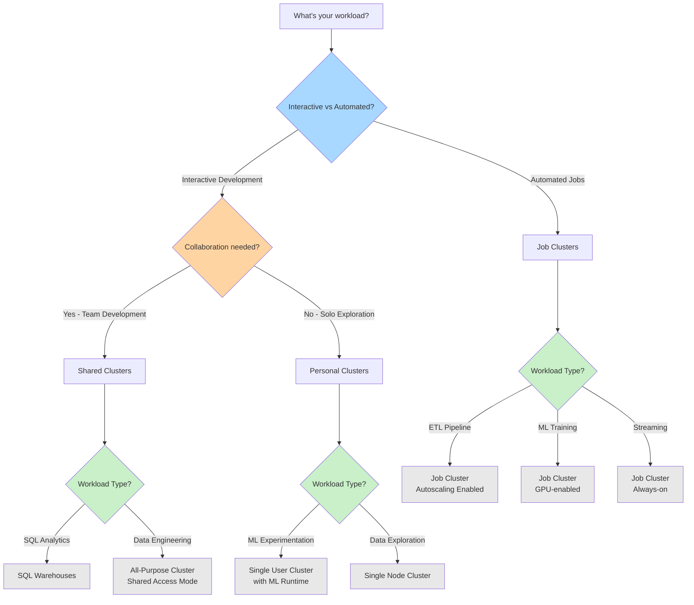
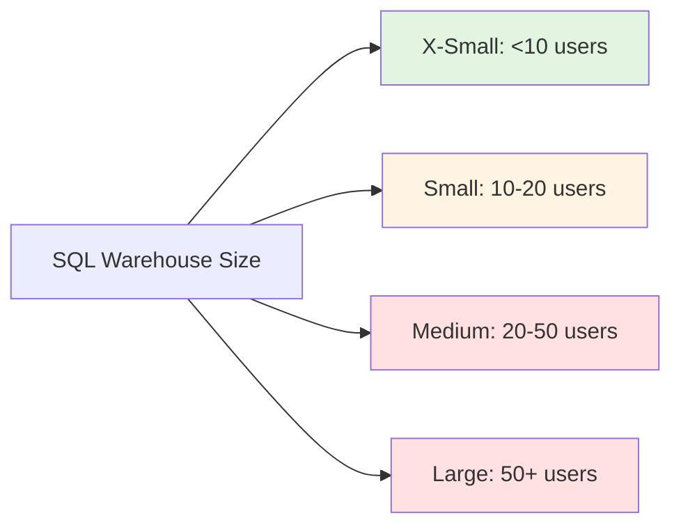
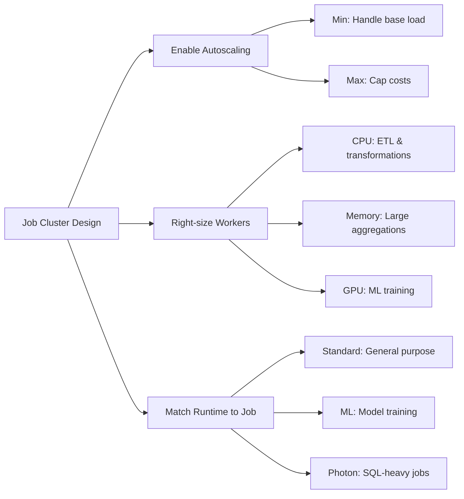
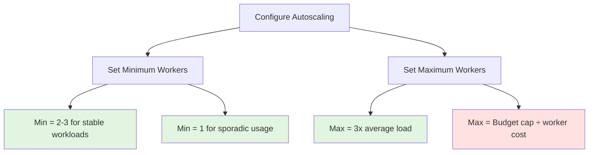
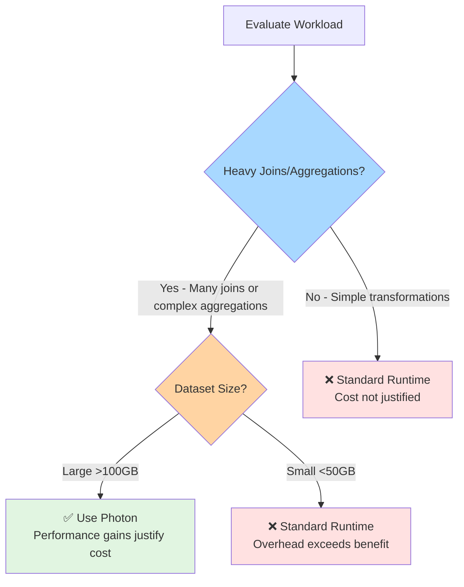

# How to choose your Compute?

> [!info] Purpose
> This guide helps you select the right compute resource in Databricks based on your workload type, team collaboration needs, and cost considerations.

## Compute Types Overview

> [!tip] Quick Navigation
> This section provides a high-level overview. Click the compute type names to jump to detailed guidance.

| Compute Type                                      | Use Case                | Cost Efficiency | Auto-termination | Best For                               |
| ------------------------------------------------- | ----------------------- | --------------- | ---------------- | -------------------------------------- |
| [**SQL Warehouses**](#sql-warehouses)             | SQL analytics & BI      | ⭐⭐⭐ High        | Yes              | Business analysts, SQL-based reporting |
| [**All-Purpose Clusters**](#all-purpose-clusters) | Interactive development | ⭐⭐ Medium       | Yes              | Collaborative data engineering         |
| [**Job Clusters**](#job-clusters)                 | Automated workloads     | ⭐⭐⭐ High        | Automatic        | Production pipelines, scheduled jobs   |
| [**Single Node Clusters**](#single-node-clusters) | Light exploration       | ⭐⭐⭐ High        | Yes              | Quick data checks, small datasets      |
| **Personal Compute**                              | Individual development  | ⭐⭐ Medium       | Yes              | Solo experimentation (see All-Purpose) |

---

## Compute Decision Flow

Use this flow to identify the right compute type for your needs:



**Legend:** 🔵 Interactive vs Automated | 🟠 Collaboration | 🟢 Workload Type | ⚪ Your Result

---

## Detailed Compute Guidance

The following sections provide in-depth information about each compute type, including configuration examples, best practices, and when to use them.

## SQL Warehouses

**When to use:**
- Running SQL queries for analytics
- Connecting BI tools (Power BI, Tableau)
- Ad-hoc data exploration by business users
- Serving dashboards and reports

**Configuration guidance:**



> [!tip] Cost Optimization
> Enable auto-stop after 10-15 minutes of inactivity. SQL Warehouses can start up quickly, so aggressive auto-stop settings minimize costs without impacting user experience.

**Example use case:**
```sql
-- Typical SQL Warehouse query for business reporting
SELECT 
    product_category,
    SUM(revenue) as total_revenue,
    COUNT(DISTINCT customer_id) as unique_customers
FROM sales_fact
WHERE order_date >= '2025-01-01'
GROUP BY product_category
ORDER BY total_revenue DESC
```

## All-Purpose Clusters

**When to use:**
- Team collaboration on notebooks
- Interactive data engineering work
- Prototyping data pipelines
- Shared development environment

**Access modes:**

| Mode | Use Case | Language Support | Libraries |
|------|----------|------------------|-----------|
| **Shared** | Team collaboration, production-ready | Python, SQL, R | Pre-approved only |
| **Single User** | ML experimentation, full control | Python, SQL, R, Scala | Install anything |
| **No Isolation** | Legacy support | All | Full access |

> [!warning] Shared vs Single User
> Shared access mode provides security isolation but restricts some libraries. Single User mode gives full flexibility but can't be shared with team members.

**Configuration example:**
```python
# Cluster configuration for data engineering team
{
    "cluster_name": "DE-Team-Shared",
    "spark_version": "14.3.x-scala2.12",
    "node_type_id": "Standard_DS3_v2",
    "autoscale": {
        "min_workers": 2,
        "max_workers": 8
    },
    "autotermination_minutes": 30,
    "data_security_mode": "USER_ISOLATION"
}
```

## Job Clusters

**When to use:**
- Production ETL pipelines
- Scheduled data processing
- Automated ML model training
- Any automated, repeatable workflow

**Key advantages:**
- Spin up for job execution only
- Automatically terminated after completion
- Most cost-effective for production workloads
- Isolated from interactive development

**Configuration strategy:**



> [!tip] Job Cluster Best Practice
> Always define job clusters in the job definition itself, not as a separate shared cluster. This ensures complete isolation and automatic cleanup.

**Example job configuration:**
```python
# Optimal job cluster for daily ETL
{
    "name": "daily-sales-aggregation",
    "new_cluster": {
        "spark_version": "14.3.x-photon-scala2.12",
        "node_type_id": "Standard_D4ds_v5",
        "autoscale": {
            "min_workers": 2,
            "max_workers": 10
        },
        "enable_elastic_disk": true
    },
    "libraries": [
        {"pypi": {"package": "delta-spark==2.4.0"}}
    ]
}
```

## Single Node Clusters

**When to use:**
- Quick data exploration on small datasets (<100 GB)
- Testing code snippets
- Learning and experimentation
- Personal data science notebooks

**Limitations:**
- No distributed processing
- Limited memory and CPU
- Not suitable for production
- Driver-only architecture

> [!warning] Size Limitations
> Single node clusters work well for datasets that fit in memory. For larger datasets, switch to a multi-node cluster.

**When it makes sense:**
```python
# Good use case: Small data exploration
df = spark.read.parquet("dbfs:/small-dataset")  # 10 MB
df.groupBy("category").count().show()

# Bad use case: Large data processing
# df = spark.read.parquet("dbfs:/huge-dataset")  # 500 GB
# This will fail on single node!
```

## Decision Matrix

Use this matrix to quickly identify the right compute type:

| Your Scenario | Recommended Compute | Why? |
|---------------|---------------------|------|
| "I need to write SQL for a dashboard" | SQL Warehouse | Optimized for SQL, BI tool integration |
| "Our team is building a new pipeline together" | All-Purpose (Shared) | Collaboration with cost sharing |
| "I'm experimenting with ML models" | All-Purpose (Single User) | Full library access, GPU support |
| "This ETL runs every night at 2 AM" | Job Cluster | Most cost-effective for automation |
| "I want to quickly check a CSV file" | Single Node | Fast startup, low cost |
| "We're running production streaming" | Job Cluster (Always-on) | Reliability and isolation |
| "Analysts need self-service SQL access" | SQL Warehouse | Easy to use, cost-effective |

## Cost Optimization Strategies

### Autoscaling Best Practices



### Auto-termination Guidelines

| Compute Type | Recommended Auto-stop | Reasoning |
|--------------|----------------------|-----------|
| SQL Warehouse | 10-15 minutes | Fast restart, analytics is bursty |
| All-Purpose (Active dev) | 30-60 minutes | Balance cost vs restart friction |
| All-Purpose (Occasional) | 15-20 minutes | Minimize idle time |
| Personal Compute | 20 minutes | Individual usage patterns |
| Job Cluster | N/A | Auto-terminates on completion |

> [!tip] Monitor and Adjust
> Review cluster usage metrics monthly. If clusters frequently restart due to aggressive auto-termination, increase the timeout slightly to improve user experience.

---

## Photon Acceleration: When to Use It

**Photon** is Databricks' native vectorized query engine that accelerates SQL and DataFrame workloads. While it can provide 2-5x performance improvements, it comes with approximately **2x higher DBU costs**. In practice, Photon is primarily valuable for workloads with **heavy joins and aggregations**. For most other use cases, the cost increase outweighs the performance benefits.

### Decision Framework



### When to Enable Photon

| Workload Characteristic | Use Photon? | Why? |
|------------------------|-------------|------|
| **Complex multi-table joins** | ✅ Yes | Photon's vectorization excels at join operations |
| **Heavy aggregations (GROUP BY)** | ✅ Yes | Significant speedup for complex aggregations on large datasets |
| **Star schema queries** | ✅ Yes | Ideal for fact-dimension joins with aggregations |
| **BI dashboards (SQL Warehouse)** | ✅ Default | SQL Warehouses include Photon, optimized for analytical queries |

### When NOT to Use Photon

| Workload Characteristic | Use Standard | Why? |
|------------------------|--------------|------|
| **Simple transformations (filters, selects)** | ❌ Standard | Minimal joins/aggregations = cost not justified |
| **ETL with mostly data movement** | ❌ Standard | Reading/writing data doesn't benefit from Photon |
| **Small to medium datasets (<50GB)** | ❌ Standard | Performance gains too small to justify 2x cost |
| **DLT pipelines without complex logic** | ❌ Standard | Simple bronze→silver transformations don't need Photon |
| **Streaming without aggregations** | ❌ Standard | Simple event processing doesn't benefit |
| **ML training pipelines** | ❌ Standard | ML libraries don't benefit from Photon (use GPU instead) |
| **Development/testing environments** | ❌ Standard | Cost not justified for non-production work |
| **Custom Scala/Java code** | ❌ Standard | Photon optimizes SQL/DataFrame operations only |

### Cost vs Performance Trade-off

**Photon pricing:**
- Approximately **2x DBU cost** compared to standard runtime
- Performance improvements: **2-5x faster** for SQL workloads

**ROI calculation:**
```
Standard runtime: 100 DBUs × $0.40 = $40 (takes 60 minutes)
Photon runtime: 100 DBUs × $0.80 = $80 (takes 20 minutes)

Cost increase: +$40 (+100%)
Time saved: -40 minutes (-67%)
```

> [!warning] Cost vs Benefit Reality
> Photon doubles your DBU costs. Unless your workload performs **heavy joins and aggregations on large datasets (>100GB)**, the 2x cost increase typically exceeds any time savings. Most ETL pipelines don't have enough join/aggregation complexity to justify Photon.

### Photon Configuration Examples

**Enable Photon on Job Cluster:**
```python
{
    "name": "daily-etl-with-photon",
    "new_cluster": {
        "spark_version": "14.3.x-photon-scala2.12",  # Note: photon in version
        "node_type_id": "Standard_D4ds_v5",
        "autoscale": {
            "min_workers": 2,
            "max_workers": 10
        }
    }
}
```

**Photon in SQL Warehouse:**
```sql
-- SQL Warehouses automatically use Photon
-- No configuration needed - it's enabled by default
SELECT 
    customer_segment,
    COUNT(*) as customer_count,
    SUM(lifetime_value) as total_value
FROM gold.customer_metrics
GROUP BY customer_segment
ORDER BY total_value DESC
```

**Photon in DLT Pipeline (only for heavy aggregations):**
```python
import dlt

# Use Photon only when you have complex joins and aggregations
@dlt.table(
    comment="Complex multi-table aggregation - Photon justified"
)
def gold_sales_summary():
    return (
        dlt.read("silver_sales")
            .join(dlt.read("silver_customers"), "customer_id")
            .join(dlt.read("silver_products"), "product_id")
            .join(dlt.read("silver_regions"), "region_id")
            .groupBy("region", "customer_segment", "product_category")
            .agg(
                sum("amount").alias("total_revenue"),
                avg("amount").alias("avg_order_value"),
                count("transaction_id").alias("transaction_count")
            )
    )
```

### Best Practices

| Practice | Rationale |
|----------|-----------|
| ✅ Use Photon **only for heavy joins/aggregations** | The ONLY use case where cost is justified |
| ✅ Enable on **SQL Warehouses for BI** | Already default, optimized for analytical queries |
| ✅ Require **>100GB datasets** before considering | Small data doesn't benefit enough |
| ✅ **Benchmark rigorously** before committing | Most workloads won't see ROI—prove it first |
| ❌ **Don't use Photon by default** | 2x cost increase requires clear justification |
| ❌ Don't use for **simple ETL pipelines** | Data movement and basic transforms don't benefit |
| ❌ Don't use for **development/testing** | Cost never justified for non-production |
| ❌ Don't use without **many joins/aggregations** | Core value proposition—without these, skip Photon |

---

## Anti-Patterns to Avoid

❌ **Don't:** Use All-Purpose clusters for production jobs
✅ **Do:** Use dedicated Job Clusters with autoscaling

❌ **Don't:** Leave interactive clusters running 24/7
✅ **Do:** Enable auto-termination on all interactive clusters

❌ **Don't:** Create one massive shared cluster for everything
✅ **Do:** Use purpose-specific clusters for different workloads

❌ **Don't:** Use GPU instances for non-ML workloads
✅ **Do:** Match compute resources to actual requirements

❌ **Don't:** Set min_workers = max_workers on variable workloads
✅ **Do:** Enable autoscaling to match demand

## Related Topics

- [[Lakehouse Architecture]] - Understanding data architecture patterns
- [[Data Pipeline Patterns]] - How compute choices affect pipeline design
- [[Capacity Management]] - Related concepts for Fabric environments

---

*Last updated: November 2025*
