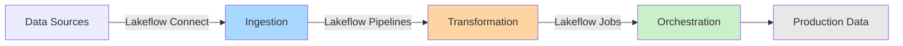
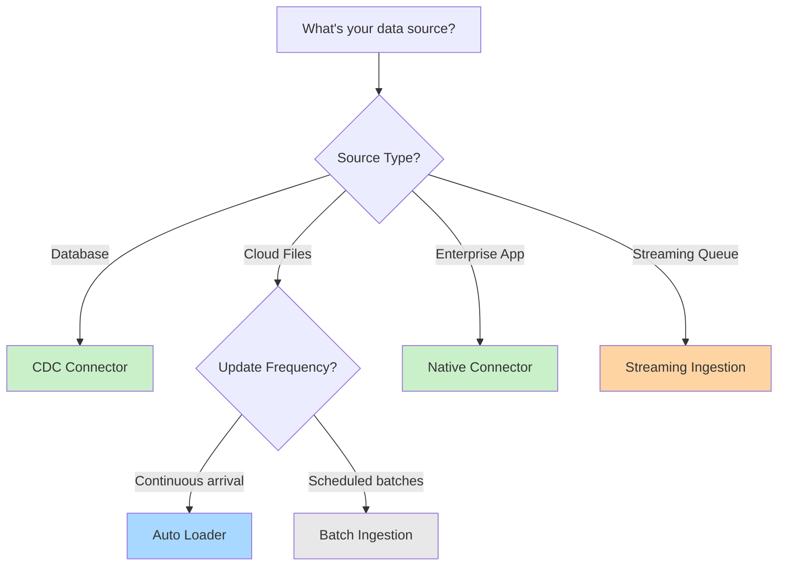
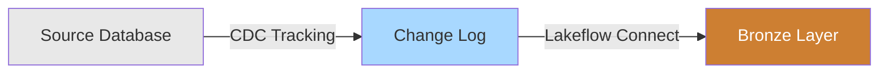
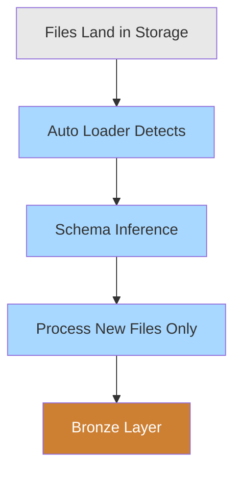
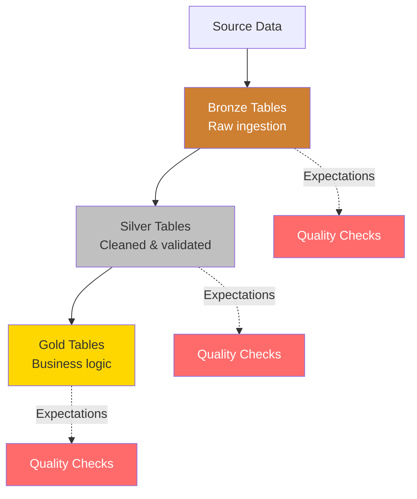
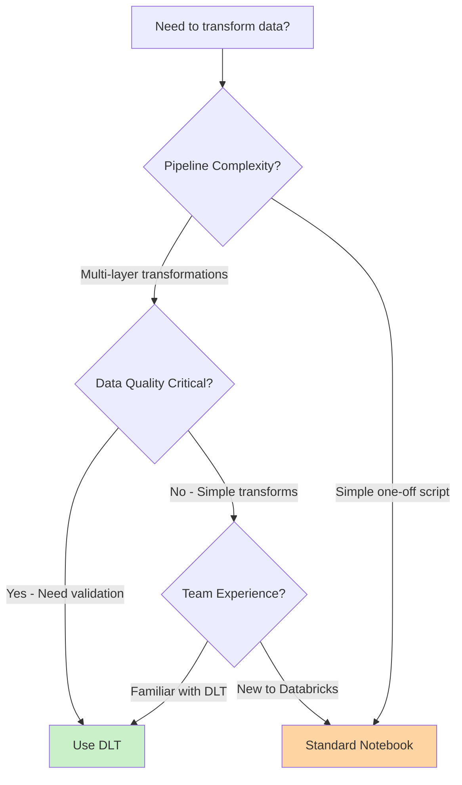
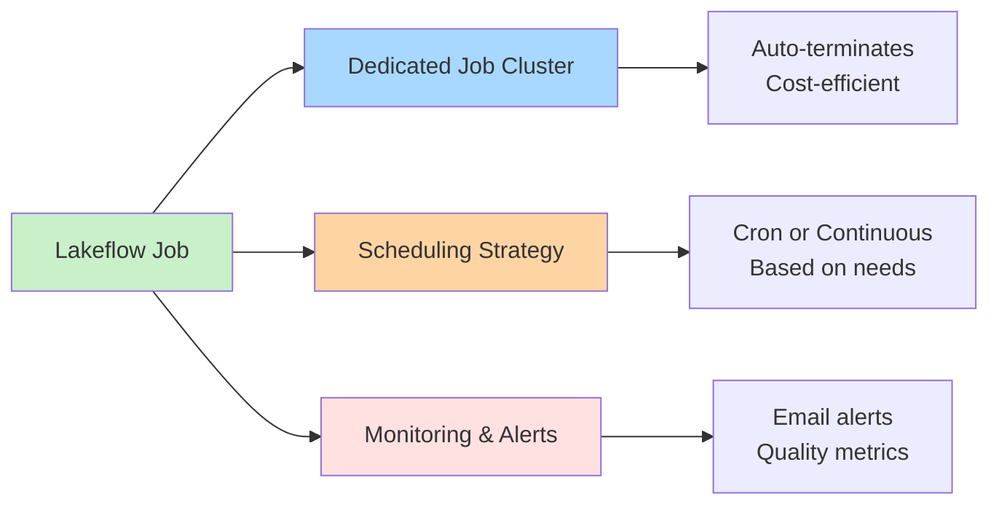
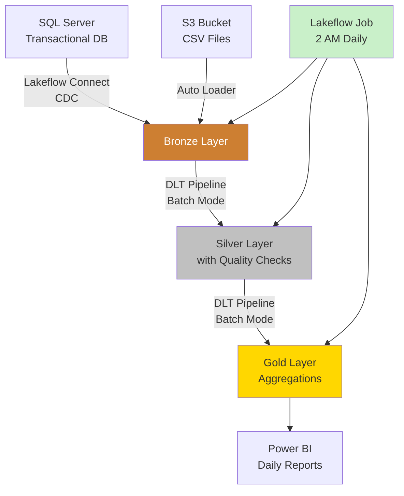

> [!info] Get in Touch
> This guide explains how to build production-ready ETL pipelines using **Databricks Lakeflow** — a unified data engineering solution combining ingestion, transformation, and orchestration. For Plainsight-specific implementation guidance, contact **Benoit**, **Nick** or **Lander**.

---

## What is Databricks Lakeflow?

**Databricks Lakeflow** simplifies building production data pipelines by integrating three essential components into a single platform:



| Component | Purpose | What It Does |
|-----------|---------|--------------|
| **Lakeflow Connect** | Data ingestion | Point-and-click ingestion from databases, enterprise apps, and cloud storage |
| **Lakeflow Pipelines** | Data transformation | Declarative pipelines with built-in quality checks (Delta Live Tables / Spark Declarative Pipelines) |
| **Lakeflow Jobs** | Orchestration | Reliable scheduling, monitoring, and production deployment |

> [!info] Naming Note
> Lakeflow Pipelines is also known as **Spark Declarative Pipelines** since its full integration with Spark. Some DLT commands may reflect this updated naming.

---

## 1. Lakeflow Connect: Data Ingestion

### What is Lakeflow Connect?

**Lakeflow Connect** provides scalable, point-and-click data ingestion without writing complex connector code. It handles the complexity of connections, schemas, and incremental loading.

### Ingestion Methods Overview



### Ingestion Method Decision Table

| Ingestion Method | Use When | Technology | Example |
|-----------------|----------|------------|---------|
| **CDC Connectors** | Source is a database | Change Data Capture | SQL Server, MySQL, PostgreSQL, Oracle |
| **Auto Loader** | Files continuously arrive | Automatic schema detection | Log files dropped to S3 every minute |
| **Batch Ingestion** | Files arrive on schedule | Simple file reads | Nightly CSV export from legacy system |
| **Streaming** | Real-time events from queues | Kafka/Event Hub integration | Real-time clickstream from Kafka |
| **Native Connectors** | Enterprise applications | Pre-built connectors | Salesforce, Workday, ServiceNow |

---

### CDC (Change Data Capture)

**What it is:**
CDC efficiently captures only changed data (inserts, updates, deletes) from databases with minimal impact on source systems.

**When to use:**
- Source is a transactional database
- Need only changed records (not full table)
- Want to minimize load on operational systems
- Require real-time or near-real-time sync

**How it works:**


**Configuration:**
```python
# Lakeflow Connect handles CDC via UI - no code needed
# Point-and-click steps:
# 1. Select database source (e.g., SQL Server)
# 2. Choose tables to sync
# 3. Enable CDC mode
# 4. Set sync frequency (continuous or scheduled)
```

**Best practices:**
- ✅ Use CDC for production databases to minimize source impact
- ✅ Schedule initial full load during off-peak hours
- ✅ Monitor lag metrics to ensure timely data arrival
- ✅ Handle schema changes with automatic evolution
- ❌ Don't use full table sync if CDC is available
- ❌ Don't skip error handling for failed sync operations

---

### Auto Loader

**What it is:**
Auto Loader incrementally and efficiently processes new data files as they arrive in cloud storage, with automatic schema detection and evolution.

**When to use:**
- Files land continuously in cloud storage (S3, ADLS, GCS)
- New files arrive unpredictably throughout the day
- Need automatic schema detection and evolution
- Want automatic tracking of processed files

**How it works:**


**Configuration:**
```python
# Good: Auto Loader with schema inference
@dlt.table(comment="Bronze layer with Auto Loader")
def bronze_transactions():
    return (
        spark.readStream
            .format("cloudFiles")
            .option("cloudFiles.format", "json")
            .option("cloudFiles.schemaLocation", "/schemas/transactions")
            .option("cloudFiles.inferColumnTypes", "true")
            .load("/mnt/landing/transactions/")
    )
```

**Best practices:**
- ✅ Use Auto Loader for continuously arriving files
- ✅ Enable schema inference for flexible data sources
- ✅ Store schema in dedicated location for evolution tracking
- ✅ Set appropriate file notification mode (directory listing vs file notification)
- ❌ Don't use batch processing for continuous file arrival
- ❌ Don't manually track processed files (Auto Loader handles this)

> [!tip] Auto Loader Advantages
> Auto Loader automatically tracks processed files, handles schema evolution, and scales efficiently. Use it whenever files arrive continuously rather than in scheduled batches.

---

### Batch Ingestion

**What it is:**
Simple file reads executed on a schedule for predictable data arrival patterns.

**When to use:**
- Files arrive on predictable schedule (daily/weekly)
- Full control over file arrival timing
- Dataset is relatively small (<100GB per batch)
- One-time historical data loads

**Configuration:**
```python
# Good: Simple batch load for scheduled data
@dlt.table(comment="Daily batch from partner system")
def bronze_partner_data():
    return (
        spark.read
            .format("parquet")
            .load("/mnt/landing/partner/daily/*.parquet")
    )
```

**Best practices:**
- ✅ Use for predictable, scheduled file arrivals
- ✅ Leverage file patterns for date partitioning
- ✅ Validate expected file counts and sizes
- ❌ Don't use batch for continuous file arrival (use Auto Loader)
- ❌ Don't manually implement file tracking logic

> [!warning] Avoid Batch for Continuous Data
> If files arrive continuously, use Auto Loader instead. Manual file tracking adds unnecessary complexity and error potential.

---

### Streaming Ingestion

**What it is:**
Real-time data ingestion from message queues and event streams.

**When to use:**
- Data arrives from queues (Kafka, Event Hub, Kinesis)
- Sub-minute latency required
- Event-driven architecture
- High-throughput real-time processing

**Configuration:**
```python
# Good: Streaming from Kafka
@dlt.table(comment="Real-time events from Kafka")
def bronze_events():
    return (
        spark.readStream
            .format("kafka")
            .option("kafka.bootstrap.servers", "broker:9092")
            .option("subscribe", "events-topic")
            .option("startingOffsets", "latest")
            .load()
    )
```

**Best practices:**
- ✅ Use checkpointing to track progress
- ✅ Set appropriate trigger intervals (5-15 minutes for most cases)
- ✅ Monitor consumer lag metrics
- ✅ Handle late-arriving data with watermarks
- ❌ Don't stream if hourly/daily batch is sufficient
- ❌ Don't ignore backpressure and scaling considerations

---

## 2. Lakeflow Pipelines: Data Transformation

### What are Lakeflow Pipelines?

**Lakeflow Pipelines** (built on Delta Live Tables/Spark Declarative Pipelines) provides a declarative framework for data transformation. You define *what* you want, and Databricks handles *how* to execute it efficiently.

### Core Concepts

| Concept | Description | Use Case |
|---------|-------------|----------|
| **Tables** | Materialized datasets | Final outputs you want to query |
| **Views** | Intermediate transformations | Reusable logic without storage overhead |
| **Streaming Tables** | Real-time processing | Continuous data ingestion and transformation |
| **Expectations** | Data quality rules | Validation and enforcement at each layer |

### Medal Architecture



---

### DLT vs Standard Notebooks

**Decision flow:**


**Comparison:**

| Aspect | DLT Pipelines | Standard Notebooks |
|--------|---------------|-------------------|
| **Multi-layer pipelines** | ✅ Bronze → Silver → Gold | ❌ Single-step transformations |
| **Data quality checks** | ✅ Built-in expectations | ⚠️ Manual validation needed |
| **Dependency management** | ✅ Automatic | ❌ Manual orchestration |
| **Quick prototypes** | ❌ More overhead | ✅ Fast iteration |
| **Custom logic** | ⚠️ Some limitations | ✅ Full flexibility |
| **Monitoring & lineage** | ✅ Built-in | ❌ Manual tracking |
| **Production readiness** | ✅ Designed for production | ⚠️ Requires hardening |

---

### When to Use DLT Pipelines

**Use DLT for:**
- Production ETL with bronze → silver → gold layers
- Pipelines requiring data quality validation
- Team collaboration on shared transformations
- Automatic dependency management needs

**Complete DLT example:**
```python
import dlt
from pyspark.sql.functions import col, current_timestamp, sum, count

# Bronze: Raw data ingestion
@dlt.table(
    comment="Raw sales data from source system",
    table_properties={"quality": "bronze"}
)
def bronze_sales():
    return (
        spark.readStream
            .format("cloudFiles")
            .option("cloudFiles.format", "json")
            .load("/mnt/raw/sales/")
    )

# Silver: Cleaned and validated
@dlt.table(
    comment="Cleaned sales data with quality checks",
    table_properties={"quality": "silver"}
)
@dlt.expect_or_drop("valid_sale_id", "sale_id IS NOT NULL")
@dlt.expect_or_drop("positive_amount", "amount > 0")
@dlt.expect("recent_data", "sale_date >= current_date() - 365")
def silver_sales():
    return (
        dlt.read_stream("bronze_sales")
            .withColumn("processed_at", current_timestamp())
            .dropDuplicates(["sale_id"])
    )

# Gold: Business aggregations
@dlt.table(
    comment="Daily revenue by product category",
    table_properties={"quality": "gold"}
)
def gold_daily_revenue():
    return (
        dlt.read("silver_sales")
            .groupBy("sale_date", "product_category")
            .agg(
                sum("amount").alias("total_revenue"),
                count("sale_id").alias("transaction_count")
            )
    )
```

**Best practices:**
- ✅ Follow medal architecture (bronze → silver → gold)
- ✅ Add quality expectations at each layer
- ✅ Use streaming for real-time, batch for scheduled updates
- ✅ Document table purposes and business logic
- ❌ Don't mix data quality levels in one table
- ❌ Don't skip bronze layer—always preserve raw data

> [!tip] DLT for Production
> Use DLT for production pipelines. The declarative approach and built-in quality checks provide reliability and maintainability worth the initial learning curve.

---

### When to Use Standard Notebooks

**Use Standard Notebooks for:**
- Ad-hoc analysis and exploration
- One-time data migrations
- Custom logic with third-party libraries
- Quick prototypes before productionizing

**Example:**
```python
# Good for: One-off data migration
from pyspark.sql.functions import col, to_date

# Read source data
df = spark.read.parquet("/legacy/customer_data/")

# Apply transformations
transformed = (
    df.filter(col("status") == "active")
      .withColumn("migrated_date", to_date(col("date_string"), "yyyy-MM-dd"))
      .drop("deprecated_column")
)

# Write to new location
transformed.write.mode("overwrite").saveAsTable("catalog.schema.customers")
```

**Best practices:**
- ✅ Use for exploratory work and quick iterations
- ✅ Migrate to DLT when ready for production
- ❌ Don't build complex production pipelines without quality checks
- ❌ Don't use for multi-layer transformations

---

### Batch vs Streaming Processing

**Decision criteria:**

| Processing Mode | Use When | Latency | Example |
|----------------|----------|---------|---------|
| **Streaming** | Need results within minutes | <1 hour | Real-time dashboards, alerting systems |
| **Streaming** | Continuous data arrival | Sub-minute | Log processing, IoT sensor data |
| **Batch** | Daily/hourly updates sufficient | Hours/Days | Nightly reporting, data warehouse loads |
| **Batch** | Complex multi-table joins | Hours | Star schema dimension loading |
| **Batch** | Large historical reprocessing | Days | Backfilling 3 years of historical data |

**Streaming example:**
```python
# Streaming: Process events in near real-time
@dlt.table
def silver_events_stream():
    return (
        dlt.read_stream("bronze_events")
            .filter(col("event_type").isin(["click", "purchase"]))
            .withWatermark("event_timestamp", "10 minutes")
    )
```

**Batch example:**
```python
# Batch: Daily aggregation
@dlt.table
def gold_daily_metrics():
    return (
        dlt.read("silver_events")  # No stream - batch read
            .filter(col("event_date") == current_date())
            .groupBy("user_id", "event_type")
            .agg(count("*").alias("event_count"))
    )
```

> [!warning] Don't Over-Stream
> Streaming adds complexity and cost. If hourly or daily updates meet business needs, use batch processing. Most BI reports don't need sub-minute latency.

---

### Data Quality Expectations

**Three levels of enforcement:**

| Expectation Type | Behavior | When to Use | Example |
|-----------------|----------|-------------|---------|
| `@dlt.expect()` | Track violations, keep records | Monitor data quality trends | Track missing emails for reporting |
| `@dlt.expect_or_drop()` | Drop invalid records | Handle bad data gracefully | Drop negative amounts |
| `@dlt.expect_or_fail()` | Stop pipeline on violation | Critical business rules | Enforce presence of customer IDs |

**Practical example:**
```python
@dlt.table
@dlt.expect("valid_email", "email IS NOT NULL")  # Track missing emails
@dlt.expect_or_drop("valid_amount", "amount > 0")  # Drop negative amounts
@dlt.expect_or_fail("critical_id", "customer_id IS NOT NULL")  # Stop if missing IDs
def silver_customers():
    return dlt.read_stream("bronze_customers")
```

**Best practices:**
- ✅ Use `expect()` for data profiling and monitoring
- ✅ Use `expect_or_drop()` for most quality checks
- ✅ Use `expect_or_fail()` only for critical business keys
- ❌ Don't use `expect_or_fail()` liberally—it stops the entire pipeline

> [!warning] Production Consideration
> Use `expect_or_fail()` sparingly—it will stop your entire pipeline. Reserve it for truly critical validations where data integrity failures would cause downstream issues.

---

## 3. Lakeflow Jobs: Orchestration

### What are Lakeflow Jobs?

**Lakeflow Jobs** orchestrates your entire data workflow, from ingestion through transformation to final delivery. It provides reliable scheduling, monitoring, and production deployment.

### Job Architecture



> [!warning] Cost Optimization Rule
> **Every production job must have a dedicated Job Cluster.** Never use All-Purpose clusters for scheduled production jobs.

**Why Job Clusters?**
- Automatically terminate after job completion (no idle costs)
- Isolated environment (no conflicts with other workloads)
- Right-sized for specific workload
- Better cost tracking per pipeline
- Optimal for production reliability

**See [[Compute Selection]] for detailed guidance on cluster sizing and Photon usage.**

---

### Scheduling Strategies

| Schedule Type | Use When | Cron Example | Best For |
|--------------|----------|--------------|----------|
| **Daily overnight** | Standard reporting pipelines | `0 0 2 * * ?` (2 AM daily) | Batch ETL, daily aggregations |
| **Hourly** | Near-real-time dashboards | `0 0 * * * ?` (Every hour) | Frequent updates, trending data |
| **Continuous** | Streaming pipelines | Set trigger interval in DLT | Real-time analytics |
| **Event-driven** | On data arrival | Use file arrival trigger | Dynamic workloads |
| **Multiple per day** | High-frequency updates | `0 0 */6 * * ?` (Every 6 hours) | Intraday reporting |

**Best practices:**
- ✅ Schedule batch jobs during off-peak hours (1-5 AM)
- ✅ Stagger multiple pipelines to avoid resource contention
- ✅ Use continuous mode only for true streaming needs
- ✅ Consider timezone when scheduling (Europe/Brussels)
- ❌ Don't run batch jobs every minute (use streaming instead)
- ❌ Don't schedule during peak business hours

---

### Task Dependencies

**Chain tasks for complex workflows:**
```json
{
  "tasks": [
    {
      "task_key": "ingest_data",
      "pipeline_task": {"pipeline_id": "ingestion-pipeline"}
    },
    {
      "task_key": "validate_quality",
      "depends_on": [{"task_key": "ingest_data"}],
      "notebook_task": {"notebook_path": "/Validation/check_quality"}
    },
    {
      "task_key": "send_notification",
      "depends_on": [{"task_key": "validate_quality"}],
      "notebook_task": {"notebook_path": "/Alerts/send_email"}
    }
  ]
}
```

**Best practices:**
- ✅ Keep dependencies simple and linear when possible
- ✅ Use parallel tasks for independent workloads
- ✅ Add validation tasks between major stages
- ✅ Define clear failure handling paths
- ❌ Don't create overly complex DAGs (split into separate jobs)
- ❌ Don't forget to test dependency chains

---

### Monitoring and Observability

**Key metrics to track:**

| Metric | Why Monitor | Action on Alert |
|--------|-------------|----------------|
| **Job completion time** | Detect performance degradation | Optimize queries or scale cluster |
| **Data quality failures** | Catch bad data early | Investigate source system |
| **Rows processed** | Validate expected volume | Check upstream issues |
| **Cost per run** | Control budget | Review cluster size and Photon usage |
| **Failure rate** | Ensure reliability | Fix recurring errors |

**Monitoring implementation:**
```python
# In validation notebook
from datetime import datetime

# Check row counts
current_count = spark.table("gold.daily_sales").count()
expected_min = 10000

if current_count < expected_min:
    raise Exception(f"Data quality alert: Only {current_count} rows processed")

# Log metrics
dbutils.notebook.exit(f"Success: {current_count} rows processed at {datetime.now()}")
```

**Lakeflow Jobs observability features:**
- **Full lineage tracking**: Source to table relationships, transformation dependencies
- **Health monitoring**: Data freshness metrics, quality check results, pipeline status
- **Automated alerts**: Failure notifications, SLA breach warnings, quality degradation

---

## Complete End-to-End Example

### Scenario: Daily Sales Analytics Pipeline

**Business requirement:** Ingest sales data from SQL Server and product files from S3, transform through medal architecture, deliver daily reports to Power BI.



---

## Quick Reference: Decision Matrix

| If you need to... | Then use... | Key consideration |
|-------------------|-------------|-------------------|
| Ingest from database | CDC Connector | Minimizes source impact, captures changes only |
| Ingest continuous files | Auto Loader | Automatic schema handling, file tracking |
| Ingest scheduled batches | Batch ingestion | Simple and cost-effective for predictable data |
| Ingest from Kafka/queues | Streaming ingestion | Real-time processing requirements |
| Build production pipeline | DLT Pipelines | Quality checks + lineage + dependency management |
| Quick one-off script | Standard notebook | Fast iteration for ad-hoc work |
| Need <1 hour latency | Streaming mode | Sub-hour data freshness |
| Daily/hourly is fine | Batch mode | Lower cost and complexity |
| Schedule pipeline | Lakeflow Job + Job Cluster | Auto-termination saves cost |
| Complex joins/aggregations on >100GB | Consider Photon | Only if heavy joins/aggregations justify 2x cost |

---

## Best Practices Summary

### Ingestion Layer

| Practice | Rationale |
|----------|-----------|
| ✅ Use CDC for databases | Captures only changes, minimizes source system impact |
| ✅ Use Auto Loader for continuous files | Automatic schema evolution and file tracking |
| ✅ Schedule ingestion during off-peak hours | Reduces load on operational systems |
| ✅ Monitor ingestion lag metrics | Catch delays and failures early |
| ❌ Don't skip bronze layer | Always preserve raw data for reprocessing |
| ❌ Don't use batch for continuous arrivals | Manual file tracking adds complexity |

### Transformation Layer

| Practice | Rationale |
|----------|-----------|
| ✅ Follow medal architecture (bronze → silver → gold) | Clear separation of data quality levels |
| ✅ Use DLT for production pipelines | Built-in quality, lineage, and dependency management |
| ✅ Add expectations at each layer | Catch quality issues early in pipeline |
| ✅ Use streaming only when latency requires it | Batch is simpler and cheaper for most use cases |
| ✅ Document table purposes and business logic | Maintainability for team collaboration |
| ❌ Don't mix quality levels in one table | Maintain clear bronze/silver/gold boundaries |
| ❌ Don't use `expect_or_fail()` liberally | Reserve for truly critical validations |
| ❌ Don't build production pipelines in notebooks | Use DLT for reliability and monitoring |

### Orchestration Layer

| Practice | Rationale |
|----------|-----------|
| ✅ Use Job Clusters for all scheduled jobs | Automatically terminates, saves costs |
| ✅ Set up failure alerts immediately | Enables quick response to issues |
| ✅ Enable 2-3 retries with exponential backoff | Handles transient failures gracefully |
| ✅ Schedule batch jobs during off-peak hours | Minimizes resource contention |
| ✅ Monitor job duration and data volumes | Detect performance degradation early |
| ❌ Don't use All-Purpose clusters for jobs | Wastes money on idle compute |
| ❌ Don't run full refresh in production | Incremental processing is more efficient |
| ❌ Don't create overly complex task dependencies | Split into separate jobs for clarity |

---

## Related Documentation

### Within Databricks Best-Practices
- [[Compute Selection]] - Cluster sizing, Photon usage, and cost optimization

### Fabric Architecture (Similar Concepts)
- [[Data Layers and Modeling]] - Medal architecture principles applicable to Lakeflow
- [[Landing and Staging]] - Bronze layer patterns and best practices
- [[Data Pipeline Patterns]] - Common pipeline architectures
- [[Lakehouse Architecture]] - Overall data platform design philosophy

### dbt Integration
- [[Project Structure]] - Organizing transformation code for maintainability
- [[Operations & Testing]] - Testing strategies applicable to DLT expectations

---

*For Plainsight-specific Lakeflow implementation guidance, contact Benoit | Last updated: November 2025*
