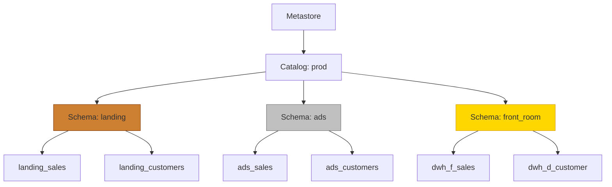

# Working with the Unity Catalog

> [!info]
> **Audience:** Data engineers, analytics engineers, and platform administrators working with Databricks.  
> In this guide we will quickly zoom in on the Unity Catalog and provide our personal tips and tricks to get started quickly and scalable.

## Overview

The Unity Catalog is Databricks' unified governance solution for all data assets. Advantages of working with the Unity Catalog include:
- Fine-grained access control,
- Centralized metadata management,
- Auditability across workspaces.
Adopting Unity Catalog ensures data security, compliance, and operational efficiency.

## Unity Catalog components

The unity catalog works on a four-level structure: Metastore, Catalog (top level), Schema (mid level) and table/view (bottom level)



The metastore is always present and fixed over the entire databricks account. When creating or reading tables, you only need to reference the catalog, schema and table/view/volume/model name. The most straightforward way to reference a table is by using the three-level dot notation `catalog.schema.table/view/volume/model`. When not specified, spark will assume the `default` catalog and/or `default` schema.

The best way to read and write data is by using the `read_table` and `saveAsTable` functionalities in python. An example is given in the code block below.

```python
# We use the dot notation to read from the Landing schema (Bronze-equivalent)
df = spark.read_table("prod.landing.sap_sales_order_items")
# For writing to ADS (Silver-equivalent) a similar syntax is used
df.write.saveAsTable("prod.ads.sales")
```

In SQL the same can be achieved as follows:

```SQL
-- Read from Landing (Bronze-equivalent)
SELECT * FROM prod.landing.sap_sales_order_items;
-- Write into ADS (Silver-equivalent)
CREATE TABLE prod.ads.sales AS SELECT * FROM some_source_table;
```

## Managed vs external tables

In the Unity Catalog two types of tables exist: Managed and external tables. **Our preference is to use Managed tables**. With managed tables, the Unity Catalog will manage all aspects of data management: storage location, optimizations, indexing, ... . With external tables *you* are in control of the different data management aspects.

What would be a case to use external tables? These type of tables are typically used when you want fine-grained control. In some cases (e.g. when using sensitive data) this is enforced by other departements. An example to create external tables is shown below.

```python
# Adding a path parameter to saveAsTable results in an external table!
(
        df.write
            .option("path", "abfss://container@storageaccount.dfs.core.windows.net/front_room/sales_data")
            .saveAsTable("prod.front_room.sales_data")
)
```

In SQL this can be achieved as follows:

```SQL
CREATE TABLE prod.ads.sales_data
USING DELTA
LOCATION 'abfss://container@storageaccount.dfs.core.windows.net/ads/sales_data'
AS SELECT * FROM source_table;
```

## Unity Catalog Organization

In the unity catalog we have two organizational units: Catalogs and schemas. We can freely define these structures to our convenience. However, for a scalable and maintainable solution we recommend to follow a few best practices.

Catalogs are best organized by either data domains or environments. The preferred choice here is organization by environment: `dev`, `test`, `acc`, `prod`. 

Schemas can be either organized by data domains or by **data layers**. Unity Catalog makes it easy to express our preferred semantic layers such as `landing`, `staging`, `ads`, `front_room` / `star` (see [[Data Layers and Modeling]] and [[Analytical Data Store (ADS)]]). Where you must align with existing lakehouse conventions, you can map these directly to medallion-style layers `bronze` (≈ `landing`), `silver` (≈ `ads`), `gold` (≈ `front_room` / `star`) - see [[Technical Guideline Ops/Architectural Principles/Medallion - Bronze Silver Gold|Medallion Architecture]] for details.

The main reason for organizing by environment at the catalog level is to have a clear separation between different application environments. This clear separation will make it easier to promote data solutions from one environment to another (e.g. from dev to prod) without the risk of accidental data exposure or modification. The following code block shows how to read data from a specific catalog in python.

```python
# Set up the catalog to use for the current session
spark.catalog.setCurrentCatalog("catalog_name")
# Table is read from the specified catalog
df = spark.read_table("schema.table_name")
```

In SQL this can be achieved as follows:

```SQL
USE CATALOG catalog_name;
SELECT * FROM schema.table_name;
```

The correct catalog name is provided to the code based on the environment the code is running in using environment variables or configuration files.

Apart from the simplified promotion process, other advantages of organizing by environment at the catalog level include:
- A clear separation between environments, which reduces the risk of accidental data exposure or modification.
- Simplified testing and development processes by isolating changes to specific environments. Note that the three dot notation can still be used to access data across different catalogs if needed (e.g. when building test scripts to stage prod data).
- Simplified access management since permissions can be set at the catalog level for each environment.
- Facilitation of environment-specific configurations and optimizations.
- Clear cost allocation and resource management per environment.

## User and access management

Next to catalogs, principals are the second main component of the Unity Catalog. Principals are users, groups or service principals that can be granted permissions on catalogs, schemas and tables/views. Principals can be managed directly in the Unity Catalog or can be synchronized from an external identity provider. Our recommendation is to centralize all user management in an external identity provider and synchronize the users and groups to the Unity Catalog. 

On Azure the recommended way to sync your identity provider with the Unity Catalog is by using AIM (Automated Identity Management). With AIM you can sync databricks with Entera, without setting up an application. Note that this will sync *all* of your users and groups from Entra to Databricks. For other identity providers (or when limitations on the sync exist) a synchronization using SCIM (Secure for Cross-domain Identity Management) is recommended.

When setting up access management in the Unity Catalog we recommend to follow the principle of least privilege. This means that users and groups should only be granted the minimum permissions necessary to perform their tasks. Regular reviews of access permissions should be conducted to ensure compliance with this principle.

A second recommendation is to implement role-based access control (RBAC). With RBAC, permissions are assigned to roles rather than individual users. Users are then assigned to roles based on their job functions. This approach simplifies access management and ensures consistency in permission assignments.

In order to make access management more efficient and auditable, it is advisable to use infrastructure as code tools. Our recommendation is to use Terraform with the Databricks provider to manage access control in a reproducible manner. When checking the terraform code into Git, an audit trail of changes is automatically created.
