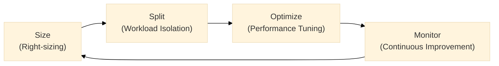

# Capacity Management & Optimization

> [!info] Purpose
> Strategic capacity management ensures optimal performance and cost-effectiveness in Fabric environments. Through careful workload isolation, performance optimization, and intelligent scaling strategies, teams can maintain predictable performance while controlling costs. Proper capacity planning combined with workload smoothing enables efficient resource utilization while meeting service level objectives.

## Overview
Capacity management follows a four-step cycle: Size → Split → Optimize → Monitor. Success requires both initial planning and ongoing operational excellence.

### Key Objectives

| Objective | Outcome | How to Achieve |
|---|---|---|
| Predictable performance | Meet SLAs for interactive and batch workloads | Proper sizing and workload isolation |
| Cost control | Keep peak spend in line with expected value | Optimization and scheduled scaling |
| Scalable operations | Enable predictable growth via capacity patterns | Monitoring and proactive management |

## Quick Reference: Do's and Don'ts

| Do ✅ | Don't ❌ |
|-------|----------|
| Use F8+ for production workloads | Deploy production on F2 capacities |
| Separate interactive and batch loads | Mix heavy ETL with user queries |
| Implement scheduled scaling for predictable loads | Leave dev/test capacities running 24/7 |
| Monitor CPU, memory, and query metrics | Wait for user complaints to optimize |
| Use reserved capacity for steady workloads | Pay premium rates for predictable usage |
| Tag capacities for cost allocation | Mix different departments on shared capacity |
| Stagger refresh schedules to smooth peaks | Schedule all refreshes at the same time |
| Plan capacity around peak concurrency | Size only for average load patterns |

## 1. Sizing Your Capacity

### SKU Selection Guide

| SKU | vCores | Memory | Best For | Key Considerations |
|-----:|:------:|:-------:|----------|-------------------|
| F4 | 4 | ~25GB | Development | Personal sandboxes, POCs |
| F8 | 8 | ~50GB | Testing | Small team environments |
| F16 | 16 | ~100GB | Small Prod | Departmental solutions |
| F32 | 32 | ~200GB | Med Prod | Enterprise workloads |
| F64 | 64 | ~400GB | Large Prod | Enterprise-scale workloads |

### Sizing Factors Checklist
✓ Concurrent active users and query patterns
✓ Peak vs baseline workload requirements
✓ Dataset sizes and refresh patterns
✓ Business SLAs and performance targets
✓ Growth projections (6-12 months)

> [!warning]
> Avoid F2 for production use - suitable only for POCs and light testing. F2 becomes constrained for Spark operations and cannot support Copilot features.

## 2. Workload Isolation

### Split Strategies

1. **Environment-based Splitting**
   - Separate Dev/Test/Prod to prevent resource contention
   - Enable different settings per environment
   - Maintain clear cost allocation

2. **Workload-based Splitting**
   - Isolate interactive (BI) from batch (ETL) workloads
   - Optimize settings for specific use cases
   - Better resource utilization

### Example Split Configuration

| Capacity | Size | Workload Type | Typical Use |
|---------|:----:|---------------|-------------|
| Dev | F4 | Mixed | Development & testing |
| QA | F8 | Mixed | Integration testing |
| Prod-Interactive | F16 | Interactive | Reports & dashboards |
| Prod-Batch | F8 | Background | ETL & refreshes |

## 3. Performance Optimization

### Performance Optimization Strategies

1. **Workload Management Approaches**

   a. **Smoothing**
   - Stagger jobs to avoid concurrent peaks
   - More cost-efficient approach
   - Better for predictable workloads
   - Requires careful scheduling

   

   **Impact of Smoothing on Capacity Metrics**

   Without smoothing - CPU usage shows sharp spikes:
   

   With smoothing - More even resource utilization:
   

   > [!tip]
   > Notice how workload smoothing reduces sharp CPU spikes and creates a more consistent resource utilization pattern. This leads to better performance predictability and more efficient capacity usage.

   b. **Bursting**
   - Scale up temporarily for peaks
   - More expensive but flexible
   - Good for unexpected spikes
   - Requires proper monitoring

   c. **Autoscaling**
   - Automatically adjusts capacity based on usage
   - Balances performance and cost
   - Responds to both predictable and unexpected demands
   - Sets min/max boundaries for control

   

   > [!tip]
   > Autoscaling automatically increases or decreases your capacity size based on workload demands. It helps optimize costs by scaling down during quiet periods and scaling up to handle peak loads. Configure min/max boundaries to control costs while ensuring performance.

2. **Admin Portal Settings**

| Setting | Purpose | Recommended Value |
|---------|---------|------------------|
| Max Memory (%) | Dataset memory limit | 70% shared, 90% critical |
| Max Parallel Refreshes | Concurrent refreshes | Match SKU size (4 for F16) |
| Query Memory Limit | DAX query memory | Based on query complexity |
| Container Size Limit | Isolation control | Based on dataset size |

3. **Cost Optimization**
   - Use automation for scaling (REST API)
   - Implement reserved capacity for steady workloads
   - Tag resources for cost allocation
   - Set spend alerts and thresholds

> [!tip]
> Start with conservative limits and adjust based on monitoring data.

## 4. Monitoring & Governance

A focused monitoring strategy gives teams the telemetry they need to keep capacities healthy, make data-driven scaling decisions, and control costs. Use a combination of built-in dashboards, usage reports and the Microsoft Fabric Capacity Metrics App for live operations and trend analysis.

### Primary monitoring sources
- Fabric Admin Center — real-time operational view (live troubleshooting, active sessions)
- Capacity Metrics App — trend-driven capacity analysis (CU consumption, memory pressure, autoscale tuning)
- FUAM (Fabric Usage & Activity Monitoring) - dataset/query growth, adoption and long-term trends
- Power BI Activity Log - audit, refresh history and query-level troubleshooting
- Custom scripts / APIs - automation, alerting and bespoke reporting into Azure Monitor or your SIEM

### Key metrics, thresholds and suggested actions
| Metric | Warning | Critical | Typical action |
|--------|--------:|---------:|----------------|
| CPU avg | 60–75% | >80% | Investigate heavy queries, optimize or scale |
| Memory | 70–85% | >90% | Tune models/queries or increase capacity |
| Queue depth | >10 | >20 | Reduce concurrency or increase capacity |
| Refresh time | +25% baseline | +50% baseline | Investigate refresh failures, stagger schedules |

Tip: treat sustained warnings (multiple intervals) as actionable signals; investigate hot datasets and expensive queries before resizing capacity.

---
## Related pages
- [[Workspace Organization]]
- [[Lakehouse Architecture]]
- [[Data Pipeline Patterns]]