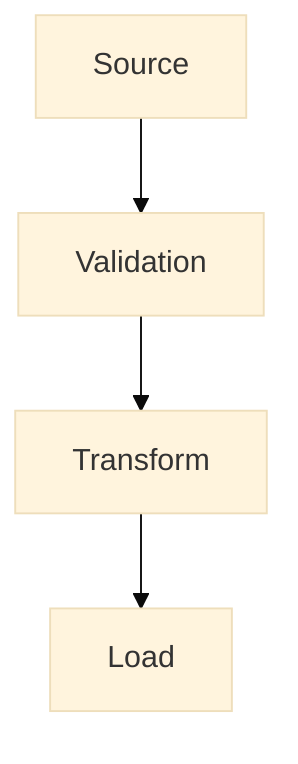

# Data Pipeline Patterns

> [!info] Purpose
> Proven pipeline patterns ensure reliable data processing and optimal resource utilization in Fabric implementations. Through incremental processing, smart CDC handling, and comprehensive observability, teams can maintain data freshness and recover gracefully from failures. Robust error handling and checkpointing strategies enable automated recovery while optimizing resource usage through intelligent scheduling.

## Overview

Reliable pipelines are the backbone of a healthy lakehouse. Use idempotent steps, clear checkpoints (watermarks), and structured logging to enable replays and troubleshooting.



## Quick Reference: Do's and Don'ts

| Do ✅ | Don't ❌ |
|-------|----------|
| Use incremental processing when possible | Always default to full table reloads |
| Save watermarks before state changes | Update watermarks before successful completion |
| Implement idempotent operations (MERGE) | Use INSERT without duplicate checks |
| Add structured logging and metrics | Rely on generic error messages |
| Choose the right tool (Pipeline/Notebook/Dataflow) | Force-fit complex logic into basic pipelines |
| Include retry logic for transient failures | Let pipelines fail without recovery |
| Parallelize large data loads strategically | Over-parallelize small datasets |
| Implement circuit breakers for dependencies | Allow cascading failures across pipelines |

## Core concepts

Incremental processing, idempotency, and observability are the pillars of resilient pipelines. Design pipelines as small, testable steps with clear checkpoints and deterministic keys to enable safe replays.

### Merge / Upsert pattern

Use MERGE statements or duplicate detection to apply changes into dimension/fact tables.

```sql
MERGE INTO gold.fct_orders AS T
USING stage.orders AS S
ON T.order_id = S.order_id
WHEN MATCHED AND S.hash <> T.hash THEN UPDATE SET ...
WHEN NOT MATCHED THEN INSERT (...)
;
```

## When to use Pipelines vs Notebooks vs Dataflows

| Tool | Best use case |
|---|---|
| Data Pipelines | Orchestration and scheduled, repeatable ETL/ELT (low-code/no-code). Great for copy jobs and chaining activities. |
| Notebooks | Advanced data processing, custom transform logic and ML experiments. Use when custom code, libraries or iterative exploration is needed. Notebooks can be orchestrated from Data Pipelines. |
| Dataflow Gen2 | Self-service transformations for Power BI users (Power Query experience). Best for light-weight transformations tightly coupled to Power BI workflows. |

![[pipelines_editor.png]]
![[dataflow_gen2.png]]

![[notebook_sample.png]]

## Error handling patterns

| Scope | Mechanism | Example |
|------|-----------|--------|
| Activity | Retries (exp backoff) | 3 attempts |
| Pipeline | Checkpoints, idempotency | Save watermark before transform |
| Orchestration | Circuit breaker | Pause dependent jobs on repeated failures |

## Performance & cost trade-offs

| Action | Benefit | Cost |
|-------|--------|------|
| Parallel partitions | Faster loads | More compute
| Auto-scaling IR | Handles bursts | Higher peak spend
| Smaller chunk sizes | Lower memory | Higher overhead

## Security

- Use managed identities for resource access
- Parameterize secrets via Key Vault

---
## Related pages
- [[Technical Guideline Ops/Fabric Best-Practices/Naming Conventions]]
- [[Workspace Organization]]
- [[Lakehouse Architecture]]
