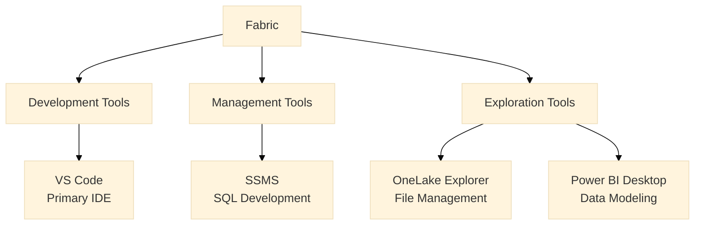

# Third Party Tools for Fabric

## Overview
The right tooling choices accelerate development and simplify administration of Fabric environments. This guide outlines recommended tools for different aspects of Fabric development and management.

> [!info] Core Principles
> 1. Use the right tool for each task
> 2. Standardize tooling across teams
> 3. Prioritize tools with Git integration
> 4. Enable automation where possible

## Tool Categories

## Best Practices: Do's and Don'ts

| Do ✅ | Don't ❌ |
|-------|----------|
| Standardize on VS Code for development | Mix different IDEs across the team |
| Use SSMS for deep SQL performance tuning | Rely on basic editors for complex SQL work |
| Configure VS Code with recommended extensions | Leave developers to set up their own tools |
| Use OneLake Explorer for file operations | Rely on Storage Explorer for OneLake files |
| Store PBIP files in Git | Keep Power BI files outside source control |
| Enable notebook features in VS Code | Use Azure Data Studio for notebooks |
| Document tool configurations centrally | Let each developer use different settings |
| Size capacity based on workload needs | Undersize capacity for production workloads |

## Implementation Guide

1. **Standardization:**
   - Use VS Code as primary development environment
   - Configure recommended extensions and settings
   - Document common workflows

2. **Integration:**
   - Enable Git source control
   - Configure workspace settings
   - Set up Copilot features

3. **Maintenance:**
   - Keep tools updated
   - Monitor capacity usage
   - Review and update configurations

> [!tip] About Copilot
> Copilot features in Fabric and Power BI can significantly boost productivity. Available on all capacity tiers (F2 and above). Consider workload requirements when choosing capacity tiers for Copilot-enabled experiences.

- Copilot features (in Fabric and Power BI) can significantly boost productivity for exploration and report generation. Copilot capabilities are available on all capacity tiers (starting from F2). Consider your workload requirements when choosing the appropriate capacity tier for your Copilot-enabled experiences.

# Key Tools

### Visual Studio Code (⭐ Essential)
![[logo_vscode.svg]]

- **Purpose:** Primary development environment for Fabric workspaces
- **Key Capabilities:**
  - Rich extension ecosystem for Fabric development
  - Integrated Git and source control
  - Notebook support for data exploration
  - Integrated terminal for CLI operations
  - Multi-language support (Python, SQL, etc.)
  - Connect to Fabric services
  - Run and debug notebooks
  - Author transformations and data quality checks
- **Essential Extensions:**
  - Azure Account (`ms-vscode.azure-account`)
  - Python (`ms-python.python`)
  - Jupyter (`ms-toolsai.jupyter`)
  - PowerShell (`ms-vscode.powershell`)
  - SQL Server (`ms-mssql.mssql`)
- **Feature Matrix:**

| Feature | Benefits |
|---------|----------|
| Extensions | Connect to Fabric, run notebooks, interact with Git |
| Integrated terminal | Run scripts and CLI tools |
| Notebooks | Author transformation and data quality checks |
| Git integration | Version control and collaboration |
| Multi-language | Work with Python, SQL, PowerShell in one IDE |

- **Website:** [Visual Studio Code](https://code.visualstudio.com/)

---

### SQL Server Management Studio (SSMS)
![[logo_ssms.png]]

- **Purpose:** Deep SQL development and performance tuning
- **Key Capabilities:**
  - Advanced query plan analysis
  - Database administration interface
  - Security management
  - Server monitoring and maintenance
  - Performance investigations
  - GUI for security & maintenance
- **Best For:**
  - Performance investigations
  - DBAs and infrastructure teams
  - Complex SQL development
  - Server management tasks
- **Limitations:**
  - Windows-only
  - Limited notebook support
  - No direct lakehouse integration
- **Website:** [SQL Server Management Studio](https://learn.microsoft.com/sql/ssms/)

---

### OneLake Explorer
![[logo_onelake.jpg]]

- **Purpose:** File-level operations and sync for Fabric lakehouses
- **Key Capabilities:**
  - Browse and manage lakehouse files
  - Offline file sync
  - Windows integration
  - Direct file operations
- **Feature Comparison:**

| Capability | OneLake Explorer | Storage Explorer |
|-----------|------------------:|------------------:|
| File operations | ✅ | ✅ |
| Offline sync | ✅ | ❌ |
| Metadata editing | ⚠️ limited | ✅ |
| Cross-workspace | ✅ | ⚠️ |

- **Benefits over Azure Storage Explorer:**
  - Native OneLake integration
  - Offline capabilities
  - Simpler authentication
  - Better performance
- **Website:** [OneLake Explorer](https://learn.microsoft.com/en-us/fabric/onelake/onelake-file-explorer)

---

### Power BI Desktop
![[logo_powerbi.svg]]

- **Purpose:** Data modeling and report development
- **Key Capabilities:**
  - Visual report creation
  - DAX measure development
  - Data model design
  - DirectLake connectivity
  - Report prototyping and testing
- **Integration with Fabric:**
  - Direct lakehouse connections
  - Semantic model development
  - Copilot integration
  - Deployment pipelines
- **Best Practices:**
  - Use for report testing before publishing
  - Leverage PBIP files for version control
  - Integrate with deployment pipelines
  - Enable Copilot features for productivity
- **Website:** [Power BI Desktop](https://powerbi.microsoft.com/desktop/)

> [!note]
> Azure Data Studio is intentionally excluded from recommendations in this guide.

## Tool Selection Guide

| Task | Primary Tool | Secondary Tool | Best Practice |
|------|-------------|----------------|---------------|
| Code & Notebooks | VS Code | Power BI (for DAX) | Use Git for version control |
| SQL Development | SSMS | VS Code | SSMS for performance tuning |
| File Operations | OneLake Explorer | Storage Explorer | Prefer OneLake for daily work |
| Report Development | Power BI Desktop | VS Code | Use PBIP files with Git |

## Security Configuration

- **Authentication:**
  - Use Azure AD authentication
  - Enable managed identities where possible
  - Enforce MFA for administrative access
  - Configure conditional access policies

- **Secret Management:**
  - Store credentials in Key Vault
  - Never embed secrets in notebooks
  - Use service principals for automation
  - Rotate access keys regularly

## Related Documentation
- [[Technical Guideline Ops/Fabric Best-Practices/Naming Conventions]]
- [[Workspace Organization]]
- [[Lakehouse Architecture]]