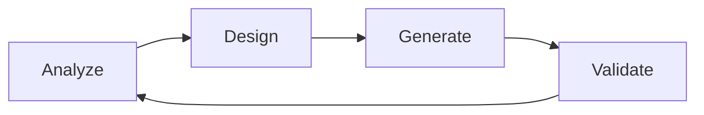
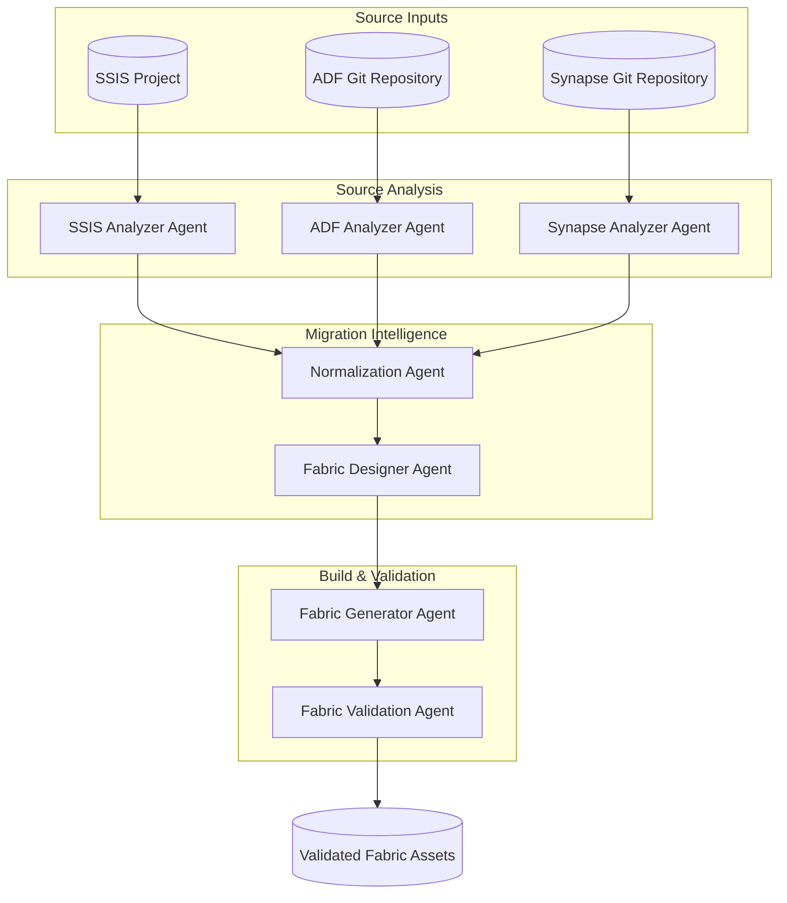

### Intro

This guide describes how AI agents can accelerate and standardize migrations from SQL-based integration tools  to Microsoft Fabric. The approach is designed to industrialize repeatable migration work while maintaining strong human oversight and delivery quality.

⚠️ Important: This is an AI-assisted migration approach and is not fully autonomous. Human review and approval remain mandatory at defined control points.

---

### AI-Driven Migration

AI-assisted migration brings structure, speed and risk reduction to large-scale data platform modernizations. Instead of manually analyzing hundred of integration pipelines, the AI engine automatically inventories assets, detects complexity drivers and recommends the most appropiate Fabric-native implementation patterns. This shifts migration projects from slow and tedious work to a scalable meta-driven approach. By using this approach there will be faster time-to-insight, more predictable delivery and significantly reduced migration risk.

| Capability | Traditional Migration | AI-Assisted Migration | Business Impact |
|---|---|---|---|
| Estate discovery | Manual inventory, weeks of analysis | Automated scanning in minutes | Faster project kickoff |
| Complexity assessment | Expert judgment, inconsistent | AI-driven scoring | Predictable planning |
| Migration pattern selection | Trial-and-error | Automated Fabric recommendations | Reduced rework |
| Risk identification | Often late in project | Early detection of high-risk components | Fewer surprises |
| Portfolio prioritization | Spreadsheet exercises | Data-driven backlog generation | Better ROI focus |
| Delivery scalability | Linear with team size | Factory-style parallelization | Lower migration cost |
| Knowledge dependency | Key-person risk | Codified intelligence | More resilient teams |

To realize these benefits in practice, the AI-assisted migration capability is implemented through a modular agent framework that supports the major SQL-based integration tools.

---

### Supported integration tools

The AI-assisted migration framework is designed to support the core Microsoft data integration ecosystem through a unified, metadata-driven approach. The agents can ingest and analyze legacy SSIS projects as well as modern cloud-native Azure Data Factory and Azure Synapse definitions. Their control flow, data movement and transformation logic will be nomalized into a common model. Based on this model, the AI engine generates migration insights, complexity scoring and recommends fabric-native implementations. After a human review of the assessment an automatic generation of the Fabric artifacts could take place.

- **SQL Server Integration Services (SSIS)** 
- **Azure Data Factory (ADF)** 
- **Azure Synapse Pipelines** 

---

### Core Principles of the AI-Driven Migration Framework

The AI-assisted migration framework operates as a continuous lifecycle of Analyze → Design → Generate → Validate. Legacy workloads are first analyzed to understand structure and risks, then translated into an optimal Fabric design, automatically generated into deployable assets, and finally validated to ensure correctness and reliability.

This closed-loop approach enables scalable, repeatable, and high-quality migrations while keeping human experts in control at critical decision points.

---

### AI-Driven Migration Framework

This section introduces the AI-driven migration framework used to accelerate and standardize the transition of SQL-based integration workloads to Microsoft Fabric. The framework applies a modular, multi-agent approach in which specialized AI agents collaborate to analyze legacy solutions, design the optimal Fabric architecture, and generate production-ready assets.

The design emphasizes:

- **Repeatability** — consistent outcomes across projects
- **Scalability** — ability to process many pipelines efficiently
- **Transparency** — clear hand-offs between agents
- **Human control** — mandatory review points remain in place

Each agent has a single, well-defined responsibility. Tool-specific analyzers first interpret the source logic (SSIS, ADF, Synapse). Their outputs are normalized into a unified canonical model, which then drives automated target design and asset generation for Microsoft Fabric.

⚠️ Important: This framework is AI-assisted, not AI-autonomous. While agents significantly accelerate analysis and generation, human validation and architectural oversight remain essential to ensure correctness, performance, and business alignment.

The diagram below illustrates the end-to-end interaction between the agents in the migration pipeline.

Below is a concise explanation of each part of the AI-driven migration framework.

---

### Source Inputs

These are the starting artifacts that contain the legacy integration logic.

- **SSIS Project** — `.ispac` or `.dtsx` packages representing existing ETL workflows.  
- **ADF Git Repository** — JSON definitions of pipelines, datasets, linked services, and triggers from Azure Data Factory.  
- **Synapse Git Repository** — Synapse pipeline and related artifacts extracted from the workspace repo.

**Purpose:** Provide the authoritative source logic that the analyzers will interpret.

---

### Source Analysis

This layer contains tool-specific analyzer agents that reconstruct the functional behavior of the legacy workloads.

#### SSIS Analyzer Agent  
Parses SSIS packages to extract control/data flows, SQL logic, dependencies, and risk indicators (e.g., Script Tasks). It produces a structured logical view of each SSIS pipeline.

#### ADF Analyzer Agent  
Reads ADF Git artifacts and rebuilds the pipeline dependency graph, parameter usage, and transformation patterns. It identifies sources, sinks, and potential migration risks.

#### Synapse Analyzer Agent  
Analyzes Synapse pipelines and detects workspace-specific dependencies such as SQL pool coupling or hybrid Spark/SQL patterns. It produces a structured logical model similar to the other analyzers.

**Outcome of this layer:** Each legacy tool is translated into a structured, comparable representation.

---

### Migration Intelligence

#### Normalization Agent  
This agent converts the tool-specific analyzer outputs into a single **Canonical Migration Model (CMM)**. It standardizes pipeline structure, transformation types, parameters, and scheduling information.

**What it enables:**

- Tool-agnostic downstream processing  
- Consistent pattern classification  
- Complexity and confidence scoring  
- Unified lineage representation  

#### Fabric Designer Agent  
Determines the optimal Microsoft Fabric implementation for each pipeline. It selects the appropriate Fabric components (e.g., Data Factory pipeline, Warehouse SQL, Notebook) and applies company standards such as naming, medallion mapping, and error-handling strategy.

**Outcome:** One normalized view of the migration workload, regardless of the original technology. Proposed Target Design Specification (TDS) describing how the solution should look in Fabric.

---

### Build & Validate

#### Fabric Generator Agent  
Transforms the approved design into deployable Fabric assets. It generates pipelines, SQL scripts, notebook scaffolding, and configuration templates aligned with project standards.

**Outcome:** Ready-to-deploy Fabric implementation artifacts. Optionally automatically creates the artifacts.

#### Fabric Validation Agent  
Verifies that the generated Fabric solution compared to the TDS. Detects issues in the the solution that is built.

**What it enables:**

- Migration confidence  
- Early defect detection  
- Business sign-off support  

**Outcome:** Validation report and approved Fabric assets.

---

### Final Output

#### Validated Fabric Assets  
The end result is a set of Fabric pipelines and related artifacts that have been:

- analyzed  
- standardized  
- designed  
- generated  
- and validated  

These assets are ready for promotion through DEV → ACC → PRD using the organization’s DevOps process.

---

⚠️ **Reminder:** The framework is **AI-assisted**. Human review and approval remain essential, especially for complex business logic and production promotion.