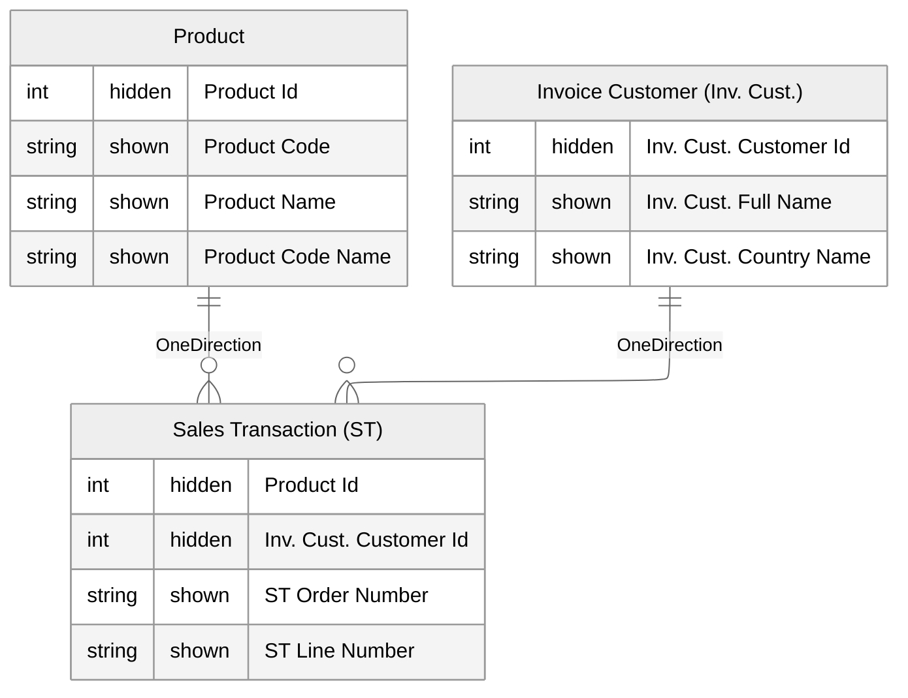

# Table/Column/Measure Naming Conventions

## Overview
Consistent, business‑friendly names improve discoverability and reduce errors.
* **Tables**: Use **singular business-friendly**  names for your tables dimensions (e.g., `Customer`, `Sales Detail`).
	*  Let tables be singular (e.g. 'Customer' and not 'Customer**s**')
* **Columns**: Provide user-friendly column names. Reference the table name to your column name. (e.g. `Booking Month`, `Product Code` or `Inv. Cust. City`)[^&1]
	* If you have columns that have a Code and Name (e.g. `Product Code` and `Product Name`), don't hesitate to also add a Code Name to that table concatenating both (e.g. `Product Code Name`). Such a column simplifies searching/filtering (you only need one column in your filter pane instead of two). 
	* Prefix your column names with the (abbreviation of the) name of the table. 
* **Measures**: Use a naming standard for measures that includes the aggregation, time calculation,.. 
	* Don't include 'Total' in your measures but use 'Revenue' or 'Transaction Count'. 
	- Put your measures on the table they're linked to.[^2]
	- Review this information: : [[DAX Coding Standards]]
## Don’ts

**Don’t**
- Don't prefix your tables with 'F_' (referencing Fact) or 'D_' (referencing Dimension). The semantic model should be used by business users and they don't know what Facts and Dimensions are. There will be tables in your semantic model that are not a F_ or D_ in the future anyway. 

## Practical Examples

**Tables & Columns** 
- `Sales Transaction (ST)`
	- `'Sales Transaction (ST)'[Product Id]`
	- `'Sales Transaction (ST)'[Inv. Cust. Customer Id]`
	- `'Sales Transaction (ST)'[ST Order Number]`
	- `'Sales Transaction (ST)'[ST Line Number]`

*  `Product`
	* `Product[Product Id]`
	* `Product[Product Code]`
	* `Product[Product Name]`
	* `Product[Product Code Name]`

- `Invoice Customer (Inv. Cust.)` (= Role Playing Dimension for 'Customer')
	- `'Invoice Customer (Inv. Cust.)'[Inv. Cust. Customer Id]`
	- `'Invoice Customer (Inv. Cust.)'[Inv. Cust. Full Name]`
	- `'Invoice Customer (Inv. Cust.)'[Inv. Cust. Country Name]`


**Measures**
```DAX
[Customer Count]
[Revenue Incl. VAT]
[Sales YoY Growth %]
```




[^1]: If you put a column in a visual (e.g. 'Code' or 'Date') and it doesn't contain the table than it is not directly clear which column that belongs to for the business users seeing the report. Is the 'Order Date' or the 'Invoice Date' shown? Is it the Product Code or the Supplier Code? By prefixing columns with (a reference to) the table name, it is directly clear what column that is in the model. 

[^2]: There was a time where we preferred measures on 'Ghost Tables/Unlinked Dummy Dimensions' to mimic Multidimensional Cubes. There are however more advantages to keeping your measures on the table they're linked to. 
