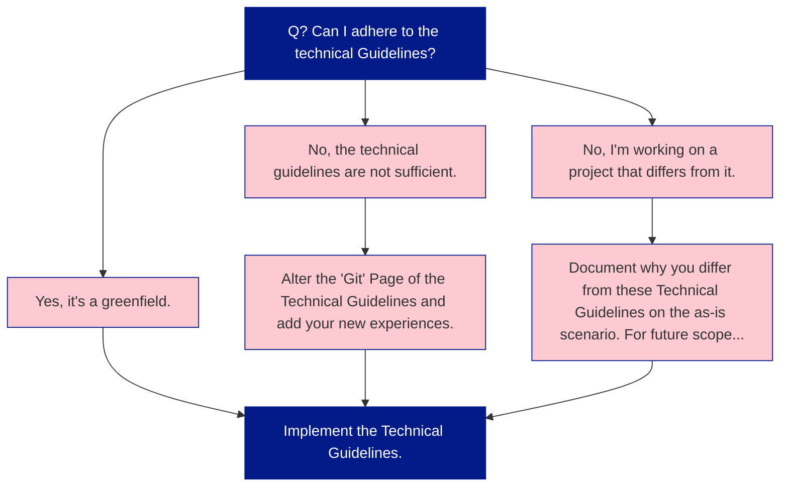

These Technical Guidelines guide you towards a better implementation within a Data Project at Plainsight. These guidelines result from years of experience, countless projects and experiences. Projects at Plainsight should, as closely as possible, adhere to these best-practices. 

While these Technical Guidelines provide our way of working, there are always reasons one prefers to use another way/manner. The flowchart below shows what to do when. 

## Why do we have these Technical Guidelines? 

* We want to provide best-practices to our customers. 
* Our projects should easily be transferrable between consultants. 

## Looking ahead: Technical Guidelines in an AI-first world

These Technical Guidelines are not just written for humans reading a wiki; they are the foundation for how our AI assistants will reason about data projects at Plainsight.

> [!info] Making the Playbook available to agents
> We are actively working on exposing this content to the AI agents our customers use, via a Model Context Protocol (MCP) integration. That means:
> - Agents can **retrieve and reference** the latest Plainsight best-practices directly from the Playbook.
> - Guidance stays **centralised, versioned and explainable**, instead of being hidden in ad‑hoc prompts.
> - Changes to the Playbook automatically **update the "source of truth"** that agents use when helping to design or review solutions.

> [!tip] Data Engineers as AI "orchestrators"
> We expect a future where Data Engineers increasingly **steer fleets of AI agents** that design, generate and maintain ETL and analytics solutions. In that future:
> - These Technical Guidelines become **machine-consumable instructions**, not just reading material.
> - ETL, modeling and platform decisions are **implemented by agents**, while humans focus on architecture, validation and exception handling.
> - Deviations from the guidelines are **explicitly documented** and can be surfaced by agents during code review or solution design.

This is why clarity, consistency and explicit trade‑offs in our guidelines matter so much: they make it easier for both humans and AI agents to build solutions that look and feel like Plainsight.