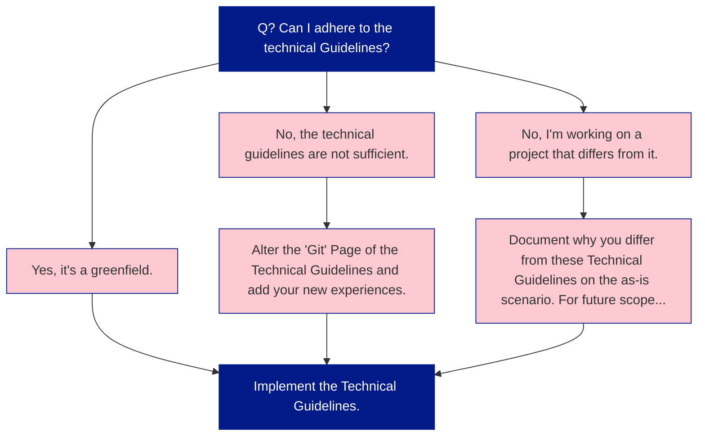

These Technical Guidelines guide you towards a better implementation within a Data Project at Plainsight. These guidelines result from years of experience, countless projects and experiences. Projects at Plainsight should, as closely as possible, adhere to these best-practices. 

While these Technical Guidelines provide our way of working, there are always reasons one prefers to use another way/manner. The flowchart below shows what to do when. 

## Why do we have these Technical Guidelines? 

* We want to provide best-practices to our customers. 
* Our projects should easily be transferrable between consultants.