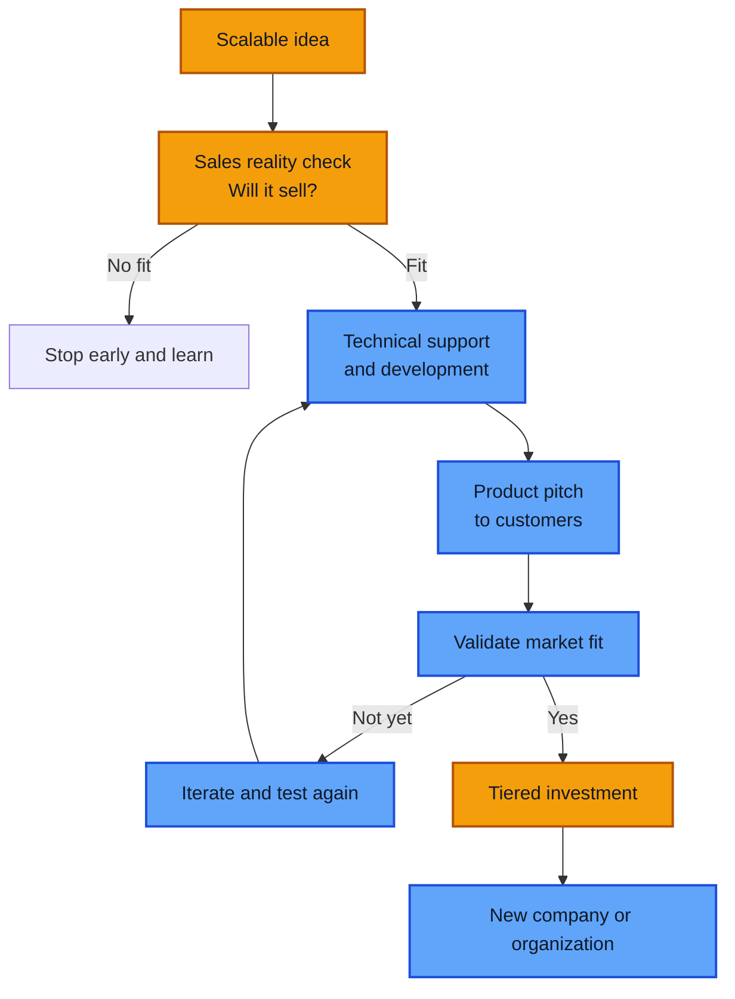
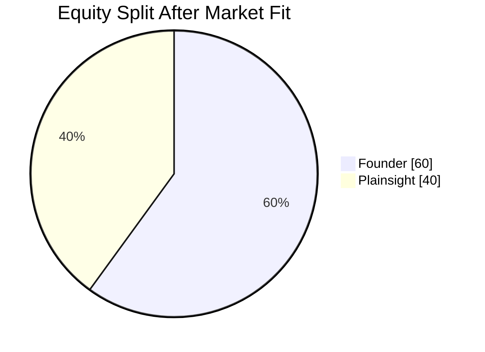

# Product Lab 🧪

At Plainsight, strong ideas should get a real shot. Product Lab is how we help colleagues turn promising ideas into products and, when the timing is right, into a new company.

This is built for colleagues who have an idea that:

- can scale beyond a single customer
- aligns with Plainsight's services and expertise
- solves a problem customers are willing to pay for

## The Product Lab flow

## What happens first?

Every idea starts with a commercial reality check.

You will tackle the concept together with someone who knows sales. The first question is simple: **will it sell?** We want to understand the problem, the buyer, the value, and whether this can become more than a nice internal concept.

If we do not see a strong fit, we will say so early. That saves time, energy, and distraction.

## What happens if there is a fit?

If the idea shows real potential, Plainsight will support you on several levels.

### 1. Technical support

We help you shape and build the product. That can include technical coaching, architecture, development support, and access to the right expertise to get from concept to something customers can react to.

### 2. Product pitch support

We help you position the product and bring it to potential customers. That means sharpening the story, the pitch, the value proposition, and the way the offer is introduced in the market.

### 3. Market validation

We validate together whether there is real market fit. Product Lab is not about building in isolation. It is about learning fast, testing assumptions, and seeing whether customers truly want the solution.

## Financial support

If the product keeps hitting the right milestones, Plainsight can invest in different tiers up to **500.000 EUR**.

That investment is linked to concrete goals. As your initiative matures, the level of support can grow with it.

## Why do we do this?

We do this because we want to see you grow and succeed.

We also accept that building something new means some initiatives will fail. That is part of the process. Product Lab is not about pretending every idea will work. It is about giving strong ideas a fair chance and learning fast along the way.

We believe in a **1 + 1 = 3** story. When you win, Plainsight wins too. Your success can create new services, new businesses, new expertise, and new momentum for the company as a whole.

That is why we are in this for the long term. We want to build lasting value together, not chase short-term experiments without commitment.

## What happens when we see market fit?

Once we see clear market fit, we can move beyond incubation and start a new organization around the product.

At that stage, you as the founder get the majority of the shares: **60%**.

This model is designed to reward the people who create and drive the opportunity, while still building on Plainsight's support, network, and investment.

## What about my customers?

If your product gains traction, we will scale down your customer work week after week. We want to create the space you need to build without forcing a hard switch too early.

At the same time, we expect you to work on your product with a founder mentality. That means ownership, urgency, customer focus, and a willingness to do the hard work of turning an idea into a business.

---

If you believe you have an idea that fits Product Lab, bring it forward. We would rather test a sharp idea early than let a strong opportunity stay on the shelf.

Contact your [career coach](evolution-process.md) to start the conversation.
