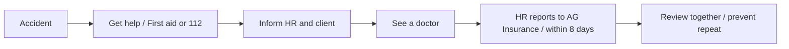

# Wellbeing & Prevention 🛟

At Plainsight, you work at our offices, at home and at our clients. Wherever you are, you should be able to work safely and feel good about it. This page tells you who to contact, what to do when something goes wrong, and what we do to prevent problems.

Something on this page unclear or missing? Talk to HR or mail [hr@plainsight.pro](mailto:hr@plainsight.pro).

## 👥 Who to Contact

| Role | Who | How to reach them |
|---|---|---|
| Prevention advisor (internal) | HR | 0498 67 77 14 · [hr@plainsight.pro](mailto:hr@plainsight.pro) |
| First aiders | Trained colleagues in Ghent and Mechelen | Ask around at the office or contact HR |
| Occupational doctor | Dr. Eleonora Mutafchieva, Mediwet | 09 221 06 07 |
| Psychosocial prevention advisor | Mediwet (external, independent) | [psychosoc@mediwet.be](mailto:psychosoc@mediwet.be) · 09 221 06 07 (Ghent) · 03 205 69 70 (Antwerp) |
| Your career coach | See Officient | |
| Hospitalisation & health support | Alan | Alan app |

**Emergency numbers**

- **112**: ambulance and fire brigade
- **101**: police
- **070 245 245**: Poison Centre
- **1733**: out-of-hours GP
- **106**: Tele-Onthaal (anonymous listening line)
- **1813**: Suicide prevention line

## 🏢 Our Offices

| | Ghent | Mechelen |
|---|---|---|
| Address | Brusselsesteenweg 6 bus 101, 9050 Ledeberg (1st floor) | Kruisbaan 70, 2800 Mechelen (1st floor, Wasserman offices) |
| First aid kit | In the kitchen | In the kitchen |
| Assembly point | Keizerpark | Parking Burneys |

We rent both offices. The landlord takes care of the building installations: fire extinguishers, fire detection, emergency lighting, ventilation and lifts. We take care of what happens inside our space.

**Help us keep the offices safe**

- Keep escape routes and emergency exits free. No boxes, bikes or chairs in the way.
- Do not daisy-chain power strips. Report damaged cables or plugs right away.
- Keep the cables of the sit-stand desks, screens and docking stations tidy, so nobody trips over them.
- Walking pad: use it with proper shoes and at a sensible speed. The instruction sheet is next to it.
- Last one out? Close windows, switch off the lights and lock the office.
- Working alone in the evening or at the weekend? Let someone know.
- If the fire alarm goes off, leave the building by the nearest exit and go to the assembly point. Don't use the lift.

## 🩹 First Aid

- Each office has a first aid kit. Every time it is used, write it down in the first aid register next to the kit, even for a plaster. This helps us see where risks are.
- We train at least two first aiders per office region. Ask a colleague at the office or HR who they are.
- Is it serious? Call **112** first, then let a first aider and HR know.

## 🚑 Accident at Work, at Home or on the Way

An accident at work is not only an accident at the office. It also covers an accident at a client, while working from home, and on your way to or from work.

1. **Get help first.** First aid or 112, depending on how serious it is.
2. **Inform HR and your client right away**, via Teams, mail or phone, and at the latest before your normal start time the next working day.
3. **See a doctor.** You are free to choose your own doctor.
4. HR reports the accident to our insurer (AG Insurance) **within 8 days**. Keep receipts of medical costs.
5. HR looks at what happened together with you, so it doesn't happen again. Small accidents and near misses count too: tell us about them.

## 🤒 When You Are Ill

1. **Inform HR and your client** before your normal start time, via Teams, mail ([hr@plainsight.pro](mailto:hr@plainsight.pro)) or phone.
2. **Log your illness** in [Officient](https://selfservice.officient.io/).
3. **Upload a medical certificate** in Officient within 2 working days. Up to three times per calendar year, you don't need a certificate for the first day of an illness.
4. During the first 30 days of illness, a control doctor may visit you between 13:00 and 17:00 at the address where you are staying.

**Coming back after a longer absence?** You can ask to see the occupational doctor before you restart, to discuss whether your work needs adjusting for a while. Contact Mediwet directly. Plainsight pays your travel costs. Your career coach and HR will also plan a conversation with you, so you can restart at a pace that works.

**Pregnant?** Let HR know as soon as you feel comfortable doing so.

## 🏠 Working from Home

On average you work three days a week from home. Take care of that workplace as well as we try to take care of the office:

- Sit at a table or desk at the right height: elbows at about 90°, shoulders relaxed.
- Use an external screen (or a laptop stand) with the top edge at eye level, plus a separate keyboard and mouse.
- Put your screen at a right angle to the window, so you don't get glare or backlight.
- Get up at least once an hour. Take a real lunch break.
- Keep cables and power strips safe.

## 🤝 Working at a Client

The client is responsible for safety on their site, but you remain a Plainsight employee and we remain responsible for your wellbeing. When you start at a new client, check that you know:

- the house rules, how to get in, and who your contact person is;
- what to do in case of fire or evacuation, and where the assembly point is;
- who the first aiders are on site;
- whether there are specific risks (production floor, lab, site visits) and whether you need protective equipment.

Something at the client that bothers you: workload, the way you're treated, unsafe situations? Tell your career coach or HR. You don't have to solve it alone. Our training *From consultant to trusted advisor* also helps you push back on a client with a strong opinion, in a constructive way.

## 🧠 Mental Wellbeing & Psychosocial Support

Stress, conflicts, too much work, feeling isolated at a client: it happens, and it's better to talk about it early. What we do:

- **Career coaching.** Your career coach checks in with you regularly, not only about goals but also about how you're really doing. See [Evolution Process](evolution-process.md).
- **Monthly company update.** Everyone knows where the company stands. We share openly and welcome feedback in every direction.
- **Training *From consultant to trusted advisor*.** Stand your ground with clients, set boundaries and support your advice with arguments.
- **Right to disconnect.** You don't have to be reachable outside your working hours or during holidays and sick leave. Mails sent outside someone's working hours can wait until their next working day. Set an out-of-office when you're away. WhatsApp groups are informal and optional; important news always comes through official channels.
- **Alan.** Via the Alan app you can book calls about (mental) health as well.

**Need help?** You can always go to your career coach, HR or management. If you prefer an independent person, you can contact the **psychosocial prevention advisor of Mediwet** ([psychosoc@mediwet.be](mailto:psychosoc@mediwet.be), 09 221 06 07). They work in full confidentiality and are independent of Plainsight.

- **Informal request:** a conversation, advice, an intervention with someone else, or a mediation if both parties agree.
- **Formal request:** if the informal route doesn't work or isn't appropriate, the prevention advisor analyses the situation and advises Plainsight on measures.

Within 10 calendar days of your first contact, the prevention advisor meets you and explains your options. Violence, bullying and unwanted sexual behaviour at work are never tolerated, whether they come from colleagues or from people at a client. Did something like that happen to you at a client? Tell HR. HR registers it in the *register of facts by third parties* (anonymously if you want). Anyone who files a request or testifies is protected against retaliation.

The full procedure is in our work regulations (chapter 10.3), available on SharePoint and in Officient.

## 🍷 Alcohol & Drugs

We count on common sense. Drink responsibly at company events and receptions, and never drive after drinking. Alcohol or drug use during working hours is not allowed. Worried about a colleague, or about yourself? Talk to HR or the occupational doctor, confidentially.

## 💬 Help Us Improve

Every year we update our five-year **global prevention plan** and draw up an **annual action plan**. Before 1 November, we present the action plan for the next year to everyone for feedback. You don't have to wait for that moment: ideas or concerns about safety, health or wellbeing are always welcome.

