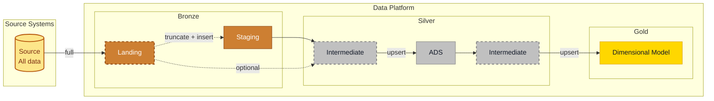
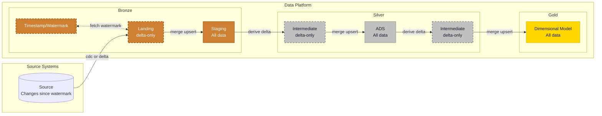

# Data Sources

- **Databases**: SQL Server, PostgreSQL, MySQL, ...
- **Applications**: SaaS platforms, CRM systems (HubSpot, Salesforce), ERP systems, ...
- **Files**: CSV, JSON, XML, Parquet files from SFTP/FTP servers or cloud storage
- **APIs**: REST APIs, GraphQL endpoints, webhooks
- **Message Queues**: Kafka, RabbitMQ, ...
- **Streaming Sources**: IoT devices, clickstreams, social media feeds
- **Cloud Services**: Azure Storage Accounts, AWS S3, Google Cloud Storage, ...

# Data Loading

## ETL or ELT?

| Property         | ETL                                                                                                                                                     | ELT                                                                                                                                                  |
| ---------------- | ------------------------------------------------------------------------------------------------------------------------------------------------------- | ---------------------------------------------------------------------------------------------------------------------------------------------------- |
| **Abbreviation** | Extract > Transform > Load                                                                                                                              | Extract > Load > Transform                                                                                                                           |
| **Explanation**  | The data is first extracted by an extraction tool, then transformed (typically in-memory of this extraction tool) and then loaded into a data platform. | The data is first extracted from the source system and directly loaded into a data platform. Transformations are applied within this data platform.  |

??? note "ETL or ELT? Frankly, we don't care"
    While our frameworks implement the 'ELT' principle, we often mix and match the older more used term 'ETL'. The term 'ETL' is more used by business and the difference between ETL and ELT is not always worth explaining (or an explanation could even lead to more confusion).  
    Our main goal is to provide insightful data layers meant for analytics; as long as this is achieved in a best-practice manner we don't care if you use the term 'ETL' or 'ELT'.

## Data Ingestion Strategies

### Full Load

When applying a full loading strategy, all data from the source system is extracted during an ETL run. This means that the Landing and Staging layers (Bronze) have the same data. Subsequent layers use Landing and Staging to fill Silver (ADS) and Gold (Dimensional Model).

While the Staging layer can be filled using a truncate-and-insert pattern, this cannot be done in ADS or the Dimensional Model layer as history is captured there (snapshots and SCD2). Hence, an upsert pattern is used.

Full load simplifies ETL but results in long loading times when the source data contains large amounts of data.

### Incremental Loading

When applying an incremental loading strategy, only the changed records from the source system are extracted since the last run (newly inserted, updated, or deleted records). Landing stores the change set only, while these records are then upserted into Staging. Those deltas efficiently fill ADS (Silver) and Dimensional Model (Gold).

Incremental loading mechanisms reduce ETL duration but increase the complexity of maintaining copies of the source system. Whenever possible, an incremental loading mechanism is preferred.

---

## Related Topics

- [Data Layers and Modeling](data-layers-and-modeling.md) - Overall architecture showing how data sources fit into the platform
- [Analytical Data Store (ADS)](analytical-data-store-ads.md) - Where source data is cleaned and integrated
