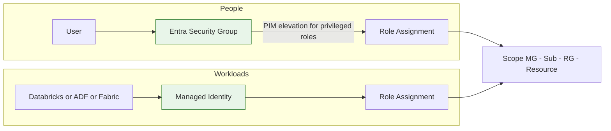

# Identity & Access

??? info "Purpose"
    Most cloud incidents trace back to a leaked credential or an over-privileged account. Our access model removes both failure modes structurally: workloads authenticate with managed identities so there is no secret to leak, and people get access through security groups so there is no forgotten individual assignment to audit.

## Overview

| Principle | Rule |
|---|---|
| Workload identity | Managed identities wherever the service supports them — no service principal secrets, no account keys |
| Human access | Always via Entra security groups — never assign a role to an individual user |
| Privileged access | Time-boxed elevation via PIM, not standing Owner/Admin rights |
| Scope | Assign at the lowest scope that works, following least privilege |

## Managed identities first

A managed identity is a service principal whose credentials Azure manages and rotates for you — there is **no secret to store, leak, or expire**.

| Type | Lifecycle | Use when |
|---|---|---|
| System-assigned | Created and deleted with the resource | One resource needs its own identity — the default choice |
| User-assigned | Independent resource, shared by several consumers | Multiple resources need identical access, or the identity must survive resource recreation |

Typical Plainsight examples:

| Scenario | Instead of |
|---|---|
| Databricks access connector reads ADLS Gen2 via its managed identity | Mounting with account keys |
| Data Factory pulls secrets from Key Vault via its system-assigned identity | Connection strings in linked services |
| Fabric workspace identity authenticates to storage | Stored credentials in connections |
| CI/CD pipeline deploys via workload identity federation | A service principal client secret in pipeline variables |

!!! warning "Account keys are a last resort"
    If a service truly cannot use Entra authentication, store the key in [Key Vault](security-fundamentals.md) and rotate it. Never put keys or connection strings in code, notebooks, or pipeline definitions.

## Security groups, not individuals

Role assignments go to **Entra security groups**; people get access by group membership.

| Benefit | Why it matters |
|---|---|
| Onboarding and offboarding | One membership change instead of hunting down assignments across scopes |
| Auditability | "Who can touch PRD?" is answered by one group membership list |
| Consistency | Everyone in the same role has exactly the same access |

Suggested group pattern per product: `sec-<product>-<env>-<role>`, for example `sec-visionanalytics-prd-reader` and `sec-visionanalytics-nonprd-contributor`.

### PIM for privileged roles

Standing `Owner` or `Contributor` on production is a risk with no upside. With **Privileged Identity Management** the elevated role is *eligible* instead of *active*: you activate it when needed, for a limited time, optionally with approval — and every activation is logged.

| Access | Standing or PIM |
|---|---|
| Reader on PRD | Standing, via group |
| Contributor on non-PRD | Standing, via group |
| Contributor or Owner on PRD | **PIM-eligible only** |
| User Access Administrator anywhere | **PIM-eligible only** |

## RBAC scoping

RBAC inherits down the same hierarchy as policy: management group → subscription → resource group → resource. Grant at the **lowest scope that does the job** — a support engineer who needs to restart one Data Factory doesn't need Contributor on the subscription.

| Role | Grants | Watch out |
|---|---|---|
| Reader | View everything, change nothing | Safe default for stakeholders |
| Contributor | Manage resources, but not access | Cannot hand out permissions — good |
| Owner | Everything including access management | PIM-only, sparingly |
| Storage Blob Data Contributor | Read/write blob *data* | Data-plane roles are separate from control-plane — Reader alone doesn't let you read blobs |
| Key Vault Secrets User | Read secret values | Pair with managed identities for workloads |

## Quick Reference: Do's and Don'ts

| Do ✅ | Don't ❌ |
|---|---|
| Use managed identities for every service-to-service connection | Create service principals with client secrets |
| Assign roles to security groups | Assign roles to individual users |
| Make PRD write-access PIM-eligible | Leave standing Owner rights on production |
| Grant the lowest sufficient scope and role | Hand out subscription Contributor for convenience |
| Review group memberships periodically | Let leavers keep access through forgotten groups |
| Use data-plane roles for data access | Assume control-plane Reader can read data |

## Related pages

- [Security Fundamentals](security-fundamentals.md) — Zero Trust, Defense in Depth, and Key Vault
- [Resource Organization](resource-organization.md) — the scopes RBAC inherits through
- [Unity Catalog](../databricks/unity-catalog.md) — data-level access control in Databricks
