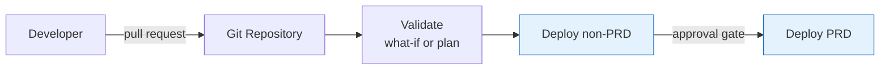

# Infrastructure as Code

??? info "Purpose"
    Anything clicked together in the portal exists exactly once, is documented nowhere, and cannot be reviewed, repeated, or rolled back. Infrastructure as Code turns environments into versioned, reviewable artifacts — the same discipline we already apply to data pipelines and reports, applied to the platform they run on.

## Overview

| Benefit | Why it matters |
|---|---|
| Repeatable | Non-PRD and PRD are deployed from the same templates — no drift between environments |
| Reviewable | Infrastructure changes go through pull requests like any other code |
| Auditable | Git history answers "who changed what, when, and why" |
| Recoverable | An environment can be rebuilt from the repository instead of from memory |

!!! info "The rule"
    The portal is for **exploring and reading**. Sandbox subscriptions are the exception where clicking is fine. Everything that reaches a non-PRD or PRD subscription arrives through code and a pipeline.

## Choosing a tool

We don't mandate a single tool — pick per project with this guidance:

| | Bicep | Terraform | ARM templates |
|---|---|---|---|
| Language | Azure-native DSL | HCL, provider-based | JSON |
| State | None — Azure *is* the state | State file to host and protect | None |
| Scope | Azure only | Azure **plus** Databricks, Fabric, Entra, and other providers | Azure only |
| Preview changes | `what-if` | `plan` | `what-if` |
| When to pick | Pure-Azure product, no appetite for state management | The project also manages Databricks or Fabric artifacts, or spans clouds | Don't start new work in it — Bicep compiles to ARM |

!!! tip "Rule of thumb"
    Azure-only product → **Bicep**. The moment the project also needs to manage Databricks workspaces objects, Fabric items, or Entra groups as code → **Terraform**, so one tool owns the whole deployment.

## Reference deployment flow

| Practice | Detail |
|---|---|
| One template set, per-environment parameters | `main.bicep` with `dev.bicepparam` / `prd.bicepparam` — never a copy of the template per environment |
| Preview before apply | `what-if` / `plan` output posted on the pull request, so the reviewer sees the real impact |
| Pipeline identity | Workload identity federation — the pipeline authenticates without any stored secret, see [Identity & Access](identity-and-access.md) |
| Approval gate to PRD | A human approves the promotion; the pipeline does the work |
| Names and tags from variables | The [naming convention](naming-conventions-and-tagging.md) and mandatory tags are parameterized once, not typed per resource |

## Quick Reference: Do's and Don'ts

| Do ✅ | Don't ❌ |
|---|---|
| Deploy every non-PRD and PRD change through a pipeline | Click resources together in the portal and promise to codify later |
| Use one template set with per-environment parameters | Maintain diverging copies per environment |
| Review the what-if / plan output in the pull request | Approve infrastructure PRs on the code diff alone |
| Use workload identity federation for pipelines | Store service principal secrets in pipeline variables |
| Protect the Terraform state file like a credential | Commit state files to Git |
| Start new Azure-only work in Bicep | Write raw ARM JSON by hand |

## Related pages

- [Resource Organization](resource-organization.md) — the structure these deployments land in
- [Naming Conventions & Tagging](naming-conventions-and-tagging.md) — parameterized into every template
- [Databricks CI-CD](../databricks/databricks-ci-cd.md) and [CICD & Versioning](../power-bi/cicd-and-versioning.md) — the workload-level counterparts
