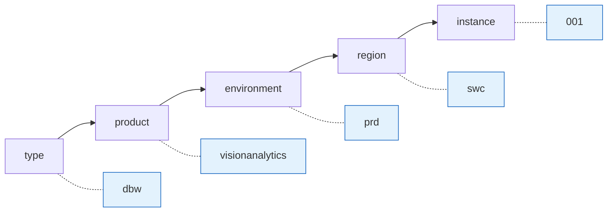

# Naming Conventions & Tagging

??? info "Purpose"
    A resource name is the first thing anyone sees in the portal, in a cost report, or in an incident alert. Consistent names make ownership, environment, and purpose readable at a glance, and they make automation possible, because scripts and policies can parse them. Tags carry the metadata that names can't.

## Naming pattern

We follow the [Cloud Adoption Framework naming guidance](https://learn.microsoft.com/azure/cloud-adoption-framework/ready/azure-best-practices/resource-naming):

```
<type>-<product>-<environment>-<region>-<instance>
```



| Segment | Values | Notes |
|---|---|---|
| `type` | CAF abbreviation | See the table below |
| `product` | Short lowercase product name | No hyphens inside the product name itself |
| `environment` | `dev` / `tst` / `acc` / `prd` | Subscriptions use `prd` / `nonprd` instead: they are the environment *class*, resources carry the specific environment |
| `region` | `swc` for Sweden Central | Our default region (see [Regions & Storage](regions-and-storage.md)) |
| `instance` | `001`, `002`, ... | Always three digits, even for the first instance |

## Abbreviations for our most-used resources

Taken from the [CAF abbreviation list](https://learn.microsoft.com/azure/cloud-adoption-framework/ready/azure-best-practices/resource-abbreviations):

| Resource | Abbreviation | Example |
|---|:---:|---|
| Resource group | `rg` | `rg-visionanalytics-prd-swc-001` |
| Microsoft Fabric capacity | `fc` | `fcvisionanalyticsprd001` [^1] |
| Databricks workspace | `dbw` | `dbw-visionanalytics-prd-swc-001` |
| Databricks access connector | `dbac` | `dbac-visionanalytics-prd-swc-001` |
| Azure SQL Database server | `sql` | `sql-visionanalytics-prd-swc-001` |
| Azure SQL database | `sqldb` | `sqldb-visionanalytics-prd-swc-001` |
| Storage account / ADLS Gen2 | `st` | `stvisionanalyticsprd001` [^1] |
| Key vault | `kv` | `kv-visionanalytics-prd-swc-01` [^2] |
| Data Factory | `adf` | `adf-visionanalytics-prd-swc-001` |
| User-assigned managed identity | `id` | `id-visionanalytics-prd-swc-001` |
| Log Analytics workspace | `log` | `log-visionanalytics-prd-swc-001` |
| Virtual network | `vnet` | `vnet-visionanalytics-prd-swc-001` |
| Subscription | `sub` | `sub-visionanalytics-prd` / `sub-visionanalytics-nonprd` |

[^1]: Storage accounts and Fabric capacities only allow lowercase letters and numbers (no hyphens), and storage account names are capped at 24 characters. Drop the hyphens and, if needed, the region segment.
[^2]: Key Vault names are capped at 24 characters. Shorten the product name or instance segment when necessary.

!!! tip "Check name rules before you settle on a product name"
    The 24-character limits on storage accounts and Key Vaults are the ones that bite. Pick a short product code early: `visionanalytics` is already too long for `st` + product + `prd` + instance to stay under 24 characters. Prefer something like `visan`.

## Tagging

Tags travel with the resource into cost reports, inventories, and alerts. Two tags are **mandatory on every resource**, enforced by Azure Policy at the management group level:

| Tag | Required | Example value | Purpose |
|---|:---:|---|---|
| `Owner` | ✅ | `sander.allert@plainsight.pro` | Who to contact: accountability for cost and incidents |
| `Environment` | ✅ | `Production` / `Acceptance` / `Test` / `Development` | Filtering in cost analysis and safe-to-touch decisions |
| `AppName` | Recommended | `Vision Analytics` | Groups resources across resource groups |
| `CostCenter` | Recommended | `CC-1042` | Chargeback to the right budget |
| `Impact` | Recommended | `High` / `Medium` / `Low` | Prioritizing incidents and maintenance windows |

Use Azure Policy with the *inherit tag from resource group* effect so resources automatically pick up `Owner` and `Environment` from their resource group: tag once, inherit everywhere.

## Quick Reference: Do's and Don'ts

| Do ✅ | Don't ❌ |
|---|---|
| Follow `<type>-<product>-<env>-<region>-<instance>` for every resource | Invent per-project naming schemes |
| Use CAF abbreviations for the type segment | Make up your own abbreviations |
| Keep product codes short (think of the 24-character limits) | Discover the storage account limit at deploy time |
| Tag `Owner` and `Environment` on everything | Leave tagging as a cleanup task for later |
| Enforce names and tags with Azure Policy | Rely on code review to catch naming drift |
| Use lowercase everywhere | Mix casing between resources |

## Related pages

- [Resource Organization](resource-organization.md): the subscription strategy these names reflect
- [Regions & Storage](regions-and-storage.md): why the region segment is almost always `swc`
- [Fabric Naming Conventions](../fabric/naming-conventions.md): naming *inside* Fabric workspaces
