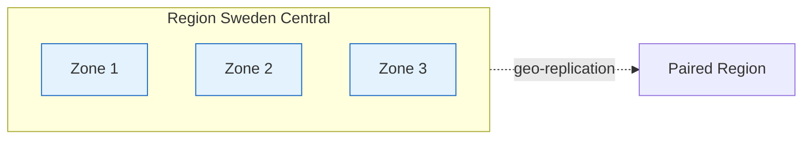

# Regions & Storage

??? info "Purpose"
    Region choice and storage redundancy are decisions you make once per product and live with for years: moving data later is expensive. This page fixes both defaults so projects don't re-debate them: deploy in Sweden Central, and store production data zone-redundantly.

## Default region: Sweden Central

Deploy new products in **Sweden Central** (`swedencentral`, short code `swc`) unless a required service isn't available there. In that case, fall back to **West Europe**.

| Reason | Detail |
|---|---|
| EU data residency | Data stays within the EU, satisfying most customer compliance requirements |
| Availability zones | Sweden Central has three availability zones, required for the ZRS storage default below |
| Sustainability | One of Microsoft's most sustainable datacenter regions, running largely on renewable energy |
| Price | Compute and storage are generally cheaper than in West Europe |
| Capacity | Newer region with better availability of modern SKUs than the frequently constrained West Europe |

!!! tip "Check service availability first"
    Verify every service of your architecture is available in Sweden Central via [Azure products by region](https://azure.microsoft.com/explore/global-infrastructure/products-by-region/) **before** committing. Keep all resources of one product in one region: cross-region traffic costs money and adds latency.

## Regions, zones, and pairs in one picture

| Concept | What it protects against |
|---|---|
| Availability zone | A datacenter failure: zones are physically separate datacenters with independent power, cooling, and networking |
| Region pair | A regional disaster: data is geo-replicated to a second region hundreds of kilometers away |

## Storage redundancy

| Option | Copies | Survives | Use at Plainsight |
|---|---|---|---|
| LRS | 3 in one datacenter | Rack and drive failures | Non-PRD environments |
| **ZRS** | 3 across availability zones | A whole datacenter outage | **Default for PRD** |
| GRS | 3 + 3 in the paired region | A regional disaster | Only on explicit customer DR requirements |
| GZRS | ZRS + 3 in the paired region | Datacenter and regional disasters | Only on explicit customer DR requirements |

!!! info "The rule"
    **Production ADLS Gen2 storage accounts use ZRS with hierarchical namespace enabled.** LRS is acceptable in non-PRD to save cost. Geo-redundant options are opt-in per customer, not our default: they roughly double storage cost, and data governance may even forbid data leaving the region.

### ADLS Gen2 checklist

| Setting | Value | Why |
|---|---|---|
| Account kind | StandardV2 general purpose | The standard for analytical workloads |
| Hierarchical namespace | **Enabled** | Turns blob storage into a real filesystem, required for the medallion lakehouse layout and efficient directory operations |
| Redundancy | ZRS in PRD, LRS in non-PRD | See above |
| Public network access | Disabled where possible | See [Security Fundamentals](security-fundamentals.md) |
| Access tier | Hot | Analytical data is read frequently; use lifecycle rules to cool down aged data |

## Quick Reference: Do's and Don'ts

| Do ✅ | Don't ❌ |
|---|---|
| Default to Sweden Central for new deployments | Spread one product across multiple regions |
| Verify service availability before committing to a region | Assume every service exists in every region |
| Use ZRS for production ADLS Gen2 accounts | Leave production data on LRS |
| Enable hierarchical namespace on data lake accounts | Enable it on accounts that only serve blobs or queues |
| Use lifecycle management to tier aged data | Pay hot-tier prices for archive data |
| Reserve GRS/GZRS for explicit DR requirements | Default to geo-redundancy "to be safe" |

## Related pages

- [Naming Conventions & Tagging](naming-conventions-and-tagging.md): the `swc` region code in resource names
- [Medallion - Bronze Silver Gold](../architectural-principles/medallion-bronze-silver-gold.md): the lakehouse layout that lives on ADLS Gen2
- [Lakehouse Architecture](../fabric/lakehouse-architecture.md): the Fabric counterpart
