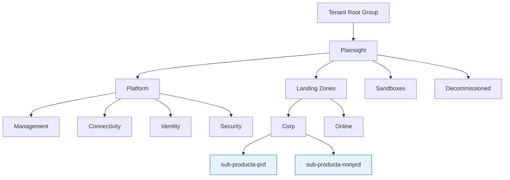

# Resource Organization

??? info "Purpose"
    A predictable resource hierarchy is the foundation for everything else in Azure: access, policies, cost reporting, and safe deployments all hang off it. We follow the Azure Landing Zone reference architecture so that governance is applied once at the right level and inherited everywhere below, instead of being repaired per resource afterwards.

## Overview

Azure has four levels of organization. Governance (Azure Policy and RBAC) flows **downward**: whatever you assign at a management group applies to every subscription, resource group, and resource underneath it.

| Level | What it is | What we use it for |
|---|---|---|
| Management group | Container for subscriptions | Policies and access that apply to *groups* of subscriptions |
| Subscription | Unit of billing, scale, and isolation | **One product, one environment class** (see below) |
| Resource group | Container for resources that share a lifecycle | All resources of one product component that are deployed and deleted together |
| Resource | The actual service | Databricks workspace, storage account, SQL database, ... |

## Management group structure

We conform to the [Azure Landing Zone](https://learn.microsoft.com/azure/cloud-adoption-framework/ready/landing-zone/design-area/resource-org-management-groups) management group hierarchy:

| Management group | Role |
|---|---|
| **Plainsight** (intermediate root) | Everything we own lives under here: never assign directly on the Tenant Root Group |
| **Platform** | Shared services: monitoring, networking, identity, and security tooling |
| **Landing Zones** | The product subscriptions, grouped by workload *archetype*: `Corp` for internal-only workloads, `Online` for internet-facing ones |
| **Sandboxes** | Personal experimentation with loose policies, also the default group for new subscriptions so nothing lands under the root |
| **Decommissioned** | Cancelled subscriptions parked here before deletion |

### How the tree changes

The hierarchy is deliberately **stable**. Onboarding a new product means creating **two new subscriptions** under the right Landing Zones archetype, never new management groups.

!!! warning "No environment management groups"
    The Azure Landing Zone guidance is explicit: *don't create management groups for production, test, and development environments*. Environments are separated at the **subscription** level. A PRD and non-PRD subscription of the same product sit side by side in the same management group.

## Subscription strategy

One product gets exactly two subscriptions:

| Subscription | Hosts | Example name |
|---|---|---|
| `sub-<product>-prd` | Production only | `sub-visionanalytics-prd` |
| `sub-<product>-nonprd` | Development, test, and acceptance | `sub-visionanalytics-nonprd` |

This split gives every product a hard blast-radius boundary, a clean cost report per product and environment class, and the ability to grant developers broad rights in non-PRD while keeping PRD locked down.

## Policy-driven governance

Azure Policy is how rules stay enforced without manual reviews. Policies inherit: **Management group → Subscription → Resource group → Resource**. Assign at the highest level where the rule holds.

| Example policy | Assigned at | Effect |
|---|---|---|
| Require `Owner` and `Environment` tags | Plainsight MG | Deny deployment of untagged resources |
| Allowed locations = Sweden Central | Plainsight MG | Deny resources outside our default region |
| Deny public network access on storage accounts | Landing Zones MG | Audit or deny public endpoints |
| Allowed VM SKUs | Sandboxes MG | Keep experimentation cheap |

Complement policies with **resource locks** on resources whose loss would hurt:

| Lock | Behavior | Use for |
|---|---|---|
| `Delete` | Read and modify allowed, delete blocked | PRD data resources: storage accounts, SQL databases, Key Vaults |
| `ReadOnly` | Only reads allowed | Rarely: it blocks legitimate operations surprisingly often |

## Cost management

| Practice | How |
|---|---|
| Budget per subscription | Set a monthly budget with alert thresholds at 80% and 100%, mailed to the product owner |
| Cost breakdown | Tags (`Owner`, `Environment`, and optionally `CostCenter`) make Cost Analysis reports meaningful (see [Naming Conventions & Tagging](naming-conventions-and-tagging.md)) |
| Estimating new work | Use the [Azure Pricing Calculator](https://azure.microsoft.com/pricing/calculator/) before provisioning, not after the first invoice |

## Quick Reference: Do's and Don'ts

| Do ✅ | Don't ❌ |
|---|---|
| Follow the Azure Landing Zone management group layout | Invent management groups per region, team, or environment |
| Create one PRD and one non-PRD subscription per product | Mix multiple products or PRD and non-PRD in one subscription |
| Assign policies at the highest applicable management group | Repeat the same policy assignment on every subscription |
| Group resources by lifecycle into resource groups | Use one giant resource group per subscription |
| Put a `Delete` lock on PRD data resources | Rely on "we'll be careful" for irreplaceable data |
| Set budgets and alerts on every subscription | Discover overspend on the monthly invoice |

## Related pages

- [Naming Conventions & Tagging](naming-conventions-and-tagging.md): how subscriptions, resource groups, and resources are named and tagged
- [Identity & Access](identity-and-access.md): how RBAC follows this same hierarchy
- [Infrastructure as Code](infrastructure-as-code.md): deploying this structure repeatably
