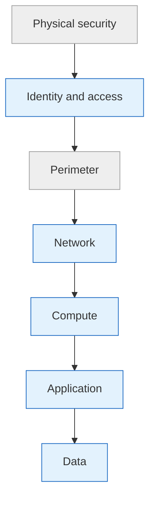

# Security Fundamentals

??? info "Purpose"
    You don't need to be a security engineer to build securely on Azure — you need two mental models and one habit. The models are Zero Trust and Defense in Depth; the habit is that every secret lives in Key Vault. This page keeps all three deliberately high-level.

## Zero Trust

The traditional model assumed everything *inside* the corporate network was safe. Zero Trust flips that: **no request is trusted because of where it comes from** — every access is authenticated and authorized, every time.

| Principle | Meaning | What it looks like in our work |
|---|---|---|
| Verify explicitly | Authenticate and authorize on all available signals | Entra ID everywhere, MFA, Conditional Access |
| Least privilege | Just-enough access, just-in-time | Scoped RBAC via groups, PIM elevation — see [Identity & Access](identity-and-access.md) |
| Assume breach | Design as if an attacker is already inside | Segmented networks, private endpoints, encryption everywhere, audit logging on |

## Defense in Depth

No single control is perfect, so Azure security is built as **layers** — an attacker who gets past one still faces the next. You influence the inner layers on every project; Microsoft owns the outermost.

| Layer | Who owns it | Our typical measures |
|---|---|---|
| Physical | Microsoft | — |
| Identity & access | **Us** | Managed identities, security groups, PIM, MFA |
| Perimeter | Mostly Microsoft | DDoS protection is built in |
| Network | **Us** | Private endpoints, disabled public network access, NSGs |
| Compute | **Us** | Patched runtimes, no public VMs, minimal exposure |
| Application | **Us** | Secure coding, no secrets in code, dependency updates |
| Data | **Us** | Encryption at rest by default, RBAC on data planes, Unity Catalog / OneLake permissions |

## Azure Key Vault

Key Vault is the **only** acceptable home for secrets, keys, and certificates. If a credential exists, it lives in a vault — full stop.

| Store in Key Vault | Never store in |
|---|---|
| Connection strings, API keys, storage keys | Code or notebooks |
| Certificates | Pipeline variable text fields |
| Encryption keys | Config files in Git |
| Service credentials that can't be managed identities | Chat messages or wikis |

How we use it:

| Practice | Detail |
|---|---|
| One vault per product per environment | `kv-<product>-prd-...` and `kv-<product>-dev-...` — PRD secrets are never readable from non-PRD |
| RBAC authorization mode | Use Azure RBAC (e.g. *Key Vault Secrets User*), not legacy access policies |
| Consumers use managed identities | Databricks secret scopes, ADF linked services, and Fabric connections all read from Key Vault without any bootstrap secret |
| Soft delete + purge protection | Enabled — an accidental (or malicious) delete is recoverable |
| Rotation | Prefer managed identities so there is nothing to rotate; where keys must exist, rotate them and let consumers resolve the vault reference |

!!! tip "The litmus test"
    If revoking a credential requires editing code or redeploying a pipeline, it's stored in the wrong place.

## Quick Reference: Do's and Don'ts

| Do ✅ | Don't ❌ |
|---|---|
| Treat every request as untrusted until verified | Trust traffic because it's "internal" |
| Layer controls — identity, network, data | Rely on a single firewall or VNet as "the" security |
| Put every secret in Key Vault | Paste keys into notebooks, code, or chat |
| Enable soft delete and purge protection on vaults | Leave vaults deletable in one click |
| Separate PRD and non-PRD vaults | Share one vault across environments |
| Disable public network access where the service allows it | Expose storage and SQL publicly by default |

## Related pages

- [Identity & Access](identity-and-access.md) — the identity layer in practice
- [Regions & Storage](regions-and-storage.md) — storage network settings
- [Resource Organization](resource-organization.md) — enforcing security settings via Azure Policy
