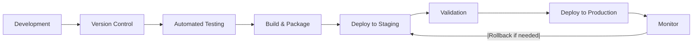
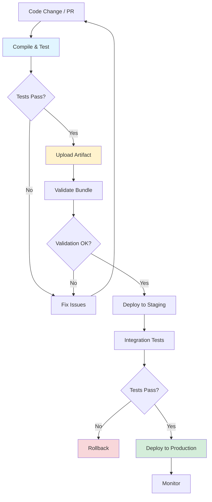
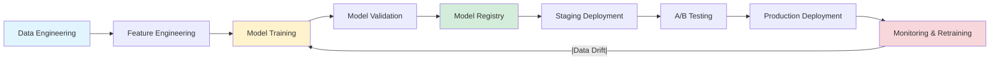
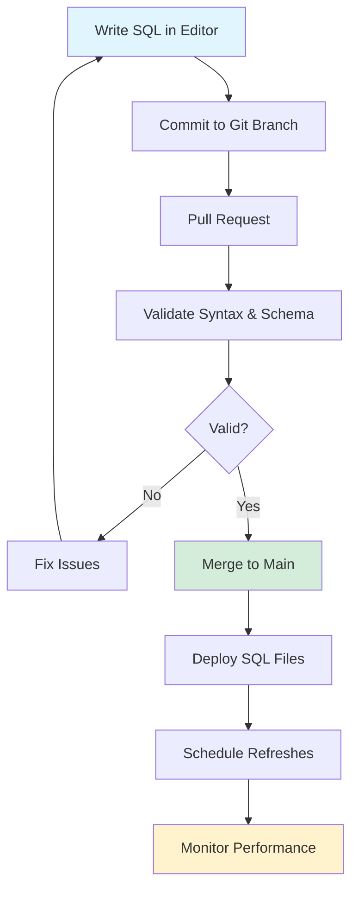

# Databricks CI/CD Best Practices

!!! info "Purpose"
    This guide provides best practices for designing robust CI/CD pipelines on Databricks, ensuring rapid and reliable deployment of data engineering and analytics workloads.

## Overview

CI/CD (Continuous Integration and Continuous Delivery) has become a cornerstone of modern data engineering and analytics, ensuring code changes are integrated, tested, and deployed rapidly and reliably. Databricks provides a flexible framework supporting various CI/CD options shaped by organizational preferences, existing workflows, and specific technology environments.



## Core Principles of CI/CD

Effective CI/CD pipelines share foundational principles regardless of implementation specifics. These universal best practices apply across organizational preferences, developer workflows, and cloud environments.

### Version Control Everything

- **Store all artifacts in Git**: Notebooks, scripts, infrastructure definitions (IaC), and job configurations
- **Use branching strategies**: Implement Gitflow or similar strategies aligned with development, staging, and production environments
- **Track configuration changes**: Maintain history of all deployment-related changes

### Automate Testing

| Test Type         | Tools                                  | Purpose                                    |
| ----------------- | -------------------------------------- | ------------------------------------------ |
| Unit Tests        | `pytest` (Python), `ScalaTest` (Scala) | Validate business logic                    |
| Validation Tests  | Databricks CLI `bundle validate`       | Check notebook and workflow functionality  |
| Integration Tests | `chispa` for Spark DataFrames          | Test complete workflows and data pipelines |

!!! tip "Testing Strategy"
    Implement multiple layers of testing to catch issues early in the development cycle.

### Employ Infrastructure as Code (IaC)

- **Define infrastructure declaratively**: Use Databricks Asset Bundles YAML or Terraform for clusters, jobs, and workspace configurations
- **Parameterize settings**: Avoid hardcoding environment-specific values like cluster size and secrets
- **Version infrastructure changes**: Track all infrastructure modifications in Git

### Isolate Environments

**Environment separation best practices:**
- Maintain separate workspaces for development, staging, and production
- Choose tools that match your cloud ecosystem:
  - **Azure**: Azure DevOps + Databricks Asset Bundles or Terraform

### Monitor and Automate Rollbacks

Track key metrics:
- Deployment success rates
- Job performance
- Test coverage
- Pipeline execution times

Implement automated rollback mechanisms for failed deployments to minimize downtime.

### Unify Asset Management

!!! warning "Avoid Siloed Management"
    Use Databricks Asset Bundles to deploy code, jobs, and infrastructure as a single unit. Avoid managing notebooks, libraries, and workflows separately.
    
    [!info] Authentication Recommendation
    Databricks recommends **workload identity federation** for CI/CD authentication. This eliminates the need for Databricks secrets, making it the most secure authentication method for automated flows.

## Databricks Asset Bundles for CI/CD

Databricks Asset Bundles offer a unified approach to managing code, workflows, and infrastructure within the Databricks ecosystem and are **recommended** for CI/CD pipelines.

### Why Bundles?

By bundling code, workflows, and infrastructure into a single YAML-defined unit, bundles:
- ✅ Simplify deployment
- ✅ Ensure consistency across environments
- ✅ Provide atomic deployments
- ✅ Enable version control of entire stack

### Workflow Adaptation

Different development backgrounds require different approaches to adopting bundles:

| Developer Background | Traditional Workflow                          | Bundle Workflow                            |
| -------------------- | --------------------------------------------- | ------------------------------------------ |
| Java                 | Build JARs with Maven/Gradle, test with JUnit | Bundle code + infrastructure in YAML       |
| Python               | Package wheels, test with pytest              | Bundle Python code + configs together      |
| SQL                  | Query validation, notebook management         | Bundle SQL files with pipeline definitions |

## Source Control Strategies

The first choice when implementing CI/CD is how to store and version source files. Two main approaches exist:

### Option 1: Single Repository (Recommended for Small Projects)

**Structure:**
```
databricks-dab-repo/
├── databricks.yml               # Bundle definition
├── resources/
│   ├── workflows/
│   │   ├── my_pipeline.yml      # YAML pipeline def
│   │   └── my_pipeline_job.yml  # YAML job def
│   ├── clusters/
│   │   ├── dev_cluster.yml      # Development cluster
│   │   └── prod_cluster.yml     # Production cluster
├── src/
│   ├── my_pipeline.ipynb        # Pipeline notebook
│   └── mypython.py              # Python modules
└── README.md
```

**Pros:**
- ✅ All artifacts versioned together
- ✅ Single PR updates both code and configuration
- ✅ Simplified CI/CD pipeline

**Cons:**
- ❌ Repository may become bloated
- ❌ Coordinated releases required

### Option 2: Separate Repositories (Recommended for Large Teams)

**Repository 1: Application Code**
```
java-app-repo/
├── pom.xml                      # Maven configuration
├── src/
│   ├── main/
│   │   ├── java/                # Java source code
│   │   └── resources/           # Application resources
│   └── test/
│       ├── java/                # Unit tests
│       └── resources/           # Test resources
├── target/                      # Compiled JARs
└── README.md
```

**Repository 2: Bundle Configuration**
```
databricks-dab-repo/
├── databricks.yml               # Bundle definition
├── resources/
│   ├── jobs/
│   │   ├── my_java_job.yml      # Job definitions
│   │   └── my_other_job.yml
│   ├── clusters/
│   │   ├── dev_cluster.yml      # Cluster configs
│   │   └── prod_cluster.yml
└── README.md
```

**Pros:**
- ✅ Team separation: Development vs. infrastructure management
- ✅ Independent release cycles
- ✅ Smaller, focused repositories

**Cons:**
- ❌ Additional coordination required
- ❌ Must ensure version compatibility

!!! warning "Version Artifacts"
    Always use versioned artifacts (Git commit hashes) when uploading to Databricks or external storage to ensure traceability and rollback capabilities.

### Reference Compiled Artifacts in Bundles

Example `databricks.yml` referencing a versioned JAR:

```yaml
resources:
  jobs:
    my_java_job:
      tasks:
        - task_key: process_data
          libraries:
            - jar: /Volumes/artifacts/my-app-${{ GIT_SHA }}.jar
```

## Recommended CI/CD Workflow

Regardless of repository structure, follow this workflow:



### Step 1: Compile and Test

**Triggered on:** Pull request or commit to main branch

Actions:
1. Compile code
2. Run unit tests
3. Generate versioned artifact (e.g., `my-app-1.0.jar`)

### Step 2: Upload and Store Artifact

**Store compiled files** in Databricks Unity Catalog volume or artifact repository Azure Blob Storage or Databricks Unity Catalog volumes (recommended)

**Versioning scheme examples:**
```
/Volumes/artifacts/my-app-${{ github.sha }}.jar
dbfs:/mnt/artifacts/my-app-1.0.jar
```

### Step 3: Validate Bundle

```bash
databricks bundle validate
```

This ensures:
- YAML configuration correctness
- No missing libraries
- Proper resource references
- Environment-specific parameters are valid

!!! tip "Catch Issues Early"
    Run validation during pull requests to catch misconfigurations before deployment.

### Step 4: Deploy Bundle

```bash
databricks bundle deploy --target=staging
```

For production:
```bash
databricks bundle deploy --target=prod
```

Reference uploaded libraries in `databricks.yml`. See [Databricks Asset Bundles library dependencies](https://docs.databricks.com) for details.

## CI/CD for Machine Learning

ML projects introduce unique CI/CD challenges compared to traditional software development:



### ML-Specific Considerations

| Challenge | Databricks Solution |
|-----------|-------------------|
| **Multi-team coordination** | MLflow for experiment tracking, Delta Sharing for governance, Asset Bundles for IaC |
| **Data & model versioning** | Delta Lake (ACID transactions, time travel), MLflow Model Registry (lineage) |
| **Reproducibility** | Asset Bundles ensure atomic deployment across environments |
| **Continuous retraining** | Lakeflow Jobs + MLflow + Data Quality Monitoring |

### MLOps Stacks Framework

MLOps Stacks combine:
- Databricks Asset Bundles
- Preconfigured CI/CD workflows
- Modular ML project templates

**Team responsibilities:**

| Team | Responsibilities | Bundle Components | Artifacts |
|------|-----------------|-------------------|-----------|
| **Data Engineers** | ETL pipelines, data quality | Lakeflow YAML, cluster policies | `etl_pipeline.yml`, `feature_store_job.yml` |
| **Data Scientists** | Model training, validation | MLflow Projects, notebooks | `train_model.yml`, `batch_inference_job.yml` |
| **MLOps Engineers** | Orchestration, monitoring | Environment variables, dashboards | `databricks.yml`, `lakehouse_monitoring.yml` |

### ML CI/CD Collaboration Workflow

1. **Data engineers** commit ETL pipeline changes → automated schema validation → staging deployment
2. **Data scientists** submit ML code → unit tests run → deploy to staging workspace for integration testing
3. **MLOps engineers** review validation metrics → promote vetted models to production via MLflow Registry

!!! info "Learn More"
    - [MLOps Stacks bundle documentation](https://docs.databricks.com)
    - [MLOps Stacks GitHub repository](https://github.com/databricks/mlops-stacks)

## CI/CD for SQL Developers

SQL developers using Databricks SQL to manage streaming tables and materialized views can leverage Git integration and CI/CD pipelines to streamline workflows.

### SQL Workflow Best Practices



### Version Control SQL Files

- **Store `.sql` files** in Git using Databricks Git folders or external providers (GitHub, Azure DevOps)
- **Use branches** for environment-specific changes (development, staging, production)
- **Integrate into CI/CD** to automate deployment

### Parameterize for Environment Isolation

Use variables in `.sql` files for dynamic resource references:

```sql
CREATE OR REFRESH STREAMING TABLE ${env}_sales_ingest 
AS SELECT * 
FROM read_files('s3://${env}-sales-data')
```

### Schedule and Monitor Refreshes

- **Use SQL tasks** in Databricks Jobs to schedule updates
- **Refresh materialized views**:
  ```sql
  REFRESH MATERIALIZED VIEW view_name
  ```
- **Monitor refresh history** using system tables

### SQL CI/CD Workflow Steps

| Stage | Action |
|-------|--------|
| **Develop** | Write and test `.sql` scripts in SQL editor, commit to Git branch |
| **Validate** | During PR, validate syntax and schema compatibility via automated CI checks |
| **Deploy** | Upon merge, deploy `.sql` scripts using CI/CD pipelines |
| **Monitor** | Track query performance and data freshness with dashboards and alerts |

## CI/CD for Dashboard Developers

Databricks supports integrating dashboards into CI/CD workflows using Asset Bundles.

### Benefits

- ✅ Version-control dashboards for auditability
- ✅ Automate deployments alongside jobs and pipelines
- ✅ Reduce manual errors
- ✅ Ensure consistent updates across environments

### Dashboard CI/CD Implementation

**1. Export existing dashboards as JSON:**

```bash
databricks bundle generate
```

**2. Configure bundle YAML:**

```yaml
resources:
  dashboards:
    sales_dashboard:
      display_name: 'Sales Dashboard'
      file_path: ./dashboards/sales_dashboard.lvdash.json
      warehouse_id: ${var.warehouse_id}
```

**3. Store `.lvdash.json` files in Git** to track changes and collaborate

**4. Deploy dashboards via CI/CD:**

```yaml
name: Deploy Dashboard
run: databricks bundle deploy --target=prod
env:
  DATABRICKS_TOKEN: ${{ secrets.DATABRICKS_TOKEN }}
```

**5. Parameterize configurations** using variables like `${var.warehouse_id}` for SQL warehouses or data sources

### Continuous Sync

- **Use `bundle generate --watch`** to continuously sync local dashboard JSON files with Databricks UI changes
- **Force overwrite** with `--force` flag during deployment if discrepancies occur

!!! tip "Dashboard Workflow"
    Maintain dashboard definitions in Git, deploy through automated pipelines, and use variables for environment-specific configurations.

---

## Related Pages

- [Databricks Jobs & Asset Bundles](databricks-jobs.md)
- [Data Pipeline Patterns](../fabric/data-pipeline-patterns.md)
- [Workspace Organization](workspace-organization.md)

---

*This guide helps teams implement robust CI/CD practices on Databricks, accelerating data engineering and analytics initiatives while improving code quality and reducing deployment risks.*