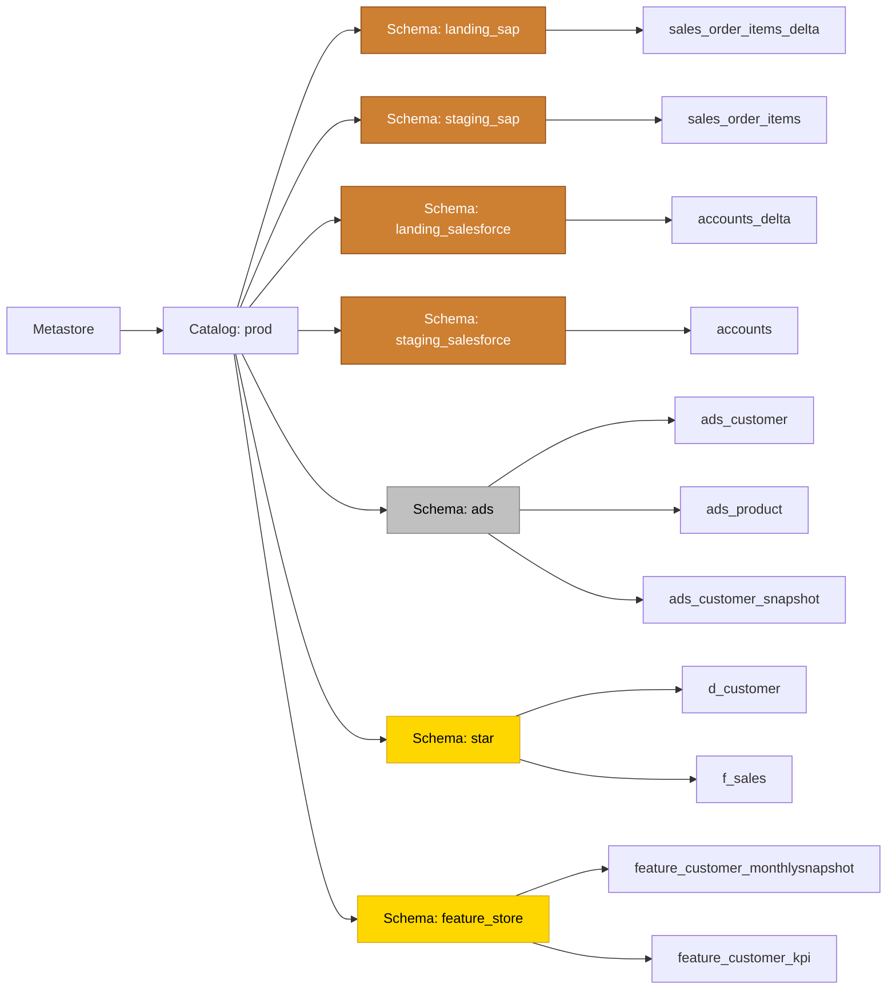

# Working with the Unity Catalog

!!! info "info"
    **Audience:** Data engineers, analytics engineers, and platform administrators working with Databricks.  
    This guide shares quick tips to get productive with Unity Catalog in a scalable way.

## Overview

The Unity Catalog is Databricks' unified governance solution for all data assets. Advantages include fine-grained access control, centralized metadata management, and auditability across workspaces. Adopting Unity Catalog ensures data security, compliance, and operational efficiency.

## Unity Catalog components

The Unity Catalog uses a four-level structure: Metastore, Catalog (top level), Schema (mid level) and table/view (bottom level).



The metastore is always present and fixed across the Databricks account. When creating or reading tables, reference the catalog, schema, and table/view/volume/model name using `catalog.schema.object`. When not specified, Spark assumes the `default` catalog and/or `default` schema.

The best way to read and write data is by using the `read_table` and `saveAsTable` functions in Python:

```python
# Read from the Staging (Bronze) schema for a specific source
df = spark.read_table("prod.staging_sap.sales_order_items")
# Optionally read from Landing (Bronze) for that same source
lnd = spark.read_table("prod.landing_sap.sales_order_items_delta")
# Write to ADS (Silver-equivalent)
df.write.saveAsTable("prod.ads.sales")
```

In SQL:

```sql
-- Read from Staging (Bronze-equivalent)
SELECT * FROM prod.staging_sap.sales_order_items;
-- Write into ADS (Silver-equivalent)
CREATE TABLE prod.ads.sales AS SELECT * FROM some_source_table;
```

## Managed vs external tables

Unity Catalog supports managed and external tables. **Prefer managed tables** so Unity Catalog manages storage locations, optimizations, and indexing. External tables are useful when you need fine-grained control or when another team enforces storage locations.

```python
# Adding a path parameter to saveAsTable results in an external table
(
    df.write
      .option("path", "abfss://container@storageaccount.dfs.core.windows.net/star/f_sales")
      .saveAsTable("prod.star.f_sales")
)
```

```sql
CREATE TABLE prod.ads.sales_data
USING DELTA
LOCATION 'abfss://container@storageaccount.dfs.core.windows.net/ads/sales_data'
AS SELECT * FROM source_table;
```

## Unity Catalog organization

Two organizational units matter: catalogs and schemas.

- **Catalogs:** organize by environment (`dev`, `test`, `acc`, `prod`) to simplify promotion and isolation.
- **Schemas:** organize by **source system in Bronze** (Landing/Staging) and by **domain / data product in Silver/Gold**.
  - Bronze schemas per source system keeps data lineage clear and makes troubleshooting and reloads simpler (see [Landing and Staging](../architectural-principles/landing-and-staging.md) and [Data Layers and Modeling](../architectural-principles/data-layers-and-modeling.md)).
  - Silver/Gold layers often integrate multiple sources, so schemas are typically shared (for example a single `ads` schema) or split by domain (for example `ads_sales`, `star_finance`).

Recommended baseline naming:
- Bronze (Landing optional): `landing_<source>` and `staging_<source>`
- Silver: `ads` (or `ads_<domain>`)
- Gold: split schemas by consumption pattern (for example `star`, `feature_store`) and optionally by domain (for example `star_sales`)

```python
# Set up the catalog to use for the current session
spark.catalog.setCurrentCatalog("catalog_name")
df = spark.read_table("schema.table_name")
```

```sql
USE CATALOG catalog_name;
SELECT * FROM schema.table_name;
```

Organizing by environment provides:
- Clear separation between environments, reducing risk of accidental exposure or modification.
- Simplified promotion and testing by isolating changes.
- Simplified access management (permissions per catalog).
- Environment-specific configuration and optimization.
- Clear cost allocation and resource management per environment.

## User and access management

Principals (users, groups, service principals) can be granted permissions on catalogs, schemas, and tables/views. Centralize identity in an external provider and synchronize to Unity Catalog (for example AIM on Azure or SCIM-based sync).

Follow least-privilege and role-based access control (RBAC). Use infrastructure-as-code (for example Terraform with the Databricks provider) to manage permissions reproducibly and keep an audit trail in Git.
