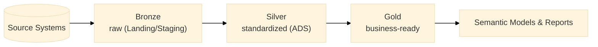
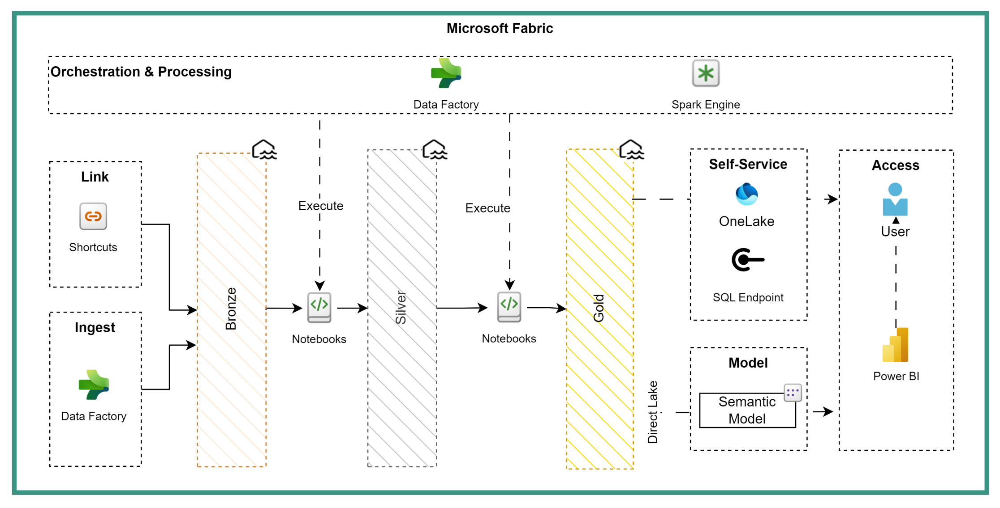
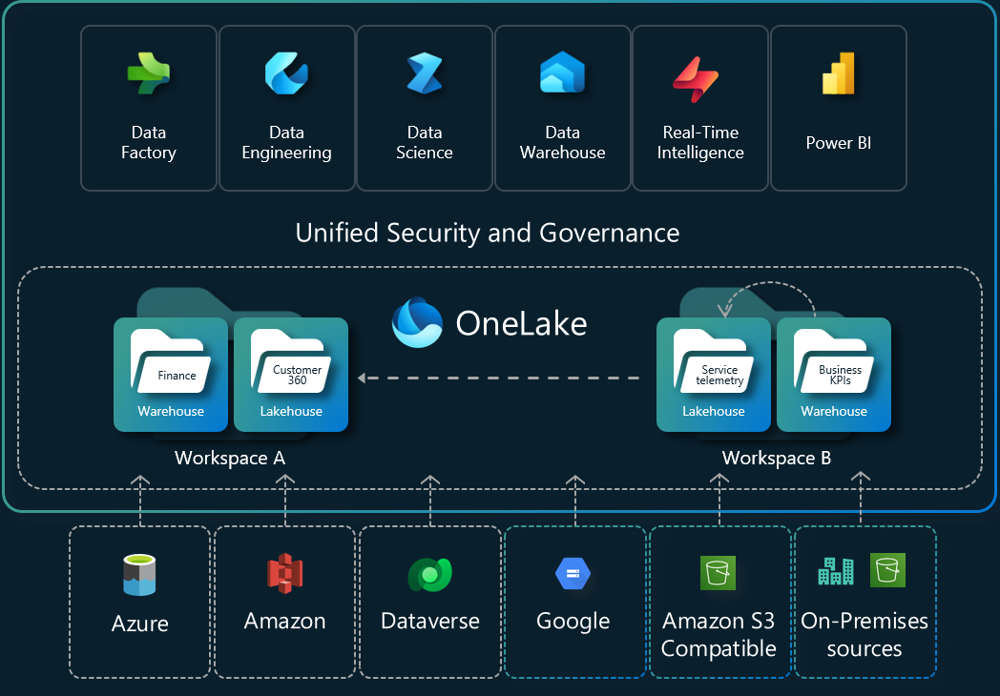

# Lakehouse Architecture

!!! info "Purpose"
    We align Fabric lakehouses to the Medallion architecture (Bronze/Silver/Gold) and map those tiers to our semantic layers (Landing/Staging -> ADS -> Gold business products). Combined with Delta Lake optimization, this creates a clear path from raw data to business-ready products with strong data quality and performance.

## Overview
The Lakehouse enforces a clear path from raw data to analytics-ready assets (Bronze -> Silver -> Gold). The table below highlights the primary responsibilities of each layer.

| Layer | Responsibility |
|---|---|
| Bronze | Ingest and persist raw source data with minimal transformation and audit metadata (Landing/Staging) |
| Silver | Standardize, clean, and enforce schema/quality checks (ADS) |
| Gold | Produce business-ready marts, aggregates, and models optimized for consumption |





## Quick Reference: Do's and Don'ts

| Do                                                            | Don't                                      |
| ------------------------------------------------------------- | ------------------------------------------ |
| Use Delta format for transactional tables                     | Mix different storage formats without reason |
| Implement clear Bronze -> Silver -> Gold layers               | Skip layers or mix responsibilities          |
| Add audit columns in Bronze layer                             | Modify source data during initial ingestion  |
| Implement automated quality gates                             | Promote data without validation checks       |
| Use partitioning for large tables strategically               | Over-partition small tables                  |
| Enable shortcuts cache for cross-geo reads                    | Create redundant copies across regions       |
| Separate sensitive data into distinct lakehouses              | Mix different sensitivity levels             |
| Implement regular file compaction jobs (vacuum and optimize)  | Let small files accumulate                   |

## Core concepts

Separation of concerns by layer simplifies governance and enables targeted performance tuning. Delta format enables ACID operations and simplifies incremental processing.

## Implementation

1. Start with a Bronze -> Silver flow for a single domain. Automate schema checks and deduplication at Silver.
2. Use Delta and implement automated compaction and Z-ordering for high-selectivity query columns.
3. Define SLAs and monitoring for ingestion latency, freshness, and error rates.

## Layer responsibilities

| Layer | Purpose | Typical content | Key controls |
|-------|---------|-----------------|--------------|
| Bronze | Land raw files | Raw tables, Parquet/Delta | Retention, audit columns |
| Silver | Standardize and validate | Cleansed entities | Data quality checks |
| Gold | Business models | Facts/dimensions, aggregates | Performance tuning |

## Storage & formats

- Always prefer Delta for transactional compatibility and ACID operations.
- Use Parquet for archival where Delta is not required.

## OneLake & Shortcuts (practical notes)

- OneLake surfaces ADLS Gen2 with Fabric-specific capabilities (shortcuts, cache). Use OneLake Shortcuts to connect existing data lakes without duplicating data. Two useful shortcut types:
  - File Shortcuts: point to files (CSV/JSON) and are best used in Bronze/landing layers. File Shortcuts are not accessible via SQL endpoints.
  - Table Shortcuts: point to Delta/managed tables and are ideal in Silver/Gold layers to share curated data across lakehouses.
- Consider enabling Shortcuts Cache for cross-geo reads to reduce egress costs; weigh cache costs vs egress savings for high-read volumes.



## Multiple Lakehouses & sensitivity

- Prefer multiple lakehouses when you need isolation for security, sensitivity labels, or separate compute boundaries. Separate lakehouses make it easier to apply sensitivity labels and manage granular access controls.

Example (SQL):

```sql
CREATE TABLE bronze.raw_orders USING DELTA LOCATION '/lakehouse/bronze/orders';
```

## Partitioning & file layout

| Strategy | When | Example |
|----------|------|---------|
| Date partition | Large time-series | partition(date) |
| Hash/Key | High-cardinality joins | partition(customerId) |
| No partition | Small tables | - |

Organize files by domain and layer: `/lakehouse/<domain>/<layer>/...`

## Quality Gates (recommended)

1. Bronze -> Silver: schema checks, null ratios, deduplication.
2. Silver -> Gold: referential integrity, business-rule validation, aggregation checks.

Implement as automated notebooks/jobs with failure alerts.

## Performance & tuning

| Technique       | Benefit                   | Notes                           |
| --------------- | ------------------------- | ------------------------------- |
| File compaction | Fewer paths, faster scans | Run periodically                |
| Z-ordering      | Better predicate pruning  | Use on high-selectivity columns |
| Caching         | Faster repeated queries   | Use sparingly                   |

!!! tip "tip"
    You can define table properties to lift performance

```sql
ALTER TABLE silver.orders SET TBLPROPERTIES (
  'delta.autoOptimize.autoCompact' = 'true',
  'delta.autoOptimize.optimizeWrite' = 'true'
);
```
## Monitoring & SLAs

Track ingestion latency, freshness, error rates, and storage growth. Define SLA targets for critical datasets.

## Checklist

- [ ] Delta format used for mission-critical tables
- [ ] Partitioning documented per table
- [ ] Quality gates automated
- [ ] Monitoring and alerts configured

## Related pages
- [Medallion Architecture](Technical%20Guideline%20Ops/Architectural%20Principles/Medallion%20-%20Bronze%20Silver%20Gold.md) - How Bronze/Silver/Gold map to our semantic layers
- [Data Layers and Modeling](../architectural-principles/data-layers-and-modeling.md) - Plainsight's explicit layer definitions
- [Naming Conventions](../power-bi/naming-conventions.md)
- [Data Pipeline Patterns](data-pipeline-patterns.md)

!!! tip "tip"
    Start small: implement Bronze -> Silver first, then expand to Gold as business needs stabilize.
