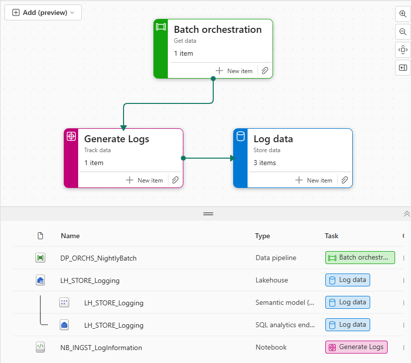

# Fabric Naming Conventions

!!! info "Purpose"
    Standardized naming patterns create clarity and enable automation across the Fabric data estate. Through semantic prefixes, version indicators, and type codes, teams can automate governance processes and maintain clear data lineage. When implemented properly, these conventions accelerate development through discoverability while building trust through consistent, meaningful artifact names.

## Overview
This section captures pragmatic rules you can enforce via templates and CI. Benefits and rationale are summarized below.

| Benefit | Why it matters |
|---|---|
| Discoverability | Quickly locate related artifacts across workspaces and apps using predictable prefixes and purpose codes |
| Automation | Scripts and CI can parse names to assign ownership, validate lifecycle, and enforce policies |
| Governance | Regex-based policy checks make it possible to deny or flag non-conforming artifacts in PRs |
| Clarity | Separates technical names from business-facing display names, reducing ambiguity |

[^1]

*Image source: [Marc Lelijveld](https://data-marc.com/2025/02/13/structure-fabric-items-by-applying-naming-conventions/)*

## Quick Reference: Do's and Don'ts

| Do ✅ | Don't ❌ |
|-------|----------|
| Use semantic prefixes (e.g., `DP_`, `LH_`) for all artifacts | Create artifacts without type prefixes |
| Keep purpose codes short and consistent (e.g., `INGST`, `STORE`) | Use long, inconsistent purpose descriptions |
| Use underscores to separate prefix, purpose, and description | Mix different separators (hyphens, dots) in names |
| Include the layer for lakehouse artifacts (e.g., `_Bronze`, `_Silver`) | Skip the layer designation in lakehouse names |
| Use PascalCase or snake_case consistently within description | Mix different naming cases in the same workspace |
| Keep names concise but meaningful | Use generic names like "Test1" or overly long descriptions |
| Document new prefixes/purposes in a central location | Create new prefixes without team alignment |
| Use automation to enforce naming standards | Rely solely on manual reviews for naming compliance |

## Structure

Overall recommended structure:

```
{ItemType}_{Purpose}_{FreeTextDescription}
```

Position mapping:

1-2: Item type (2 chars)
3: underscore
4-8: Item purpose (up to ~5 chars recommended)
9: underscore
10+: free descriptive text (PascalCase or snake_case as you prefer)

This structure keeps type & purpose easily parseable for automation.

## Item types (expanded list)

| Prefix | Item type | Notes |
|:----:|---|---|
| `CJ` | Copy Job | Small ingest jobs
| `DP` | Data Pipeline | Orchestration pipelines
| `DF` | Dataflow | Dataflow assets
| `ES` | Eventstream | Event ingestion definitions
| `MR` | Mirrored object | External DB mirror
| `SD` | Spark Job Definition | Spark job configs
| `NB` | Notebook | Development notebooks
| `EN` | Environment | Environment definitions
| `EX` | Experiment | ML experiments
| `ML` | Machine Learning Model | Trained models
| `LH` | Lakehouse | OneLake/Lakehouse assets
| `WH` | Warehouse | Fabric warehouse
| `EH` | Eventhouse | Eventhouse items
| `DB` | SQL Database | Synapse/SQL DBs
| `SM` | Semantic Model | PBIP / model files
| `KQ` | KQL Queryset | Kusto query sets
| `DA` | Data Agent | Fabric data agent/skill
| `RP` | Report | Power BI report
| `PR` | Paginated Report | Paginated report
| `DS` | Dashboard | Dashboard assets
| `RD` | Realtime Dashboard | Real-time dashboards
| `SC` | Scorecard | Scorecards
| `AC` | Activator | Activation jobs
| `OA` | Org App | Published apps
| `VL` | Variable Library | Config/variables

> Tip: choose a small subset of prefixes that match your org scale - you can expand as needed.

## Item purposes

| Purpose | Meaning | Example |
|--------|---------|--------|
| `ORCHS` | Orchestration chains | `DP_ORCHS_NightlyETL` |
| `INGST` | Ingestion | `CJ_INGST_Oracle` |
| `TRNSF` | Transform | `NB_TRNSF_CustomerCleansing` |
| `STORE` | Storage / persisting | `LH_STORE_Silver` |
| `ANLYZ` | Analytics | `SM_ANLYZ_YoYSales` |
| `SCIEN` | Data science / ML | `ML_SCIEN_ChurnModel` |
| `MAINT` | Maintenance tasks | `DP_MAINT_Vacuum` |
| `MONIT` | Monitoring | `DS_MONIT_Pipelines` |
| `CNFGS` | Configuration | `VL_CNFGS_Environments` |
| `DOCUM` | Documentation | `RP_DOCUM_DataCatalog` |

## Examples

| Artifact type | Suggested name | Why it helps |
|--------------|----------------|---------------|
| Pipeline (orchestration) | `DP_ORCHS_NightlyBatch` | Immediately shows it's an orchestration pipeline and nightly cadence |
| Copy job | `CJ_INGST_OracleDb` | Clear ingest job from Oracle DB |
| Lakehouse (silver) | `LH_STORE_Sales_Silver` | Shows domain (Sales) and medallion layer (Silver) |
| Semantic model | `SM_ANLYZ_SalesYTD` | Model focused on Sales year-to-date metrics |
| Report | `RP_ANLYZ_ExecSummary` | Business-facing Exec summary dashboard |


!!! warning "Keep Environment Names Out of Artifact Names"
    Avoid embedding environment names into canonical artifact names (prefer `Lakehouse_Bronze` over `Lakehouse_Bronze_DEV`). Environment-aware behavior is better handled by workspace scoping, deployment pipelines, or display names. This keeps canonical names environment-agnostic and simplifies promotion across environments.
    
    [!tip] Validating & Automating Naming Conventions
    - **Validation**: Use this regex pattern to validate names: `^[A-Z]{2}_[A-Z]{4,7}_[A-Za-z0-9_]+$`
    - **Ownership**: Assign ownership automatically using prefix + purpose (e.g., all `LH_*` items owned by the Data Platform team)

## Related pages
- [Workspace Organization](../databricks/workspace-organization.md) - where items live
- [Third Party Tooling](third-party-tooling.md) - tools to browse and manage artifacts

[^1]: 
