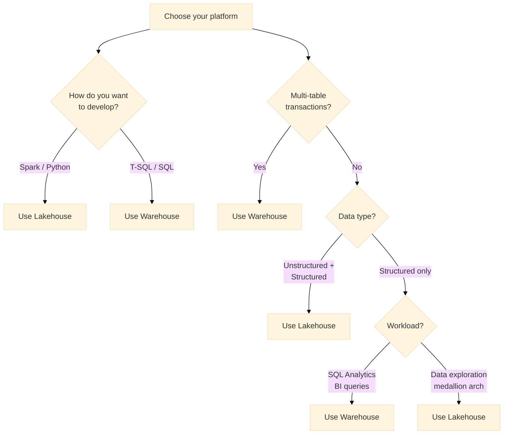

# Warehouse vs Lakehouse: A Decision Guide

??? info "Purpose"
    Microsoft Fabric offers two enterprise-scale, open-standard storage workloads: **Warehouse** and **Lakehouse**. Both store data in Delta format on OneLake, but serve different use cases and developer profiles. This guide helps you choose the right platform based on your workload, data type, and analytical needs.

## Quick Decision Tree

## At a Glance

| Aspect | Warehouse | Lakehouse |
|--------|-----------|-----------|
| **Best for** | Enterprise SQL/BI analytics, multi-table ACID transactions | Data engineering, mixed data types, medallion architectures (Bronze/Silver/Gold, see [Medallion Architecture](../architectural-principles/medallion-bronze-silver-gold.md)) |
| **Developer profile** | SQL developers, BI analysts, citizen developers | Data engineers, data scientists, Python/Spark developers |
| **Data loading** | SQL, pipelines, dataflows | Spark, pipelines, dataflows, shortcuts, notebooks |
| **Language** | T-SQL (full DQL, DML, DDL) | PySpark, Spark SQL (limited T-SQL via SQL endpoint) |
| **Transactions** | Full ACID support with multi-table guarantees | No transactions (read-only SQL endpoint) |
| **Unstructured data** | ❌ Not ideal | ✅ Native support |
| **Cost model** | Per-warehouse capacity usage | Per-capacity Spark compute + storage |

---

## Detailed Comparison

### 1. **Warehouse** - Enterprise Data Warehouse

**When to use:**
- Enterprise-scale analytics with strict ACID compliance
- Structured data only, analyzed with T-SQL
- Complex workflows with multi-table transactions (updates, inserts, deletes)
- BI teams need reliable, performant SQL analytics
- Departmental or business-unit data warehousing

**Key features:**
- **Full T-SQL support**: DQL, DML, DDL, stored procedures, views, functions
- **ACID transactions**: Multi-table consistency guarantees
- **No configuration**: Auto-scaling, no compute/storage tuning needed
- **Lake-centric**: Data stored in Delta format on OneLake for portability
- **Integrated tooling**: Full read/write support for SQL Server Management Studio (SSMS), Azure Data Studio, and third-party tools
- **Semantic layer**: Direct Power BI integration with default semantic models
- **Cross-database queries**: Virtual warehouses for federated analytics

**Typical architecture:**
- Staging zone (bronze) → transform with T-SQL → production tables (gold)
- ETL pipelines using SQL or dataflows
- Direct BI consumption via semantic models

**Example use case:**
> A retail company needs to consolidate sales, inventory, and customer data into a central warehouse for daily reporting and forecasting. Multi-table transactions ensure data consistency during nightly ETL. SQL developers use SSMS to build procedures; BI analysts connect Power BI for dashboards.

---

### 2. **Lakehouse** - Data Architecture Platform

**When to use:**
- Mixed data types (logs, images, raw data + structured tables)
- Data engineering and data science workflows (Spark / Python)
- Medallion architecture (bronze → silver → gold zones, see [Medallion Architecture](../architectural-principles/medallion-bronze-silver-gold.md))
- Rapid data exploration and prototyping
- Incremental data pipelines with Spark

**Key features:**
- **Spark-first development**: Native PySpark, SQL, and notebooks
- **Automatic discovery**: Files → tables with minimal effort
- **SQL analytics endpoint**: Read-only T-SQL endpoint for querying Delta tables and shortcuts
- **Open format**: Data in Delta format, accessible via Spark and external tools
- **Flexible ingestion**: Pipelines, dataflows, shortcuts, notebooks, ETL code
- **Medallion-friendly**: Zone-based structure for bronze (raw), silver (cleaned), and gold (analytics) - see [Medallion Architecture](../architectural-principles/medallion-bronze-silver-gold.md) for how Plainsight maps this to explicit layers
- **Large-scale processing**: Spark compute for transformations and ML

**Typical architecture:**
- Raw zone (bronze) → Spark ETL → curated zone (silver) → optional SQL endpoint for BI
- Optional SQL analytics endpoint for read-only T-SQL querying
- Notebooks for data exploration and feature engineering

**Example use case:**
> A healthcare organization ingests streaming sensor data (unstructured logs), historical patient records (structured), and external APIs into a Lakehouse. Spark jobs clean and normalize the data into silver tables; data scientists use notebooks for exploratory analysis. A read-only SQL endpoint serves analytical queries to Power BI dashboards.

---

## Decision Framework

### By Development Language

| Language | Recommendation |
|----------|-----------------|
| **T-SQL** | Warehouse (full DDL/DML/DQL support) |
| **PySpark / Spark SQL** | Lakehouse (native Spark support) |
| **SQL + Python mix** | Lakehouse (Spark) or Warehouse (if T-SQL + pipelines suffice) |
| **Python / Notebooks** | Lakehouse |

### By Data Type

| Data Profile | Recommendation |
|--------------|-----------------|
| **Structured only** | Warehouse (simpler, optimized for SQL) |
| **Structured + unstructured** | Lakehouse (native file + table support) |
| **Logs, images, raw blobs** | Lakehouse |
| **Well-defined schemas** | Either (prefer Warehouse for compliance) |

### By Workload Pattern

| Pattern | Recommendation |
|---------|-----------------|
| **BI/Analytics (SQL queries)** | Warehouse or Lakehouse SQL endpoint |
| **ETL (bulk transforms)** | Warehouse (T-SQL) or Lakehouse (Spark) |
| **Data engineering** | Lakehouse |
| **Data science / ML** | Lakehouse |
| **Multi-table transactions** | Warehouse (required for ACID) |
| **Medallion architecture** | Lakehouse |

---

## Feature Comparison Table

| Feature | Warehouse | Lakehouse | Lakehouse SQL Endpoint |
|---------|-----------|-----------|------------------------|
| **ACID compliance** | ✅ Full | ❌ | ❌ |
| **T-SQL (DQL)** | ✅ Full | ✅ Via endpoint | ✅ Full |
| **T-SQL (DML/DDL)** | ✅ Full | ❌ | ❌ Limited (views, TVFs) |
| **Spark support** | ❌ | ✅ Native | ❌ |
| **Unstructured data** | ⚠️ Via shortcuts | ✅ Native | ❌ |
| **Read Delta tables** | ✅ | ✅ | ✅ |
| **Write Delta tables** | ✅ | ✅ | ❌ |
| **Data loading** | SQL, pipelines, dataflows | Pipelines, dataflows, Spark, shortcuts, notebooks |
| **Notebooks** | ❌ | ✅ | ❌ |
| **Transactions** | ✅ Multi-table | ❌ | ❌ |
| **Stored procedures** | ✅ | ❌ | ❌ (views/TVFs only) |
| **Third-party tools** | ✅ Read/write | ⚠️ Read (via endpoint) | ⚠️ Read (via endpoint) |

---

## Common Patterns

### Pattern 1: SQL-Only Analytics
**Use Warehouse**  
SQL developers load structured data via pipelines or SSMS, build views and procedures, and serve BI via Power BI. No Spark, no notebooks needed.

### Pattern 2: Medallion Architecture (Data Engineering)
**Use Lakehouse**  
Bronze (raw ingestion) → Silver (Spark cleaning) → Gold (business tables). Optional SQL endpoint for BI consumption without extra replication.

### Pattern 3: Hybrid (Analytics + Science)
**Use Lakehouse + optional Warehouse**  
Data engineers use Lakehouse for ingestion and transformation; data scientists explore with notebooks. BI teams consume either via Lakehouse SQL endpoint or replicate curated gold tables to Warehouse for stricter governance.

### Pattern 4: Multi-Tenant / Data Mesh
**Use Warehouse**  
Departments own independent warehouses with strict ACID guarantees and cross-warehouse queries via virtual warehouses for federated analytics.

---

## Cost & Performance Considerations

Both Warehouse and Lakehouse consume Fabric capacity (F2–F64 SKUs).

- **Warehouse**: Optimized for SQL query cost; minimal overhead for read-heavy BI workloads.
- **Lakehouse**: Cost depends on Spark compute and storage; medallion patterns with incremental pipelines minimize Spark overhead.

Reserve capacity for predictable workloads; scale up for ad-hoc or peak analytics.

---

## Related Pages
- [Lakehouse Architecture](lakehouse-architecture.md) - Deep dive into medallion design patterns
- [Capacity Management](capacity-management.md) - Optimize Fabric capacity for both platforms
- [Workspace Organization](workspace-organization.md) - Structure teams and permissions
- [Data Pipeline Patterns](data-pipeline-patterns.md) - Design data flows for either platform