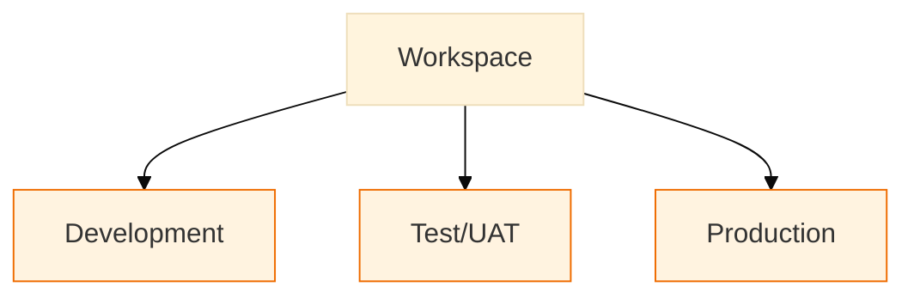

# Workspace Organization

!!! info "Purpose"
    Strategic workspace organization enables reliable development workflows and clear operational boundaries in Fabric environments. By implementing proper workspace scoping, RBAC models, and promotion patterns, teams can maintain security, predict costs, and accelerate development cycles. Well-structured workspaces form the foundation for scalable analytics delivery while maintaining clear ownership and access controls.

## Overview
Well-structured workspaces reduce accidental access, simplify promotion, and make costs predictable. Key outcomes are summarized below.

| Outcome | Why it matters |
|---|---|
| Clear boundaries | Separates development/test/production to avoid accidental changes in Prod |
| Predictable costs | Capacity and workspace splits enable cost allocation and chargeback |
| Secure promotion | Environment promotion patterns reduce human error during releases |



## Quick Reference: Do's and Don'ts

| Do ✅                                                   | Don't ❌                                                |
| ------------------------------------------------------ | ------------------------------------------------------ |
| Separate Dev/Test/Prod workspaces clearly              | Mix development and production assets in one workspace |
| Use Git integration in Dev workspaces                  | Enable Git in production workspaces unnecessarily      |
| Implement standard folder structure for all workspaces | Create ad-hoc folders without clear purpose            |
| Assign roles based on least privilege principle        | Grant admin access to regular contributors             |
| Keep secrets in Key Vault                              | Store credentials in artifacts or notebooks            |
| Schedule regular access reviews                        | Leave inactive users with access                       |
| Document workspace purpose and ownership               | Create workspaces without clear ownership              |

## Core concepts

Workspace scoping, role-based access control (RBAC), and promotion mechanics together define how teams safely develop and run analytics. Treat workspaces as unit-of-deployment and cost center.

## Implementation

1. Create minimal production workspaces; encourage feature work in development sandboxes.
2. Use Git + deployment pipelines to promote semantic models and reports.
3. Enforce Role separation via workspace roles and periodic access reviews.

## Workspace types & responsibilities

| Type | Purpose | Who | Notes |
|------|---------|-----|-------|
| Development | Feature work, experiments | Dev teams | Sandboxes per dev/team |
| Test/UAT | Integration & acceptance | QA, Stakeholders | Mirror prod data patterns |
| Production | Business use | End users, BI | Strict change control |

## Recommended folder layout (example)

```
<workspace-root>/
    /lakehouses/
        /<domain>/{bronze|silver|gold}
    /pipelines/
    /notebooks/
    /semantic_models/
    /reports/
```

## Access & roles

| Role | Scope | Example Permissions |
|------|-------|---------------------|
| Workspace Admin | Full | Manage workspace, assign roles |
| Contributor | Content | Create/edit lakehouse, pipelines |
| Viewer | Read-only | Browse datasets, run reports |

## Environment CICD patterns

- Use Git + PBIP for model artifacts
- Deploy via Deployment Pipelines or CI/CD for repeatability
- Keep credentials & secrets out of artifacts (use Key Vault)

## Capacities, multi-geo and isolation (lessons learned)

| Topic | Practical guidance |
|---|---|
| Capacity sizing | Avoid using tiny F2 capacities for production workloads - they are suitable for POCs but quickly become a bottleneck for Spark-based engineering. Prefer larger SKUs for production or reserve capacity where needed. |
| One big vs multiple small | Prefer multiple small capacities when you need strict isolation (compliance, billing, geographic or organizational boundaries). One large capacity may simplify operations for centralized teams but can create noisy-neighbor issues. Consider using multiple capacities unless you have clear reasons to centralize. |
| Multi-geo | Deploy Fabric capacities in the regions you require for data residency and latency; use multiple capacities per required geography. |


## Git integration & folders caveat

- Connect Dev workspaces to Git (recommended pattern: Git integration at Dev stage only) to keep the developer experience simple while avoiding deployment complexity in early stages.
- Be aware: workspace folders are not fully preserved by Git deployments and may be lost when promoting between environments. If folder grouping is important for component relationships, prefer multiple workspaces or explicit naming/prefixes that survive CI/CD deployments.

## Quick checklist (governance)

- [ ] Naming conventions enforced
- [ ] Environments separated with capacity isolation
- [ ] Access reviews scheduled
- [ ] Backup & soft-delete configured

## Related pages
- [Naming Conventions](../power-bi/naming-conventions.md)
- [Capacity Management](capacity-management.md)

!!! tip "tip"
    Keep production workspaces minimal; use sharing (Apps) to present friendly names to end users.
