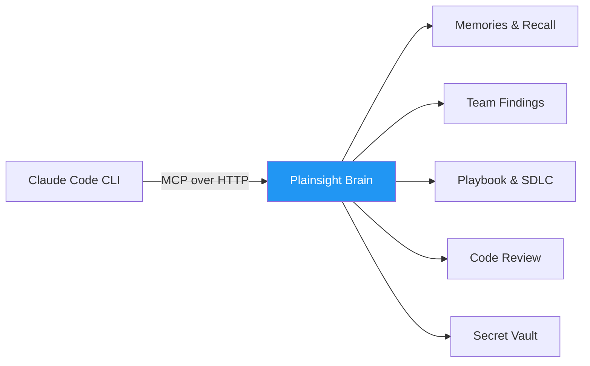
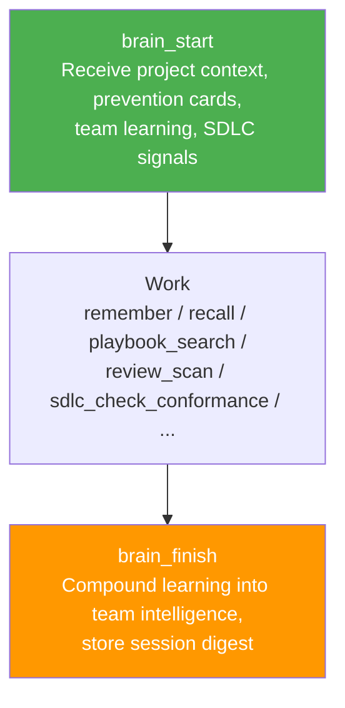

# Connect Plainsight Brain to Claude Code

??? info "Purpose"
    Plainsight Brain is our team's compounding intelligence layer — an MCP server that gives Claude Code access to memories, project context, team findings, playbook search, code review, SDLC governance, and a secret vault. This guide walks you through connecting your Claude Code CLI to the production Brain endpoint so every session starts with context and ends with a durable learning.

## How It Works



Claude Code connects to Brain via the MCP protocol over HTTP. Authentication uses your `@plainsight.pro` Entra ID — the server advertises its OAuth endpoints automatically, so Claude Code handles the login flow for you.

## Prerequisites

| Requirement | Details |
|-------------|---------|
| **Claude Code** | CLI installed (`npm install -g @anthropic-ai/claude-code`) |
| **Plainsight Entra ID** | Your `@plainsight.pro` account |
| **Brain access** | Your account must be granted access to the Brain app registration. Ask an admin if you get a login loop. |

## Step 1: Add to .mcp.json

Create or edit `.mcp.json` in your project root (per-project) or `~/.claude/.mcp.json` (global):

```json
{
  "mcpServers": {
    "plainsight-brain": {
      "type": "http",
      "url": "https://ca-plainsight-brain.thankfulglacier-ff0d1152.swedencentral.azurecontainerapps.io/mcp"
    }
  }
}
```

That's it — no tokens, no secrets, no local server to run. Claude Code detects the OAuth-protected endpoint and handles authentication automatically.

??? tip "Global vs. per-project"
    Place it in `~/.claude/.mcp.json` if you want Brain available in every project. Place it in your project's `.mcp.json` if you only want it for that specific repo. If both exist, they are merged.

## Step 2: Authenticate

1. Start Claude Code in your project
2. Claude Code detects the OAuth-protected Brain endpoint and opens your browser
3. Sign in with your `@plainsight.pro` Entra ID account
4. Approve the consent prompt (first time only)
5. Tokens are stored automatically — subsequent sessions reconnect without prompting

Type `/mcp` in Claude Code to verify. You should see `plainsight-brain` listed as a connected server.

## Step 3: Follow the Agent Lifecycle

Every meaningful session should follow a three-phase lifecycle. This ensures Claude receives context at the start and compounds learning for the team at the end.



**Start every task** by telling Claude what you're working on — it will call `brain_start` to load relevant project context, past findings, and prevention cards from the team.

**End every task** by letting Claude call `brain_finish` — it stores a durable learning that benefits the next person (or future you) working on the same project.

!!! warning "Without `brain_finish`, your session is invisible to the team knowledge base"
    If you skip the finish step, nothing from the session is compounded. The work still happens, but the team doesn't learn from it.

## Available Tools

Once connected, Claude has access to 87 tools across these categories:

| Category | Examples | What It Does |
|----------|---------|--------------|
| **Session lifecycle** | `brain_start`, `brain_finish` | Start with context, end with learning |
| **Memory** | `remember`, `recall`, `list_memories` | Personal semantic memory — store and search knowledge |
| **Team intelligence** | `team_search_findings`, `team_share_finding`, `get_company_intelligence` | Share discoveries across the team |
| **Projects** | `sync_project`, `get_project`, `get_project_brief` | Track project state and context |
| **Playbook** | `playbook_search`, `playbook_get_section`, `playbook_propose_update` | Search and contribute to the team playbook |
| **Code review** | `review_scan`, `review_report`, `review_repos` | Automated code review and scanning |
| **SDLC governance** | `sdlc_check_conformance`, `sdlc_get_guidance`, `sdlc_search_rules` | Check conformance to engineering standards |
| **Secret vault** | `get_secret`, `set_secret`, `unlock_vault`, `lock_vault` | Secure secret management with Entra SSO + MFA |
| **Plans & experiments** | `save_plan`, `record_experiment`, `record_challenge` | Track decisions and experiments |

## Combining with Other MCP Servers

Brain works alongside other MCP servers. Add them as siblings under `mcpServers`:

```json
{
  "mcpServers": {
    "plainsight-brain": {
      "type": "http",
      "url": "https://ca-plainsight-brain.thankfulglacier-ff0d1152.swedencentral.azurecontainerapps.io/mcp"
    },
    "databricks": {
      "command": "uv",
      "args": ["run", "--directory", "/path/to/ai-dev-kit", "python", "databricks-mcp-server/run_server.py"],
      "env": { "DATABRICKS_CONFIG_PROFILE": "my-workspace" },
      "defer_loading": true
    }
  }
}
```

Each server is an independent connection. Brain uses OAuth (browser sign-in), while Databricks uses a local CLI profile — they don't interfere with each other.

## Authentication Tiers

Brain supports three authentication tiers. The OAuth flow gives you personal-tier access by default.

| Tier | Access Scope |
|------|--------------|
| **Personal** (default via OAuth) | Full access: memory, secrets, projects, team, playbook, review, SDLC |
| **Team** | Shared findings, playbook, reviews, SDLC, projects. **No** personal memory. **No** secrets. |
| **Workspace** | Scoped workspace only. **No** secrets. **No** memory. **No** team. |

## Troubleshooting

| Symptom | Fix |
|---------|-----|
| OAuth login loop / never completes | Your Entra account may not have access to the Brain app registration. Ask an admin to add you. |
| `plainsight-brain` shows as disconnected in `/mcp` | Re-run `/mcp`, select the server, and reconnect. Token may have expired. |
| 401 Unauthorized on Brain tools | Your token may have expired. Disconnect and reconnect via `/mcp`. |
| Tools appear but calls fail | Check `/mcp` for error details. Common cause: Entra consent not granted for your account. |
| Server returns 503 | The server is initializing its Cosmos DB stores. Wait ~30 seconds and retry — cold starts take ~10s on Container Apps. |
