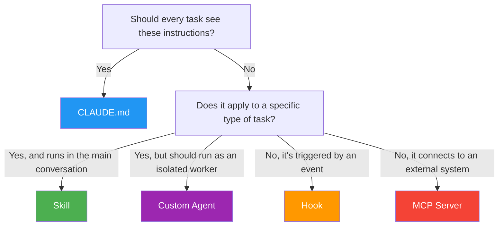
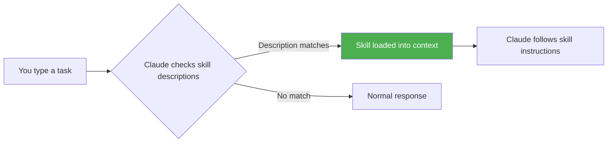
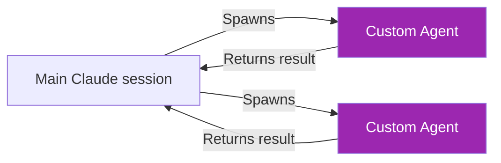
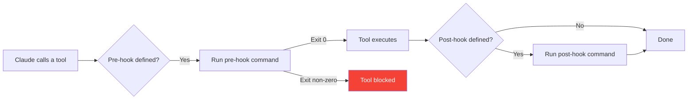
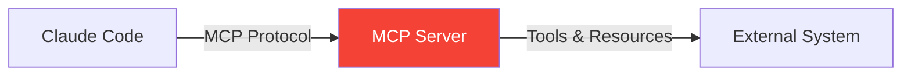

# Claude Code Extensibility Guide

??? info "Purpose"
    Claude Code is more than a chat interface — it's an extensible agentic development environment. This guide covers the five main building blocks you can use to customize Claude's behavior: **CLAUDE.md**, **Skills**, **Custom Agents**, **Hooks**, and **MCP Servers**. Understanding when to use each one is the key to getting consistent, high-quality output across your team.

## The Extensibility Landscape

Each extensibility mechanism serves a different purpose. Choosing the right one matters:

| Feature | File | Scope | When Loaded | Best For |
|---------|------|-------|-------------|----------|
| **CLAUDE.md** | `CLAUDE.md` | Project-wide | Every session, always | Repo conventions, coding standards, universal rules |
| **Skills** | `.claude/skills/*/SKILL.md` | Task-specific | When description matches the current task | Domain workflows, technology-specific guidance |
| **Custom Agents** | `.claude/agents/*.md` | Delegated work | When spawned via the Agent tool | Specialized parallel workers, isolated review tasks |
| **Hooks** | `.claude/settings.json` | Event-driven | On specific tool calls or events | Automated checks, formatting, notifications |
| **MCP Servers** | `.mcp.json` | Tool-level | When tools are invoked | External integrations (Databricks, APIs, databases) |



---

## CLAUDE.md — Project Instructions

`CLAUDE.md` is a markdown file at the root of your project (or in subdirectories) that Claude reads at the start of every session. It sets the baseline for how Claude behaves in your repo.

### Where to Place It

| Location | Scope |
|----------|-------|
| `~/CLAUDE.md` | User-level — applies to all your projects |
| `./CLAUDE.md` | Project root — applies to everyone working in this repo |
| `./src/CLAUDE.md` | Directory-level — applies when working in that subtree |

Claude reads all applicable `CLAUDE.md` files and merges them, with more specific files taking precedence.

### What to Put In It

`CLAUDE.md` is for instructions that should **always** be active:

```markdown
# Project: customer-analytics

## Tech Stack
- Python 3.11, Databricks, Delta Lake, dbt
- CI/CD via Azure DevOps

## Conventions
- Use `ruff` for Python formatting (line length 120)
- All SQL follows uppercase keywords, lowercase identifiers
- Tests go in `tests/` mirroring the `src/` structure
- Never commit secrets — use Azure Key Vault references

## Running Things
- Tests: `pytest tests/ -v`
- Linting: `ruff check src/`
- Local dev server: `make dev`
```

??? tip "Keep CLAUDE.md lean"
    `CLAUDE.md` is loaded every session. If it grows too large, Claude spends tokens processing instructions that may not be relevant. Move task-specific guidance into **skills** and keep `CLAUDE.md` focused on universal rules.

---

## Skills — Contextual Instructions

Skills are reusable instruction sets in `SKILL.md` files that Claude loads **only when relevant** to the current task. Instead of repeating the same prompt every session, you write a skill once and Claude applies it automatically.

### How Skills Work



### Creating a Skill

Skills live in `.claude/skills/` inside your project:

```
your-project/
├── .claude/
│   └── skills/
│       └── sql-style-guide/
│           └── SKILL.md
├── src/
└── ...
```

Every skill needs a `SKILL.md` file with **frontmatter** (metadata) and **body** (instructions):

```markdown
---
name: SQL Style Guide
description: >
  Enforces our team's SQL coding standards when writing or reviewing
  SQL queries — uppercase keywords, lowercase identifiers, CTEs over
  subqueries, explicit column lists.
---

When writing or reviewing SQL:

1. Use UPPERCASE for SQL keywords (SELECT, FROM, WHERE, JOIN)
2. Use lowercase_snake_case for table and column names
3. Prefer CTEs over subqueries for readability
4. Always use explicit column lists — never SELECT *
5. Use table aliases that are meaningful (not single letters)
```

### SKILL.md Frontmatter Reference

| Field | Required | Description |
|-------|----------|-------------|
| `name` | Yes | Human-readable name for the skill |
| `description` | Yes | **Critical** — Claude uses this to decide when to activate the skill |
| `allowed-tools` | No | Restrict which tools the skill can use (security boundary) |

### Writing Good Descriptions

The `description` is the single most important part. Claude uses it to decide whether to load the skill. A vague description means unreliable triggering.

| Quality | Example | Why |
|---------|---------|-----|
| Bad | `"Helps with database stuff"` | Too vague — triggers unpredictably |
| Bad | `"Code review skill"` | Every task could involve code review |
| Good | `"Guides creation of Databricks jobs, including cluster configuration, task dependencies, retry policies, and notification setup."` | Specific technology, action, and scope |
| Good | `"Applies when reviewing Python pull requests. Checks for type hints, docstring conventions, test coverage, and error handling patterns."` | Clear trigger condition and checklist |

??? tip "Description writing checklist"
    - Does it mention the **specific technology or domain**?
    - Does it mention the **specific action**?
    - Would Claude know **when NOT to trigger** this skill?
    - If two skills could overlap, does the description distinguish this one?

### Multi-File Skills

A skill directory can include reference files, templates, and examples:

```
.claude/skills/
└── databricks-job-builder/
    ├── SKILL.md
    ├── job-template.json
    ├── cluster-policies.md
    └── examples/
        ├── simple-etl-job.json
        └── multi-task-workflow.json
```

Reference them from your `SKILL.md`:

```markdown
---
name: Databricks Job Builder
description: >
  Guides creation of Databricks jobs with our standard cluster
  policies, task configurations, and alerting setup.
---

Use the template in `job-template.json` as a starting point.
Refer to `cluster-policies.md` for approved cluster configs.
See `examples/` for reference implementations.
```

### Restricting Tools

For security-sensitive skills, limit which tools Claude can use:

```yaml
---
name: Production Database Query
description: >
  Used when querying production databases. Enforces read-only
  access and prevents any write operations.
allowed-tools:
  - Read
  - Grep
  - Glob
  - mcp__databricks__execute_sql
---

Only execute SELECT queries against production.
Never run INSERT, UPDATE, DELETE, DROP, ALTER, or TRUNCATE.
Always include a LIMIT clause (max 1000 rows).
```

### Invoking Skills Manually

Skills can be invoked explicitly using slash commands. Type `/<skill-name>` in Claude Code to force-load a skill regardless of description matching. Useful for:

- Skills that don't auto-trigger often enough
- Running a skill on demand (e.g., "run the security review now")
- Testing a skill during development

### Skill Organization

```
.claude/skills/
├── data-engineering/
│   ├── databricks-jobs/
│   │   └── SKILL.md
│   └── spark-optimization/
│       └── SKILL.md
├── analytics/
│   └── power-bi-measures/
│       └── SKILL.md
├── deployment/
│   └── azure-bicep/
│       └── SKILL.md
└── review/
    └── security-review/
        └── SKILL.md
```

??? tip "One concern per skill"
    Keep skills focused on a single task or domain. A skill that covers "all Databricks things" will have a vague description and unreliable triggering. Split it: one for jobs, one for clusters, one for Unity Catalog.

---

## Custom Agents — Specialized Workers

Custom agents are defined in `.claude/agents/*.md` files. Unlike skills (which inject instructions into your main conversation), custom agents are **independent workers** that Claude can spawn to handle tasks in parallel or in isolation.

### How Custom Agents Work



When Claude uses the Agent tool with your custom agent type, it:

1. Starts a **fresh conversation** with the agent's system prompt
2. Gives the agent access to only the **tools you specified**
3. The agent works independently and returns a summary
4. The main conversation continues with the agent's findings

### Creating a Custom Agent

Place an `.md` file in `.claude/agents/`:

```
your-project/
├── .claude/
│   └── agents/
│       ├── data-quality-reviewer.md
│       └── security-auditor.md
├── src/
└── ...
```

Each agent file uses frontmatter to configure its behavior:

```markdown
---
name: data-quality-reviewer
description: >
  Reviews data pipeline code for quality issues — checks for missing
  null handling, schema validation, data type mismatches, and SLA
  compliance in Databricks notebooks and dbt models.
model: sonnet
tools:
  - Read
  - Grep
  - Glob
  - mcp__databricks__execute_sql
  - mcp__databricks__get_table_stats_and_schema
---

You are a data quality reviewer. When given code to review:

1. Check for missing null/empty handling on all input columns
2. Verify schema expectations are explicitly validated
3. Look for implicit type coercions that could silently corrupt data
4. Check that SLA-critical tables have freshness monitoring
5. Verify that all JOINs have appropriate null handling

Report findings as a structured list:
- **Critical**: Will cause data loss or corruption
- **Warning**: Could cause silent quality degradation
- **Info**: Improvement suggestions
```

### Agent Frontmatter Reference

| Field | Required | Description |
|-------|----------|-------------|
| `name` | Yes | Identifier used when spawning the agent (used as `subagent_type`) |
| `description` | Yes | Tells Claude when this agent is the right choice for a task |
| `model` | No | Which Claude model to use: `opus`, `sonnet`, or `haiku`. Defaults to the session's model. Use `haiku` for fast, cheap tasks; `opus` for complex reasoning. |
| `tools` | No | List of tools the agent can access. Omit to give access to all tools. |

### When to Use Agents vs. Skills

| Use a **Skill** when... | Use a **Custom Agent** when... |
|--------------------------|-------------------------------|
| Instructions should apply in the main conversation | Work should happen in isolation |
| The task is part of your current flow | The task can run independently or in parallel |
| You need Claude to apply rules while *you* work | You need a specialized *worker* to complete a task and report back |
| Context from the main conversation is needed | A fresh perspective without conversation context is preferred |

**Practical examples:**

- **Skill**: "When writing SQL, follow our style guide" — augments the main conversation
- **Agent**: "Review this PR for security issues" — isolated, parallel worker
- **Skill**: "When deploying, use these Bicep patterns" — guidance during your workflow
- **Agent**: "Check data quality across these 5 tables" — delegated, independent task

### Agent Examples

**Lightweight linter agent (fast and cheap with Haiku):**

```markdown
---
name: quick-lint
description: >
  Fast linting pass over changed files. Checks for common issues
  like unused imports, missing type hints, and print statements.
model: haiku
tools:
  - Read
  - Grep
  - Glob
---

Review the changed files for:
- Unused imports
- Missing type hints on function signatures
- Print/debug statements that should be removed
- TODO comments without ticket references

Report only confirmed issues. No false positives.
Keep your response under 200 words.
```

**Deep architecture reviewer (thorough with Opus):**

```markdown
---
name: architecture-review
description: >
  Deep review of architectural decisions — evaluates module
  boundaries, dependency directions, API surface area, and
  consistency with existing patterns in the codebase.
model: opus
tools:
  - Read
  - Grep
  - Glob
  - Bash
---

You are a senior architect reviewing code changes.

Evaluate:
1. Do the module boundaries make sense?
2. Are dependencies flowing in the right direction?
3. Is the API surface area minimal and consistent?
4. Does this follow existing patterns in the codebase?
5. Are there abstraction or coupling concerns?

Read the surrounding code to understand existing patterns
before making judgments. Cite specific files and lines.
```

---

## Hooks — Event-Driven Automation

Hooks are shell commands that execute automatically in response to Claude Code events. They're defined in `.claude/settings.json` and run **before or after** specific tool calls.

### How Hooks Work



### Configuring Hooks

Hooks are configured in `.claude/settings.json` (project-level) or `~/.claude/settings.json` (user-level):

```json
{
  "hooks": {
    "PreToolUse": [
      {
        "matcher": "Edit|Write",
        "command": "echo 'File being modified: check formatting'"
      }
    ],
    "PostToolUse": [
      {
        "matcher": "Bash",
        "command": "echo 'Command executed — verify output'"
      }
    ]
  }
}
```

### Hook Events

| Event | When It Fires | Use Cases |
|-------|---------------|-----------|
| `PreToolUse` | Before a tool is executed | Block dangerous operations, validate parameters, require confirmation |
| `PostToolUse` | After a tool completes | Run formatters, trigger notifications, log actions |
| `Notification` | When Claude sends a notification | Forward to Slack, Teams, or other channels |
| `Stop` | When Claude finishes a response | Run cleanup, validation, or summary actions |

### Practical Hook Examples

**Auto-format Python files after edits:**

```json
{
  "hooks": {
    "PostToolUse": [
      {
        "matcher": "Edit|Write",
        "command": "ruff format --quiet $CLAUDE_FILE_PATH 2>/dev/null || true"
      }
    ]
  }
}
```

**Prevent edits to production config files:**

```json
{
  "hooks": {
    "PreToolUse": [
      {
        "matcher": "Edit|Write",
        "command": "echo $CLAUDE_FILE_PATH | grep -q 'prod\\|production' && echo 'BLOCKED: Cannot edit production files directly' && exit 2 || exit 0"
      }
    ]
  }
}
```

??? warning "Hook exit codes matter"
    - **Exit 0**: Hook passes, tool proceeds normally
    - **Exit 2**: Hook blocks the tool call (Claude sees the block message and adjusts)
    - **Any other non-zero**: Hook failed, but tool still proceeds

---

## MCP Servers — External Integrations

MCP (Model Context Protocol) servers connect Claude Code to external systems — databases, APIs, cloud platforms, and custom tools. They extend Claude's capabilities beyond local file operations.

For MCP configuration specific to Databricks, see the dedicated guide: [Connect Databricks MCP to Claude Code](data-engineering/databricks.md).

### How MCP Works



An MCP server exposes **tools** (actions Claude can take) and **resources** (data Claude can read). Claude discovers available tools at session start and uses them as needed.

### Configuring MCP Servers

MCP servers are defined in `.mcp.json` at the project root (per-project) or `~/.claude/.mcp.json` (global):

```json
{
  "mcpServers": {
    "my-server": {
      "command": "npx",
      "args": ["-y", "@my-org/my-mcp-server"],
      "env": {
        "API_KEY": "..."
      },
      "defer_loading": true
    }
  }
}
```

| Field | Description |
|-------|-------------|
| `command` | How to start the MCP server process |
| `args` | Arguments passed to the command |
| `env` | Environment variables for the server process |
| `defer_loading` | If `true`, tools are loaded on first use instead of at session start (recommended for large tool sets) |

### Verifying MCP Connections

Type `/mcp` in a Claude Code session to see all connected MCP servers and their status.

---

## Putting It All Together

Here's how a well-configured project might use all five extensibility features:

```
your-project/
├── CLAUDE.md                          # Universal rules: tech stack, conventions, commands
├── .mcp.json                          # MCP server connections (Databricks, APIs)
├── .claude/
│   ├── settings.json                  # Hooks, permissions, env vars
│   ├── skills/
│   │   ├── sql-style-guide/
│   │   │   └── SKILL.md              # SQL conventions (triggers when writing SQL)
│   │   ├── databricks-deployment/
│   │   │   ├── SKILL.md              # Deployment workflow
│   │   │   └── checklist.md          # Pre-deployment checklist
│   │   └── dbt-model-builder/
│   │       └── SKILL.md              # dbt conventions (triggers when creating models)
│   └── agents/
│       ├── data-quality-reviewer.md   # Parallel data quality checks
│       └── security-auditor.md        # Isolated security review
├── src/
└── ...
```

### Decision Flow

When deciding which feature to use, ask:

1. **Does every session need this?** → `CLAUDE.md`
2. **Does it apply to a specific type of task?** → Skill
3. **Should it run as an independent worker?** → Custom Agent
4. **Should it trigger automatically on an event?** → Hook
5. **Does it connect to an external system?** → MCP Server

### Sharing Across the Team

All five features live in the project directory and can be committed to Git:

- `CLAUDE.md` → committed, reviewed in PRs
- `.claude/skills/` → committed, reviewed in PRs
- `.claude/agents/` → committed, reviewed in PRs
- `.claude/settings.json` → committed (project-level hooks and permissions)
- `.mcp.json` → committed (but sensitive env values should use references, not literals)

??? tip "Review extensibility changes in PRs"
    Treat skill, agent, and hook changes like code changes. Bad instructions silently degrade output quality across the entire team. A poorly written skill description can cause Claude to apply wrong guidance to the wrong tasks.

For user-level configuration that shouldn't be shared (personal preferences, local paths), use:

- `~/.claude/CLAUDE.md` — personal instructions
- `~/.claude/settings.json` — personal hooks and permissions
- `~/.claude/.mcp.json` — personal MCP connections

---

## Troubleshooting

### Skills

| Symptom | Cause | Fix |
|---------|-------|-----|
| Skill never triggers | Description too vague | Rewrite with specific technology, action, and scope |
| Skill triggers for wrong tasks | Description too broad | Narrow the description to distinguish from other skills |
| Skill loads but output is wrong | Instructions are ambiguous | Add concrete examples and explicit rules |
| Skill not found | Wrong file name or location | Must be `.claude/skills/<name>/SKILL.md` |
| `allowed-tools` blocks needed tool | Restriction too tight | Add the missing tool to the list |

### Custom Agents

| Symptom | Cause | Fix |
|---------|-------|-----|
| Agent not available | File not in `.claude/agents/` | Move the `.md` file to `.claude/agents/` |
| Agent uses wrong model | `model` field missing or misspelled | Set to `opus`, `sonnet`, or `haiku` |
| Agent can't access needed tool | `tools` list is too restrictive | Add the missing tool or remove the `tools` field entirely |
| Agent returns shallow results | Prompt is too vague | Give the agent specific instructions on what to check and how to report |

### Hooks

| Symptom | Cause | Fix |
|---------|-------|-----|
| Hook doesn't fire | `matcher` doesn't match the tool name | Check the exact tool name (case-sensitive) |
| Hook blocks everything | Exit code is always non-zero | Ensure the command exits `0` for the pass case |
| Hook runs but has no effect | Output not visible to Claude | Use exit code `2` to block, or print messages to stdout |

### Diagnostic Commands

| Command | What It Shows |
|---------|---------------|
| `/skills` | All discovered skills and their trigger status |
| `/mcp` | Connected MCP servers and their status |
| `/config` | Current Claude Code configuration |
