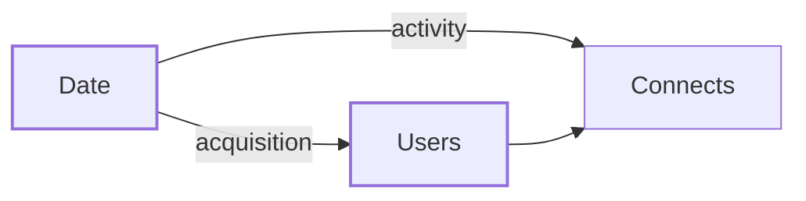

# Data Modeling Best Practices for Power BI

## Overview
Design star schemas around a central **fact** table with surrounding **dimension** tables.  
Use robust relationships (single-direction where possible), prefer whole-number surrogate keys, and plan for scale with incremental refresh/partitioning in enterprise models.

## Do’s & Don’ts

**Do**

- Model as a star schema for clarity and performance.  
- Ensure one-to-many relationships with unique dimension keys.  
- Use integer surrogate keys (Primary Keys, Foreign Keys); avoid text/GUID keys for relationships. Read more here: [Surrogate, Primary & Foreign Keys](../architectural-principles/surrogate-primary-and-foreign-keys.md)  
- Use Date dimension(s); mark it as a Date table.  
- Declare the grain of each fact table (e.g., "one row per order line") to avoid confusion.  
- Add an Unknown / Not Applicabl key (e.g., `-1`) in dimensions to handle orphaned fact rows.  
- Build dimensions wide enough with relevant attributes, but avoid unnecessary snowflaking.  
- Use bridge tables for many-to-many instead of direct relationships.  
- Enable `Incremental Refresh` on large tables with stable "last modified" columns for efficiency.  
- Optimize column storage:  
  - Remove unused columns.  
  - Use whole numbers where possible.  
  - Avoid high-cardinality text fields in facts.  
- Periodically review models with VertiPaq Analyzer / Performance Analyzer to identify bottlenecks.  
- Apply Row-Level Security (RLS) on dimensions (not facts) for better performance.  
- Enforce schema/type checks in Power Query or upstream to ensure data quality.  
- Surface a last refresh timestamp and data dictionary page to improve trust.  
- Keep reports thin: heavy logic belongs in the dataset, not in visuals.  


??? example "Grain declaration"

    ```text
    F_Sales: One row per order line
    - OrderID
    - OrderLineID
    - ProductKey
    - CustomerKey
    - SalesAmount
    ```

    This makes it clear that "OrderID" alone is not unique in the fact table.

??? example "Incremental Refresh policy"

    ```text
    Policy:
    - Keep data for last 5 years
    - Refresh last 7 days
    - Detect changes on [ModifiedDate]
    ```

    This balances query performance with manageable refresh times.

**Don’t**

- Don’t build one giant "flat" table for everything.  
- Don’t snowflake dimensions unless reuse or maintenance clearly requires it.  
- Don’t enable bi-directional relationships by default. Bi-directional relationships can lead to ambiguity. If bi-directional relationships are required, override the filtering behaviour **in your measure** by using CROSSFILTER[^1].  
- Don’t apply RLS with complex filters directly on large fact tables.  
- Don’t leave large descriptive text or high-cardinality columns in facts - split them into separate detail tables if needed.  
- Don’t hard-code data sources; use parameters for environment portability.  
- Don’t deploy straight to production; always validate in test first.  
- Don’t assume Power BI will warn you about an ambiguous filter path. It deactivates a relationship **silently** at load: verify the active-edge paths yourself after any model change. See [Role-Playing Dates](#role-playing-dates).  

[^1]: CROSSFILTER and USERELATIONSHIP are not supported in models using Row-Level Security (RLS).

## Role-Playing Dates

[Role-playing dimensions](../architectural-principles/star-dimension-tables.md) (one dimension carrying several meanings) have a specific Power BI failure mode. Only **one relationship between two tables can be active**, and when a model offers more than one active path Power BI picks one and disables the rest without raising anything. The report still renders. It just answers a different question than the one on the axis.

Verify by listing the **active** edges only and confirming every (source, target) pair is reachable exactly one way. The trap appears as soon as a dimension sits between a date table and a fact:



`Date` reaches `Connects` twice: directly, and through `Users`. One of those two relationships will be dead on arrival.

### Physical role tables are the default

| | **Physical role tables** | One date + inactive relationships |
|---|---|---|
| Model | One import of the calendar per role, each with exactly **one** active relationship | One calendar, the extra relationships inactive |
| Author drags | The role table they mean | Any date, then a role-specific measure |
| Cost | More tables in the field list | Every role needs its own `USERELATIONSHIP` measure |
| Fails when | - | Author reaches for a plain measure and silently gets whichever role is active |

Prefer physical role tables. The field list then states the question, so an author who picks the wrong role gets an obviously wrong chart rather than a plausible one.

Name them with the role-playing convention from [Naming Conventions](naming-conventions.md), `<Role> <Dimension> (<Alias>)`:

```text
Activity Date (Act)          -> the fact tables
First Seen Date (First)      -> Users[First Seen Date]
Last Seen Date (Last)        -> Users[Last Seen Date]
```

Keep dots out of the alias. In a PBIP project the table name becomes the TMDL filename, so `(Act.)` lands on disk as `Activity Date (Act.).tmdl`.

**Build the calendar once.** Put it in a single non-loaded Power Query expression and have every role table import it. Four copies of the same M drift the first time one of them is edited.

```text
expression Calendar = let ... in ...     // not loaded
Activity Date (Act)   = let Source = Calendar in Source
First Seen Date (First) = let Source = Calendar in Source
```

Mark **every** role table as a date table (`dataCategory: Time`). Time intelligence is configured per table, not per model.

### Add one all-inactive role

Alongside the active role tables, import the calendar once more with *every* relationship inactive: `Flexible Date (Flex)`. Nothing responds to it until a measure names the role it wants:

```dax
# New Users (Flex) =
CALCULATE (
    COUNTROWS ( Users ),
    USERELATIONSHIP ( Users[First Seen Date], 'Flexible Date (Flex)'[Date] )
)
```

It earns its place in exactly one situation: **a single axis carrying series that hang off different roles**: downloads by activity date beside new users by acquisition date. No single role table can do that, because each one filters one thing only.

Keep those measures in their own display folder and state in the description that they are shared-axis only. Left unlabelled they become a second, competing way to ask a question the role tables already answer.

!!! warning "Not available under RLS"
    The flexible role depends on `USERELATIONSHIP`, which is unsupported in models using Row-Level Security[^1]. In an RLS model, physical role tables are the only option.

??? example "Checking a model for ambiguity"

    List active edges only, then walk each source to each target:

    ```text
    Activity Date  -> Connects, Database Connects, Downloads, Leads   (direct, one path each)
    First Seen     -> Users -> Connects / Database Connects           (one path each)
    Last Seen      -> Users -> Connects / Database Connects           (one path each)
    Companies      -> Users -> Connects / Database Connects           (one path each)
    Flexible Date  -> everything, all inactive                        (excluded from resolution)
    ```

    Note that `Companies` attaches to `Users`, not to each fact. Relating it to both would give `Companies` two paths to the fact tables: the same defect as the date roles, wearing a different hat.
