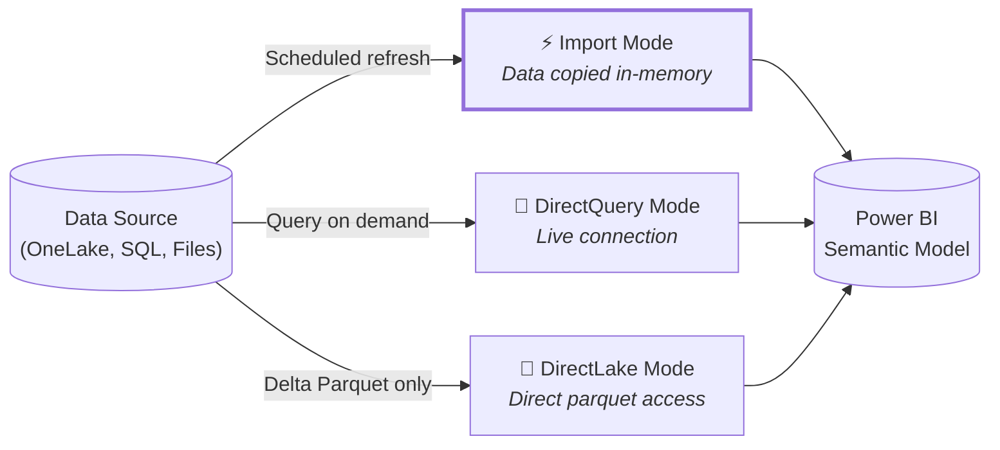
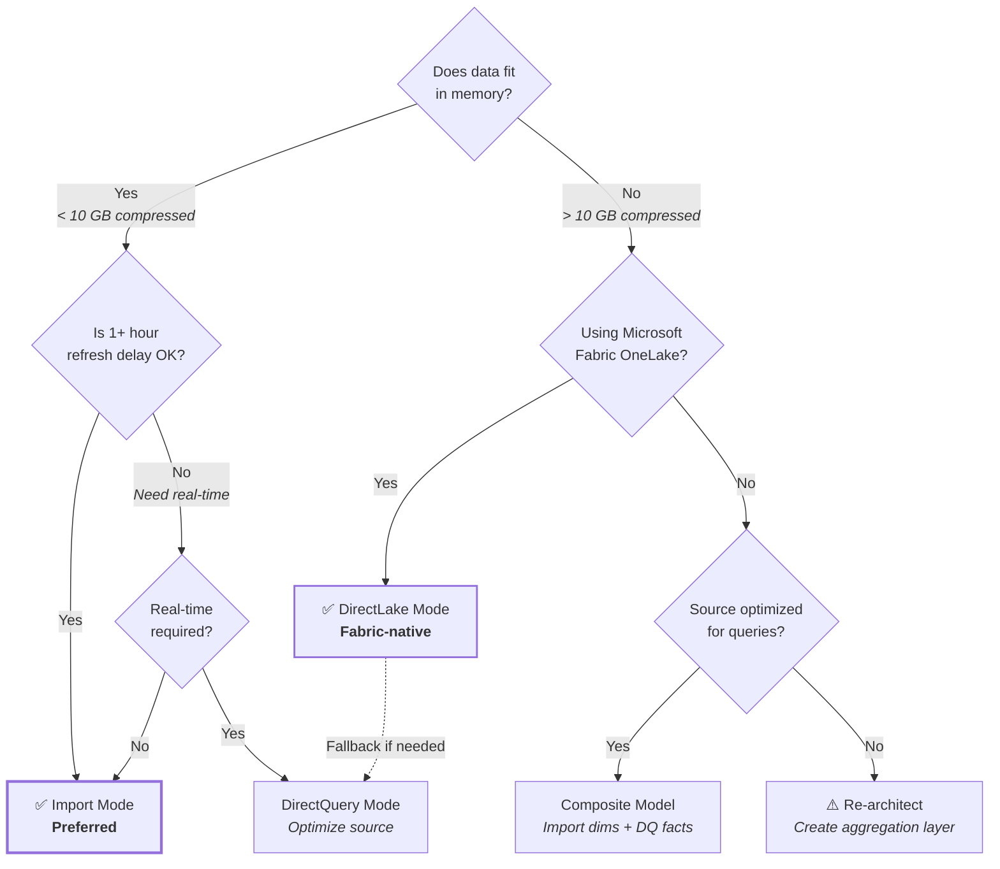

# Connection Modes – Import, DirectQuery & DirectLake

## Overview

Power BI semantic models connect to data sources using three primary connection modes: **Import**, **DirectQuery**, and **DirectLake**. Each mode has distinct performance characteristics, memory implications, and use cases.

==Import is the preferred mode when data volume and refresh requirements allow it.== Import delivers the fastest query performance and richest feature support. Only use DirectQuery or DirectLake when real-time requirements or data volumes make Import impractical.

---

## Import Mode

**Import physically copies data into Power BI's in-memory VertiPaq engine.** This enables the fastest query performance and supports all Power BI features.

### Characteristics

| Aspect | Details |
|--------|---------|
| **Performance** | ⚡ **Fastest** - all data compressed in-memory using columnar storage |
| **Data Freshness** | Depends on scheduled refresh (hourly minimum with Premium) |
| **Data Volume** | Limited by available memory and capacity SKU |
| **Feature Support** | ✅ Full - all DAX, all visuals, all modeling capabilities |
| **Network Dependency** | None after initial load |

### When to Use Import

Import should be your **default choice** unless specific constraints force alternatives:

- ✅ Data volume fits comfortably in memory (< 10 GB compressed typical threshold)
- ✅ Refresh latency of 1+ hours is acceptable for business requirements
- ✅ You need full DAX functionality including complex calculations
- ✅ Report performance is critical (executives, dashboards, embedded scenarios)
- ✅ Source system can handle scheduled extract loads

??? tip "Memory Estimation"
    Power BI's VertiPaq compression typically achieves **10:1 compression ratios** for typical business data. A 50 GB source table often compresses to ~5 GB in-memory. Use [Third Party Tooling](third-party-tooling.md) like VertiPaq Analyzer to estimate actual memory consumption.

### Do's & Don'ts

**Do:**
- Use Import for dimension tables and smaller fact tables (< 100M rows)
- Apply incremental refresh on large Import tables with stable partition columns
- Filter source data in Power Query to reduce imported volume
- Remove unused columns before loading
- Optimize data types (integers over strings, dates over datetimes when time not needed)
- Schedule refreshes during off-peak hours to minimize source system impact

**Don't:**
- Don't import unnecessarily granular data; aggregate at source when possible
- Don't import audit columns or system metadata unless required for analysis
- Don't use Import when data must be real-time (< 1 hour latency)
- Don't exceed your capacity's memory limits; monitor workspace memory usage

---

## DirectQuery Mode

**DirectQuery sends queries directly to the source system** without caching data in Power BI. Every visual interaction generates SQL (or equivalent) queries to the underlying data source.

### Characteristics

| Aspect | Details |
|--------|---------|
| **Performance** | 🐢 **Typically slow** - constrained by source system and network latency |
| **Data Freshness** | ✅ **Real-time** - always queries live data |
| **Data Volume** | Unlimited (queries execute at source) |
| **Feature Support** | ⚠️ Limited - some DAX functions unsupported, slower calculations |
| **Network Dependency** | Required for every query |

### When to Use DirectQuery

DirectQuery is appropriate when Import is not feasible due to data volume or real-time requirements:

- ✅ Data volume exceeds memory capacity (> 1 billion rows)
- ✅ Business requires real-time or near-real-time data (< 15 minute latency)
- ✅ Regulatory/security requirements prohibit data duplication
- ✅ Source system is optimized for analytical queries (columnstore indexes, materialized views)
- ✅ Query volume is predictable and manageable

??? warning "Performance Impact"
    DirectQuery shifts compute burden to the source system. A single report page with 10 visuals may generate 20+ queries to the source. Ensure the source database is designed for concurrent analytical workloads.

### Do's & Don'ts

**Do:**
- Use DirectQuery for very large fact tables while importing dimensions (Composite models)
- Create aggregation tables in Import mode to accelerate common queries
- Optimize source queries with indexes, columnstore, and query plans
- Limit report complexity; fewer visuals, simpler DAX
- Use query reduction options in Power BI Desktop
- Monitor source system performance and query patterns

**Don't:**
- Don't use DirectQuery as default "just because"; performance will suffer
- Don't point DirectQuery at OLTP transactional systems without read replicas

---

## DirectLake Mode

**DirectLake directly reads Delta Parquet files from OneLake** (Microsoft Fabric's storage layer) without importing or query translation. Power BI intelligently loads subsets of parquet data into memory as needed.

### Characteristics

| Aspect | Details |
|--------|---------|
| **Performance** | 🚀 **Fast** - selective columnar reads from optimized parquet files |
| **Data Freshness** | Near real-time (depends on upstream Delta table refresh) |
| **Data Volume** | Large scale supported (billions of rows) |
| **Feature Support** | ✅ Full DAX support |
| **Requirements** | Requires Microsoft Fabric and Delta Parquet format |

### When to Use DirectLake

DirectLake is the **preferred mode for large-scale Fabric workloads**:

- ✅ Data stored in OneLake as Delta tables (Lakehouses, Warehouses)
- ✅ Data volume exceeds Import capacity but source system can't handle DirectQuery load
- ✅ You need near-Import performance with DirectQuery scale
- ✅ Your organization uses Microsoft Fabric as data platform
- ✅ You want to avoid redundant data copies

??? info "How DirectLake Works"
    DirectLake analyzes visual queries and loads only required columns and row ranges from parquet files into memory. First interaction may be slower while data loads, but subsequent queries leverage cached parquet data. This **hybrid approach** delivers Import-like speed with DirectQuery-like scale.

### Do's & Don'ts

**Do:**
- Use DirectLake for large fact tables in Fabric Lakehouses
- Optimize Delta tables with appropriate partitioning (by date typically)
- Run OPTIMIZE and VACUUM commands on Delta tables regularly
- Design table structure for columnar access patterns
- Monitor fallback to DirectQuery mode (occurs when memory insufficient)

**Don't:**
- Don't use DirectLake outside Microsoft Fabric ecosystem (not supported)
- Don't expect instant first-load performance - initial query loads parquet data
- Don't skip Delta table optimization - poorly structured parquet degrades performance
- Don't ignore capacity memory limits - DirectLake still requires memory for cache

---

## Decision Framework

Use this decision tree to select the appropriate connection mode:

---

## Related Pages

- [Data Modeling in Power BI](data-modeling-in-power-bi.md) - Star schema design principles apply to all connection modes
- [Naming Conventions](naming-conventions.md) - Consistent naming critical for DirectQuery SQL generation
- [Third Party Tooling](third-party-tooling.md) - VertiPaq Analyzer essential for Import optimization
- [DAX Coding Standards](dax-coding-standards.md) - DirectQuery requires simpler DAX patterns
- [Data Layers and Modeling](../architectural-principles/data-layers-and-modeling.md) - Architectural context for choosing connection modes

