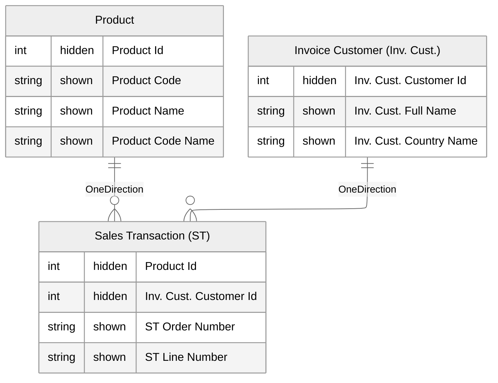

# Naming Conventions

## Overview
Consistent, business-friendly names improve discoverability and reduce errors.  
Good naming conventions make it easier for both developers and business users to understand, navigate, and trust the semantic model.  

---

## Tables
- Use singular business-friendly names for dimensions and facts (e.g., `Customer`, `Sales Transaction`).  
- When a table represents a role-playing dimension (e.g., Customer appearing as both Bill-to and Ship-to), add a short prefix or suffix in parentheses:  
  - `Invoice Customer (Inv. Cust.)`  
  - `Delivery Customer (Del. Cust.)`  
- Use abbreviations only when they are widely understood across the business.  
- Add short aliases in parentheses `(XX)` for long table names to simplify prefixing columns.  

**Don’t**
- Don’t prefix tables with `F_` or `D_`. Business users don’t think in facts/dimensions, and not all tables will fit neatly into those categories.  
- Don’t use cryptic system names from the source (e.g., `tbl_CUST_DIM` → rename to `Customer`).  

---

## Columns
- Provide user-friendly column names that describe the business meaning (e.g., `Booking Month`, `Product Code`).  
- Prefix column names with the table abbreviation to avoid ambiguity in reports.[^1] Example:  
  - `'Sales Transaction (ST)'[ST Order Number]`  
  - `'Invoice Customer (Inv. Cust.)'[Inv. Cust. Country Name]`  
- When a column contains both `Code` and `Name`, consider adding a concatenated `Code Name` column to simplify filtering and searching.  
- Use clear suffixes for role-playing columns (e.g., `Order Date`, `Invoice Date` instead of a generic `Date`).  
- Ensure that calculated/derived columns are named in a way that signals their logic (e.g., `Customer Age (Years)` instead of just `Age`).  

**Don’t**
- Don’t use technical abbreviations (e.g., `CustID`, `PrdNm`). Always prefer clarity.  
- Don’t reuse the same column name across different tables without a prefix; users won’t know whether `Date` refers to order, invoice, or delivery.  

---

## Measures
- Use business-oriented measure names; name the result, not the calculation.  
  - ✅ `Revenue`, `Customer Count`, `Churn Rate`  
  - ❌ `Total Revenue`, `Sum of Sales`, `Measure1`  
- Indicate the calculation type or time intelligence explicitly when relevant:  
  - `Revenue YoY %`  
  - `Sales Growth (QTD)`  
- Group related measures into display folders for easier navigation.  
- Keep measure names concise but unambiguous; avoid unnecessary filler words like *“Total”* unless needed for clarity.  

**Don’t**
- Don’t put all measures into a “dummy” or “measures” table.[^2] Keep them on the table they logically belong to.  
- Don’t use technical language in measure names; names should be understandable by a business audience.  

---

## Practical Examples

**Tables & Columns**  
- `Sales Transaction (ST)`  
  - `'Sales Transaction (ST)'[ST Order Number]`  
  - `'Sales Transaction (ST)'[ST Line Number]`  
- `Product`  
  - `Product[Product Code]`  
  - `Product[Product Name]`  
  - `Product[Product Code Name]`  
- `Invoice Customer (Inv. Cust.)` (= Role-Playing Dimension for `Customer`)  
  - `'Invoice Customer (Inv. Cust.)'[Inv. Cust. Customer Id]`  
  - `'Invoice Customer (Inv. Cust.)'[Inv. Cust. Full Name]`  
  - `'Invoice Customer (Inv. Cust.)'[Inv. Cust. Country Name]`  

**Measures**
```DAX
[Customer Count]
[Revenue Incl. VAT]
[Sales YoY Growth %]
```

---

## Visual Example



---

[^1]: If you put a column in a visual (e.g., `Code` or `Date`) and it doesn’t contain the table reference, it is not clear which business concept it belongs to (Order vs Invoice date, Product vs Supplier code). Prefixing avoids this ambiguity.  

[^2]: There was a time where we preferred measures on “Ghost Tables/Unlinked Dummy Dimensions” to mimic Multidimensional Cubes. Today, it’s better to keep measures on the table they logically belong to.  
