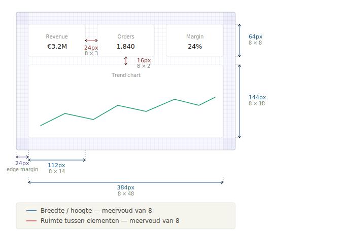
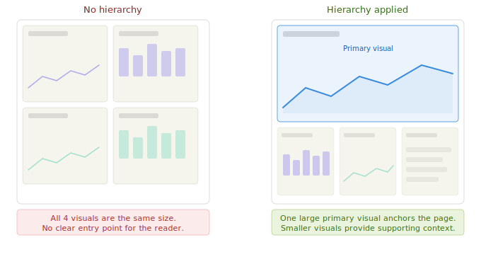
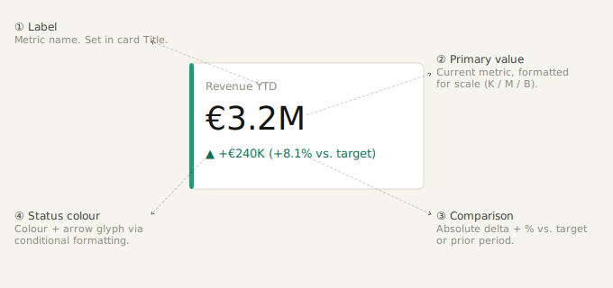

# Report Design Standards

## Purpose & Scope

These standards define how Power BI reports should look and behave. They cover layout, visual selection, chart formatting, KPI cards, slicers, tables, and number formatting. 

> **Branding:** Apply the project's approved Power BI theme file. If none exists, establish one at project kickoff before report development begins.
>
> A **Power BI theme file** is a `.json` configuration file that defines the color palette, font settings, and default visual formatting for an entire report. Once applied, every visual in the report inherits these defaults automatically, eliminating the need to format each visual manually and ensuring a consistent look across pages. Theme files are applied in Power BI Desktop via **View → Themes → Browse for themes**. They can be created manually, generated using a theme builder tool, or exported from an existing report.
>
> - 📎 [bibb.pro - Theme Generator](https://bibb.pro/apps/theme-generator/)
> - 📎 [PowerBI.Tips - Theme Editor](https://themes.powerbi.tips/themes/wireframes)


---

## Layout & Composition

### Canvas Size

- Use **16:9 canvas** (1280×720 or 1920×1080) as the default for desktop-first reports.
- Use a 375px-wide canvas for mobile layouts only when a mobile layout is explicitly in scope.
- Do not mix canvas sizes within a single report file without a clear rationale.

### Grid & Spacing

- Align all visuals to an invisible **8px grid**: every element's position, size, and spacing should be a multiple of 8 pixels. This creates alignment structure that makes the canvas feel ordered and intentional even without visible lines. Use Power BI's snap-to-grid and alignment guides to enforce this.

- Maintain consistent **gutters** (the empty space between elements): minimum **16px between visuals**, **24px from the canvas edge**. Too little space makes the page feel cluttered; too much makes it feel disconnected.

- Imply grouping through **proximity and whitespace**, not boxes or borders. Proximity alone signals that visuals belong together. Decorative borders add visual noise and are harder to maintain across theme changes.


### Page Structure

The canvas is divided into named zones. These zones create a predictable layout that users can learn once and apply to every report.

- Reserve the **top band** (60–80px) for page title, navigation controls, and global filters. The top band is the horizontal strip spanning the full width of the canvas along the top edge.
- Place primary KPIs **at the top of the page**, directly below the top band. These are the headline numbers a reader should see the moment the report loads.
- Place page navigation buttons in the **top band**, alongside the page title. This keeps the full canvas width available for content and aligns with the natural left-to-right reading flow.
- For reports with more than 6 pages, move navigation to a **right-side rail** (80–120px), a narrow vertical strip along the right edge of the canvas. This avoids crowding the top band while keeping content the primary focus on the left.
- Limit each page to **one analytical question**. If a page tries to answer two questions, split it.
- Keep the number of visuals per page low. As a rule of thumb, aim for **5 or fewer**. If you are struggling to fit everything on one page, that is a signal you are trying to communicate too much at once, not that you need a larger canvas. More visuals mean smaller visuals, and smaller visuals are harder to read and harder to compare. When in doubt, move secondary visuals to a detail or drill-through page.



### Visual Hierarchy

**Visual hierarchy** is the order in which a reader's eye moves across the page. A well-structured page guides the reader from the most important information to the supporting detail, without them having to decide where to look first. When every visual has equal size and weight, the reader has no natural entry point.

- The most important visual on a page should be the largest. Do not give equal visual weight to everything.
- Use **font size**, not color or decoration, to establish hierarchy in text elements.
- Use gradient fills, drop shadows, and borders sparingly and subtly: a slight shadow can give a card gentle depth, but a heavy one draws attention away from the data. If an effect does not help the reader interpret the information, remove it.



---

## Visual Selection

### Native-Only Policy

**Use native Power BI visuals unless a requirement cannot be met natively.**

Native visuals receive Microsoft security patches and feature updates, behave predictably across Desktop, Service, and embedded contexts, and avoid JavaScript sandbox overhead. Custom visuals introduce publisher dependency: if a visual is deprecated or its publisher goes inactive, the report breaks silently.

### Approval Process for Custom Visuals

If a custom visual is genuinely necessary:

1. Confirm the visual is **Microsoft-certified** on AppSource. Uncertified visuals cannot be used in government or regulated cloud environments, and cannot be exported to PDF.
2. Get written sign-off from stakeholders on the third-party dependency.
3. Document the custom visual name and version in the report's metadata.

### SVG & DAX-Rendered Visuals

The restriction here applies specifically to **DAX-generated SVGs**: measures that return an SVG string to render inside a table or card cell. These are:

- **Not accessible**: no alt-text support.
- **Expensive**: DAX is evaluated row-by-row to render each cell.
- **Hard to maintain**: formatting logic is split between the data model and the visual.

Use a native sparkline, icon set (via conditional formatting), or a standard chart instead.

**Static SVG files are fine.** Uploading an `.svg` as a logo, icon, or background image does not carry these drawbacks. The file is rendered directly, not generated through DAX at query time.

### Decision Guide



**When evaluating a native alternative**, consider these before reaching for a custom visual:

| Need | Native alternative |
|---|---|
| Small trend per row | Native sparkline (line or column) |
| Status per row | Conditional formatting icon set |
| Progress toward target | KPI visual or a gauge |
| Custom color by category | Conditional formatting color rules |
| Small multiples / trellis | Power BI native small multiples |

---

## Charts & Data Visualization Standards

### Gridlines

Turn gridlines **off** by default.  
Gridlines add visual noise in most dashboard contexts. When precise value reading matters, use data labels or tooltips instead. Gridlines are acceptable in dense analytical grids where the eye needs to track across rows, not on bar, line, or scatter charts.

### Axis Titles

Hide axis titles when the chart title or context already communicates the axis content.  
A bar chart titled "Revenue by Region" does not need a Y-axis label reading "Revenue (EUR)". Reserve axis titles for charts where units are ambiguous.

### Legend Placement

- Place legends at the **top** of a visual for ≤ 5 series.
- Use **direct labels** (data labels on the series) for 2–3 series when space allows - they are faster to read than a separate legend.
- Avoid placing a legend below the chart - it forces the reader's eye to travel away from the data after reading it, which is the least natural reading position.

### Tooltips

- Every visual must have a meaningful tooltip. At minimum: dimension value, measure value, and percentage of total where relevant.
- Use **report page tooltips** for visuals that benefit from richer context (e.g., a sparkline trend on a category bar chart).
- Do not surface raw IDs or internal system codes in tooltips.

---

## KPI Cards

### Anatomy

A KPI card answers one question: *what is the current value of this metric, and is it good or bad?*

Each card should contain:

- **Primary value**: current metric, formatted for scale (see [Number, Date & Percentage Formatting](#number-date-percentage-formatting)).
- **Label**: the metric name, concise.
- **Comparison**: variance vs. target, prior period, or budget. Show both absolute and percentage variance.
- **Status indicator**: a color signal or icon defined in the theme, never hardcoded.



### Card vs. KPI Visual

| | Card | KPI Visual |
|---|---|---|
| Shows a single value | ✅ | ✅ |
| Shows variance vs. target | ❌ | ✅ |
| Shows a trend indicator | ❌ | ✅ |
| Fully customizable via theme | ✅ | Partial |
| **Use for** | Headline metrics without a trend | Metrics with a target or trend |

### Number Formatting on Cards

- Match precision to the audience: executives want `€1.2M`, analysts want `€1,234,567`.
- Apply format strings in the visual's format setting or via a dynamic format string measure - not via `FORMAT()` in DAX. `FORMAT()` returns text, which breaks sorting and aggregation downstream.

---

## Slicers & Filters

### Slicer Types

| Type | Use when |
|---|---|
| Dropdown | Many values (> 8), space is limited |
| List (single/multi-select) | Few values (≤ 8), always-visible selection preferred |
| Between (range) | Continuous numeric or date ranges |
| Relative date | Rolling period filters (last 7 days, this quarter) |
| Search-enabled list | Free-text lookup on large dimension lists |

Avoid the **tile slicer** for dimensions with more than 5 values - tiles wrap unpredictably and are difficult to theme consistently.

### Placement

Reserve a **right rail** (120–160px) consistently across all pages as the dedicated home for slicers that affect the full page. Placing slicers here has two advantages: users learn where to look after seeing it once, and the vertical space accommodates more slicers without crowding the top band or the main content area.

- Place all page-level slicers in the **right rail**. Keep this zone consistent across every page - if it exists on page 1, it must exist on every page.
- Reserve the **top band** for the date slicer only, if a date filter is prominent enough to warrant immediate visibility. All other slicers belong in the right rail.
- Slicers that affect only one visual should be placed directly adjacent to that visual, not in the rail.
- On reports with more than 6 pages, the right rail is already recommended for navigation (see Layout & Composition). In this case, move page-level slicers to a **dedicated filter page** rather than splitting the rail between navigation and filters.

**Exception - Apply & Clear buttons:** When slicers are configured with an Apply button (Power BI's query reduction mode, used to prevent the report from re-querying on every selection), all slicers *and* their Apply and Clear buttons must be placed together in the right rail. Keeping them visually grouped makes it clear to users that selections do not take effect until Apply is clicked - separating the buttons from the slicers breaks this mental model and leads to confusion.

### Cross-Filtering Behavior

- Set visual interactions **explicitly**. Do not rely on Power BI's default cross-filter behavior, which changes between versions and produces confusing results.
- Document any non-default interaction settings.
- Disable cross-filtering between slicers and KPI cards that are intended to show an absolute baseline (e.g., a total company revenue card that should not respond to a regional slicer).

---

## Filter & Slicer Placement

Where a filter lives affects both usability and report performance. Use this as a guide:

| Location | When to use |
|---|---|
| **Filter pane** | Developer or power-user filters; filters invisible to typical report consumers; report-level or page-level filters that apply universally |
| **On-canvas slicer** | Filters the end user interacts with frequently; core segmentation dimensions (date, region, product category) |
| **Dedicated filter page** | Reports with many independent filters; when filter state needs to be bookmarked or shared; guided-analysis flows where users pre-configure before viewing results |

### Placement Rules Within the Canvas

- Place all page-level on-canvas slicers in the **right rail**. See [Slicers & Filters - Placement](#placement) for the full right rail guidance, including exceptions for Apply & Clear buttons and 6+ page reports.
- The date slicer may optionally sit in the **top band** when it is the single most important filter on the page and warrants immediate visibility - but only if the right rail is already reserved for navigation.
- Never split related slicers across different areas of the canvas (e.g., a date slicer in the top band and a related period-comparison slicer in the rail - keep them together).
- Use **consistent placement across all pages**. Whatever zone slicers occupy on page 1 must be the same on every page.

---

## Tables & Matrices

### When to Use Each

| Visual | Use when |
|---|---|
| **Table** | Flat list of records; no aggregation hierarchy; export to Excel is a primary use case |
| **Matrix** | Aggregated data with row and/or column hierarchies; cross-tabulation; drill-down required |

Do not use a matrix when a bar chart or line chart communicates the same insight more clearly. Tables and matrices are for lookup and export, not for visualizing trends.

### Formatting Rules

- Show a maximum of **8–10 columns** before considering whether to filter or split the view.
- Use **alternating row colors** (defined in the theme, not hardcoded) for tables with more than 15 rows.
- **Right-align numbers, left-align text.** Center-aligned numbers make magnitude comparison harder.
- Set **fixed column widths** rather than auto-fit when the report will be exported to PDF - auto-fit columns reflow unpredictably on export.
- Hide columns that exist only to drive sort order (e.g., a numeric sort key for a month name column).

### Conditional Formatting

- Apply conditional formatting to **communicate meaning, not decoration**. A heat-map scale on a margin column is meaningful; color-coding alternating rows by value is not.
- Use **rules-based** conditional formatting over gradient scales when thresholds are business-defined (e.g., margin < 5% = red).
- Ensure color choices are accessible: do not use red/green as the only signal. Pair color with an icon or text label.
- Define thresholds as measures where they may change, not as hardcoded values in the visual settings.

---

## Number, Date & Percentage Formatting

### Date Format

Date format depends on context - apply the right format for the right audience:

| Context | Format | Reason |
|---|---|---|
| Data columns, system fields, sorting keys | `YYYY-MM-DD` (ISO 8601) | Unambiguous, sorts correctly as text, language-neutral |
| End-user-facing labels (axes, cards, tables) | `DD/MM/YYYY` | Standard in most of continental Europe (BE, NL, FR, DE, ES, IT) |

**Default to `DD/MM/YYYY` for any date a business user reads directly.** Confirm the expected locale at project kickoff if the report will be used across multiple countries, and document the agreed format.

Never mix formats within the same report (e.g., some visuals showing `DD/MM/YYYY`, others showing `MM/DD/YYYY`).

### Large Number Abbreviations

| Scale | Format | Example |
|---|---|---|
| < 10,000 | Full | `9,450` |
| 10,000 – 999,999 | K | `142K` |
| 1,000,000 – 999,999,999 | M | `3.2M` |
| ≥ 1,000,000,000 | B | `1.1B` |

Apply abbreviations **consistently across a page**. If one KPI card shows `€3.2M`, do not show `€3,200,000` in an adjacent table on the same page.

Define abbreviation format strings at the measure level using a **dynamic format string measure** rather than setting them per visual. This ensures consistency and allows the format to adapt to value ranges automatically.

A dynamic format string measure is a separate DAX measure that returns a format string as text. You assign it to another measure's *Format* property in the model (not in the visual). Power BI then evaluates it at query time, so the same measure can display as `€142K` in one context and `€3.2M` in another, without any manual adjustment per visual.

**Example - Revenue with automatic scale:**

```DAX
// The measure being displayed
[Revenue] = SUM('Sales'[Amount])

// The dynamic format string measure assigned to [Revenue]
[Revenue Format] =
VAR _Value = [Revenue]
RETURN
    SWITCH (
        TRUE (),
        _Value >= 1000000000, "€#,##0,,,.0B",
        _Value >= 1000000,    "€#,##0,,.0M",
        _Value >= 10000,      "€#,##0,.0K",
        "€#,##0"
    )
```

To apply it: in Power BI Desktop, select the `[Revenue]` measure → *Measure tools* → *Format* → choose *Dynamic* → select `[Revenue Format]` as the format string measure. Every visual using `[Revenue]` will now format itself automatically based on the displayed value.

### Percentage Display

- Display percentages with **one decimal place** unless the business context requires more precision (e.g., interest rates, clinical data).
- Use `0.0%` not `0%`, the decimal communicates that this is a continuous ratio, not a rounded integer.
- Never format a percentage ratio as a whole number and label it a percentage (e.g., showing `23` instead of `23%`).

### Currency Formatting

- Include the currency symbol in the format string. Do not rely on the report title or an axis label to communicate currency.
- Confirm the symbol and placement (prefix vs. suffix) at project kickoff. EUR display conventions differ by region (`€1.2M` vs. `1,2M €`).
- Use a currency format measure or theme-level standard rather than setting the symbol per visual.

---

## Common Mistakes & Anti-Patterns

These are structural issues observed across Power BI projects. They are not branding or project-specific rules.

**Too many visuals on a single page**  
Cramming 12 visuals onto one page does not make a report more informative: it makes every visual smaller and less readable. Apply the one-question-per-page rule.

**Using the wrong visual for the data shape**  
Pie charts with more than 5 segments, 3D charts in any context, donut charts for precise comparison: all of these make comparison harder. Match the visual to the cognitive task: comparison → bar chart; trend → line chart; part-of-whole (≤ 5 parts) → stacked bar or donut.

**Formatting numbers per visual instead of at the model**  
When the same measure appears in 10 visuals and the format needs to change, updating it in 10 places is error-prone. Define format strings on the measure.

**Mixing filter mechanisms without a clear logic**  
Using the filter pane for some filters and on-canvas slicers for others without a clear rationale confuses users who cannot see that the filter pane is active. Be explicit about what is hidden and what is visible.

**Tooltips surfacing internal IDs**  
Users do not need to see `CustomerID = 84729`. Tooltips should show business-meaningful values only.


